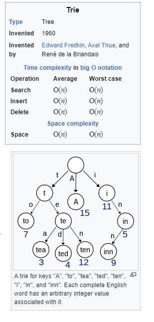
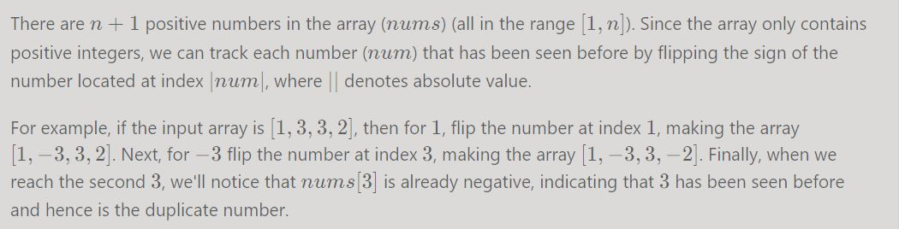

# math

## co-prime numbers

Two numbers are called relatively prime, or coprime, if their greatest common divisor equals 1.[14] For example, 9 and 28 are coprime.

## gcd

if any of the value is zero than gcd is another value
if both values are zero than gcd is 0

The greatest common divisor (GCD) of integers a and b, at least one of which is nonzero, is the greatest positive integer d such that d is a divisor of both a and b; that is, there are integers e and f such that a = de and b = df, and d is the largest such integer. The GCD of a and b is generally denoted gcd(a, b).[8]

When one of a and b is zero, the GCD is the absolute value of the nonzero integer: gcd(a, 0) = gcd(0, a) = |a|. This case is important as the terminating step of the Euclidean algorithm.


**if a >= b
gcd(a,b) = gcd(a-b,b)
gcd(a,b) = gcd(a % mod b,b)**

Algo

```
    while (a != b) {
        if (a < b) { 
            auto c = b;
            b = a;
            a = c;
        }

        int d = a % b;
        if (d == 0) {
            return b;
        } else {
            a = d;
        }
    }

    return a;
```

## lcm

lcm(a,b)=a*b/gcd(a,b)

## round down large calculations by mod 100000007

a + b  ->  (a + b) % 1e7 == ( a % 1e7 + b % 1e7) 
a * b  ->  (a * b) % 1e7 == ( a % 1e7 * b % 1e7) 
a - b  ->  (a - b) % 1e7 == (r =( a % 1e7 - b % 1e7); if (r < 0) r+= 1e7  
for division it is much harder and needs Euler teorem

# probability

## double range random generator

double fRand(double fMin, double fMax)
{
    double f = (double)rand() / RAND_MAX;
    return fMin + f * (fMax - fMin);
}

# binary search

the whole point is to track mid


``` 
left + (right - left) / 2
```

 is better than just because it does not overflow

```
 (right + left) / 2
```

```
    int search(vector<int>& nums, int target) {
        int lo = 0;
        int hi = nums.size();
        while (lo < hi)
        {            
            int mid = lo + (hi - lo) / 2;
            int val = nums[mid];
            if (val == target) {
                return mid;
            } else if (val > target) {
                hi = mid;
            } else {
                lo = mid+1;
            }
        }        
     
        /*if (lo > 0 && nums[lo-1] == target)
            return lo-1;
        else
            return -1;
            */

        return -1;
    }

    } 
```    


## lower_bound

``` 
    int search(vector<int>& nums, int target) {
        // Set the left and right boundaries
        int left = 0, right = int(nums.size());//WARNING! this can benums.size()-1 as well, but than in case target is not there it would point at nums.size()-1, rather than at nums.size()
        
        while (left < right) {
            int mid = (left + right) / 2;
            if (nums[mid] >= target) {
                right = mid;                
            } else  {               
                left = mid + 1;
            }
        }
        
        if (left < nums.size() && nums[left] == target) {
            return left;
        } else {
            return -1;
        }
    }
``` 

## upper_bound
``` 
    int search(vector<int>& nums, int target) {
        // Set the left and right boundaries
        int left = 0, right = int(nums.size());
        
        while (left < right) { //supper important so that left does not becomes original right!
            int mid = (left + right) / 2;
            if (nums[mid] <= target) {
                left = mid + 1;                
            } else  {               
                right = mid;
            }
        }
        
        if (left > 0 && nums[left-1] == target) {
            return left-1;
        } else {
            return -1;
        }
    }
``` 

# heap

binary heap 

0 1 2----3----
- P Left Right
P = Pos / 2;
Left = 2 * P;
Right = 2 * P + 1


# optimization problems

There are a couple of strategies we use to design a tractable (non-exponential) algorithm for an optimization problem.

- Identifying a greedy algorithm
- Dynamic programming

There is no guarantee that either is possible. Additionally, greedy algorithms are strictly less common than dynamic programming algorithms and are often more difficult to identify. However, if a greedy algorithm exists, then it will almost always be better than a dynamic programming one. You should, therefore, at least give some thought to the potential existence of a greedy algorithm before jumping straight into dynamic programming


While it's very difficult to be certain that there is no greedy algorithm for your interview problem, over time you'll build up an intuition about when to give up. You also don't want to risk spending so long trying to find a greedy algorithm that you run out of time to write a dynamic programming one (and it's also best to make sure you write a working solution!)

Besides, sometimes the process used to develop a dynamic programming solution can lead to a greedy one. So, you might end up being able to further optimize your dynamic programming solution anyway.


## dynamic programming

the whole point about dynamic programming is about assuming that for optimal solution , sub-problems are not optimal. If you come to he contradiction that the whole solutino is not optimal than it proves that sub-problem are indeed optimal! It is called cut-and-pate argument.


There are two characteristics of this problem that hint towards the use of dynamic programming (DP). The first is that the problem is asking us to find the maximum of something. The second is that we need to make decisions on which numbers to take, and each decision may influence future decisions.

These attributes may seem familiar to you. Greedy problems have optimal substructure, but not overlapping subproblems. Divide and conquer algorithms break a problem into subproblems, but these subproblems are not overlapping (which is why DP and divide and conquer are commonly mistaken for one another).

Generally, there are two ways to come up with a DP solution. One way is to start with a brute-force approach and reduce unnecessary calculations. Another way is to treat the stored results as "states", and try to jump from the starting state to the ending state

## DP and recursive problem solving

 For all people wondering how you'd solve this in an interview in 30 mins - this is a fairly easy DP problem. If you're confused its because the explanation jumps into the bottom-up DP solution without explaining how it got there. You can never figure out a bottom-up DP solution without first figuring out a top down recursive approach. If during the recursion you find you're solving the same sub-problem repeatedly ("overlapping sub-problems") - that's the first hint that its DP. Next, if you find that the optimal answer for the current sub-problem is formed from the optimal answer for the overlapping sub-problems, you now have found the optimal sub-structure. Its DP for sure. Typically problems involving finding the "longest/shortest/largest/smallest/maximal" of something have the optimal-substructure. For example if the shortest distance from A to D is A->B->C->D, then it follows that the shortest distance from B to D is B->C->D
 

WARNING!!!! ***once you have recurive solution figured out it is normally easy to convert it to DP by using oposite direction. For example in LCS problem, you start in array from index 0 in recursive version, but in DP you must start with N-1!***

A base case is any state where we can calculate the result without making recursive calls.

 ##  Common way to solve it
 
 Typically, dynamic programming problems can be solved with three main components. If you're new to dynamic programming, this might be hard to understand but is extremely valuable to learn since most dynamic programming problems can be solved this way.

First, we need some function or array 
that represents the answer to the problem from a given state. For many solutions on LeetCode, you will see this function/array named "dp". For this problem, let's say that we have an array dp. As just stated, this array needs to represent the answer to the problem for a given state, so let's say that dp[i] represents the length of the longest increasing subsequence that ends with the ithi^{th}ith  element. The "state" is one-dimensional since it can be represented with only one variable - the index i.

Second, we need a way to transition between states, such as dp[5] and dp[7]. This is called a recurrence relation and can sometimes be tricky to figure out. Let's say we know dp[0], dp[1], and dp[2]. How can we find dp[3] given this information? Well, since dp[2] represents the length of the longest increasing subsequence that ends with nums[2], if nums[3] > nums[2], then we can simply take the subsequence ending at i = 2 and append nums[3] to it, increasing the length by 1. The same can be said for nums[0] and nums[1] if nums[3] is larger. Of course, we should try to maximize dp[3], so we need to check all 3. Formally, the recurrence relation is: dp[i] = max(dp[j] + 1) for all j where nums[j] < nums[i] and j < i

Generally, there are two ways to come up with a DP solution. One way is to start with a brute-force approach and reduce unnecessary calculations. Another way is to treat the stored results as "states", and try to jump from the starting state to the ending state

## how to estimate time complexity for DP problems

just look at how many states possible, the number of states would be your time and space complexity as long as you use memorize the solution to the sub-states

## Max subarray problem - Kancande algorithms

```
        std::vector<int> solution(s.size(), 0);

        int global_maximum = 0;
        int local_maximum = 0;
        solution[0] = local_maximum = weights[s[0]-'a'];
        if (local_maximum > global_maximum)
            global_maximum = local_maximum;

        for (size_t i = 1; i < s.size(); ++i) {
            char idx = s[i]-'a';
            local_maximum = std::max(solution[i-1] + weights[idx],  weights[idx]);
            solution[i] = local_maximum;
            if (local_maximum > global_maximum)
                global_maximum = local_maximum;
        }
```

# trie



# sequences

total number of all sub-sequences (including empty one) = 2^n

A **subarray** is contiguous part of array and maintains the relative ordering
A **subsequence** must maintain the relative order of the original sequence. It may or may not be contiguous
A **subset** MAY NOT maintain relative ordering of elements and can or cannot be a contiguous part of an array
A **substring** is a contiguous sequence of characters in a string

## problem solving techniques

### Negative marking




### Cyclic sort


# dynamic sets

```

template <class K> using DynamicSet = std::unordered_map<K, std::optional<K>>;

template <class K>
std::optional<K> find_set(const DynamicSet<K> &S, const K &k) {
  auto it = S.find(k);
  while (it != std::end(S) && it->second) {
    it = S.find(it->second.value());
  }

  std::optional<K> r = it == std::end(S) ? std::optional<K>() : it->first;
  std::cout << "find_set k=" << k << "  r=" << (r ? r.value() : "<missing>")
            << "\n";
  return r;
}

template <class K> void union_set(DynamicSet<K> &S, const K &l, const K &r) {
  auto l_set = find_set(S, l);
  if (!l_set) {
    throw std::runtime_error("l_set cannot be found by union_set");
  }

  auto r_set = find_set(S, r);
  if (!r_set) {
    throw std::runtime_error("r_set cannot be found by union_set");
  }

  std::cout << "union_set l:" << l_set.value() << " r:" << r_set.value()
            << "\n";

  S[r_set.value()] = l_set.value();
}

```
 
 # NO hard
 if N is very small either can use bitset or that means we have to do 2*N combinations and just check many combinations with some memoization

 
 # hashing

 open hashing - probing
 closed hashing - chaining


 # Dutch National Flag problem solution.
  
  void sortColors(vector<int>& nums) {
    int p0 = 0, curr = 0;
    int p2 = nums.size() - 1;

    while (curr <= p2) {
      if (nums[curr] == 0) {
        swap(nums[curr++], nums[p0++]);
      }
      else if (nums[curr] == 2) {
        swap(nums[curr], nums[p2--]);
      }
      else curr++;
    }
  }
--------------------------------------
 int idx = rand() % N; - good way to good index into array of size N


# tracking path using DFS

        path.emplace_back(tag);  
         explore(grid,r,c+1,1);
         explore(grid,r+1,c,2);
         explore(grid,r,c-1,3);
         explore(grid,r-1,c,4);
        path.emplace_back(0); // this is super important to note exit from each sub-path, otherwise diffrent shapes would have the same path!

for examples these two shapes might have had the same path!
xxx   xxx
x x     x//exit is not tracked!
        x

# probability

```
class Solution extends SolBase {
    public int rand10() {
        int rand40 = Integer.MAX_VALUE;
        while (rand40 >= 40) {
            rand40 = (rand7() - 1) * 7 + rand7() - 1;//that -1 needed to get 0!
        }
        return rand40 % 10 + 1;//+1 needed to make sure we don't get 0
    }
}

```


# Data Structures

## Circular Buffer

typical implementation would track next read/write idx and would consider buffer empty when either readidx=writeidx or when writeidx is 
just before read_idx! This means the buffer would store N-1 elements!

## Tree

# sorting 

## Bucket sort

Bucket sort - the main idea is to assume that sorted elements have limited range and for the given range, it is possible to allocate an array in which the sorted elements can be fit in! Then just going from the back or front of the array you'll get your elements sorted.

Bucket sort, or bin sort, is a sorting algorithm that works by distributing the elements of an array into a number of buckets. Each bucket is then sorted individually, either using a different sorting algorithm, or by recursively applying the bucket sorting algorithm. It is a distribution sort, a generalization of pigeonhole sort, and is a cousin of radix sort in the most-to-least significant digit flavor. Bucket sort can be implemented with comparisons and therefore can also be considered a comparison sort algorithm. The computational complexity depends on the algorithm used to sort each bucket, the number of buckets to use, and whether the input is uniformly distributed.


# Graphs

Eulerian Path - is path through the graph where each edge can be visited exactly once (in-degree vertice count also must be even and be the number of out-degree vertice count, but starting and destination nodes may have odd and not equal in-andj-out degree vertice count)
Eulerian Cycle - is a path through the grapth where each edge can be visited exactly once and the destination node would be the same as strting node! (in-degree vertice is equal to out-degree vertice count and the count is even)


## DFS 

DFS has parenthesees structure

(1)if [u.d;u.f] is disjoint with [v.d;v.f] then none of them a descendent of each other!
(2) a verex v is descented of vertex u only if v is discovered while u is still gray!
(3) a vertex v is descented of u in depth first forest if the following property holds
u.d < v.d < v.f < u.f
(4) a vertex v is descented of u in depth first forest if while discovering u the path from u to v is consisting entilrey of white verticies

if grapth is undricted then edges (u,v) and (v,u) are the same and their clasification depends on what edge is encounter first during BFS or DFS

forward edge (u,v) connects u with its descendent v!
cross edge (u,v) is not forward,back and tree edge and neither u neither v are ancestors of each other

****DFS marks node as visited the same way as BFS DOES -> BEFORE PUSHING ANOTHER CANDIDATE ON THE STACK TO AVOID VISITING THE SAME NODE TWICE. bUT NOTE THAT IN RECURSIVE IMPLEMNATION THAT IS NOT NECESSARY AS YOU MARK NODE AS VISITED THE MOMENT YOU ENTER IN DFS ROUTINE****

there are no forward and cross edges in undirected graph run by DFS.

rks node as visited before considering other nodes. BFS marks the node as visited only after considering other nodes

### cycle detection

For undirected graphs ,just see if you get the node to be visited again and it is not its parent! (to protect from cases like A-B edge).

For directed graphs you can just compute finished time and the moment you hit a node which was already visited and not finished we got a cycle!


### edge classification
```
                      [A]
                  /       \
                [B]      /
                /       /
  (K)(c)----->[C](f)<---
     (t)     /   \ (t)
          [M]<-(c) [N]

```

```
      if (start.find(v) == std::end(start))
      {
        // tree edge which was discovered by creating DFS tree
        r[{u, v}] = EdgeClass::TREE;
        dfs_classify_visit(v, g, r, time, start, end);
      }
      else
      {
        if (start[u] < start[v] && end[v] > 0)
          r[{u, v}] = EdgeClass::FORWARD;
        else if (start[u] > start[v] && end[v] > 0)
          r[{u, v}] = EdgeClass::CROSS;
        else if (start[u] < start[v] && end[v] == 0)
          r[{u, v}] = EdgeClass::BACK;
      }
    }

```

### strongly connected components

(1)just find topological order of them
(2)inverse the grapha
(3)run DFS on the nod es from (1) to build SCC


### Code

```
  static void visit(const std::string& source, const GraphUndirected& g)
  {
    std::stack<std::string>  s;
    std::unordered_set<std::string> visited;
    s.emplace(source);
    while (!s.empty())
    {
      std::string current = s.top();
      s.pop();
      std::cout << "visited [" << current << "]\n";
      auto it = g.find(current);
      assert(it != end(g));
      for (const auto& adj : it->second)
      {        
        if (end(visited) == visited.find(adj))            
        {
          s.emplace(adj);   
          visited.emplace(adj);    
        }
      }      
    }
  }
```

## Other Algos

Hopcroft�Karp algorithm -  is an algorithm that takes as input a bipartite graph and produces as output a maximum cardinality matching
Edmonds�Karp algorithm
Dinic's algorithm


## Multigraph

In mathematics, and more specifically in graph theory, a multigraph (in contrast to a simple graph) is a graph which is permitted to have multiple edges (also called parallel edges[1]), that is, edges that have the same end nodes. Thus two vertices may be connected by more than one edge.


## BFS
!!!!!!!!!!!!!!!!!IMPORTANT !!!!!!! BFS marks the node as visited right after it enques them!

BFS is normally used with only one source vertex and runs once but DFS may be run many times from diffrent sources and is usually part of another algorithm.


Problems that use BFS usually ask to find the fewest number of steps (or the shortest path) needed to reach a certain end point (state) from the starting one. Besides this, certain ways of passing from one point to another are offered, all of them having the same cost of 1 (sometimes it may be equal to another number). Often there is given a N x M table (formed of N lines and M columns) where certain cells are passable and others are impassable, and the target of the problem is to find the shortest time/path needed to reach the end point from the start one. Such tables may represent mazes, maps, cities, and other similar things. These may be considered as classical BFS problems

## Kruskal algo for min spanning tree

- build all vertices as dynamic set
- sort all edges from shortest to longest
- keep loopign through the sorted edges and join them in dynamic set!

## Strongly connectec components

### Kosoraju

https://www.topcoder.com/thrive/articles/kosarajus-algorithm-for-strongly-connected-components
https://www.topcoder.com/thrive/articles/tarjans-algorithm-for-strongly-connected-components


## Topological sort

```
void dotopologicalSortIterative(auto& g, deque<string>& r, const string& v, auto& visited)
{
  stack<string> s;
  s.push(v);
  visited.insert(v);
  while (!s.empty())
  {
    auto c = s.top();
    auto prev_visited_sz = visited.size();
    auto it = g.find(c);
    if (it != end(g))
    {
      for (const auto& adj : it->second)
      {
        if (visited.find(adj) == end(visited))
        {
          s.push(adj);
          visited.insert(adj);
        }
      }
    }

    if (prev_visited_sz == visited.size())
    {
      r.push_front(c);
      s.pop();
    }
  }
}
```

## Dejkstra

THIS ONE EASY IMPLEMENTATBLE IN C++
```
template <class K, class Weight = int>
std::unordered_map<K, Vertex<K, Weight>> shortestPath(const Graph<K> &g,
                                                      const K &from) {
  std::unordered_map<K, Vertex<K, Weight>> r;
  std::priority_queue<Vertex<K, Weight>, std::vector<Vertex<K, Weight>>,
                      std::greater<Vertex<K, Weight>>>
      q;

  int path_count = 0;
  q.emplace(Vertex<K, Weight>{from, 0, from});
  r.emplace(from, Vertex<K, Weight>{from, 0, from});
  while (!q.empty()) {
    Vertex<K, Weight> current = q.top();
    q.pop();

    auto it2 = r.find(current.v);
    if (it2 != std::end(r) && it2->second.d < current.d) {
      continue;
    }

    std::vector<std::pair<K, Weight>> neighbors =
        getAdjacentVertecies(current.v, g);
    for (const auto &neighbor : neighbors) {
      auto it = r.find(neighbor.first);
      auto d = current.d + neighbor.second;
      if (it == std::end(r)) {
        Vertex<K, Weight> newVertex{current.v, d, neighbor.first};
        r.emplace(neighbor.first, newVertex);
        q.emplace(newVertex);
        ++path_count;
      } else if (it->second.d > d /*edge w*/) {
        Vertex<K, Weight> updatedVertex{current.v, d, neighbor.first};
        q.emplace(updatedVertex);
        ++path_count;
        it->second.p = current.v;
        it->second.d = d;
      }
    }
  }

```

Anothre type of algo in sudo-code which only works with POSITIVE PATHs

function Dijkstra(Graph, source):
       dist[source]  := 0                     // Distance from source to source is set to 0
       for each vertex v in Graph:            // Initializations
           if v ≠ source
               dist[v]  := infinity           // Unknown distance function from source to each node set to infinity
           add v to Q                         // All nodes initially in Q

      while Q is not empty:                  // The main loop
          v := vertex in Q with min dist[v]  // In the first run-through, this vertex is the source node
          remove v from Q 

          for each neighbor u of v:           // where neighbor u has not yet been removed from Q.
              alt := dist[v] + length(v, u)
              if alt < dist[u]:               // A shorter path to u has been found
                  dist[u]  := alt            // Update distance of u 

      return dist[]
  end function


--------------------------------

----------------------
lemma o rukopogatiyah - sum of all degrees for each node is 2 * E (edges)
-----


 # NP
A major charactersictic of a search problem is that its solution can be easily verifyble

NP - is problem for which a possible solution could be generated (gueesed from a number of possible polynominal solutions) in O(1) time (assuming non-deterministic machines exists)| and then verified in polynominal time. NP is biased towards YES in decision problems (YES/NO). For example 3SAT problem! Imagine if we had to go through all possible solutions, then we'd have N! possible solition candidates!
P is the class of search problems we can solve in poly-time in natural world

NP-hard is the class of decision problems to which all problems in NP can be reduced to in polynomial time by a deterministic Turing machine. They for sure cannot be in P space! we may/may-not verify the solution to these problems in polynomial time.

NP-complete is the intersection of NP-hard and NP. Equivalently, NP-complete is the class of decision problems in NP to which all problems in NP can be reduced to in polynomial time by a deterministic Turing machine

One of the most fundamental and important questions in computer science right now is whether any problem that is known to be in NP is also in P. That is, if we can easily verify the answer to a problem efficiently (in polynomial time), can we always solve that problem efficiently (in polynomial time)? It is known that any problem in P is also a problem in NP, since you can use the polynomial time algorithm to produce an answer and then check whether it's correct, but no one has ever found a way to solve arbitrary problems in NP in polynomial time


-------|---------------------|----------
P         NP      (| NP-complete)  NP-hard
nondetermentstic machine may guess the solution!


A problem is intractable is you cannot gauarntee solving it in polynominal time

To find shorted path in undirected graph, just make the edges directed both ways and run normal algo to fin one! works only on positive weight edges


These changes to the position of the operator with respect to the operands create two new expression formats, prefix and postfix. Prefix expression notation requires that all operators precede the two operands that they work on. Postfix, on the other hand, requires that its operators come after the corresponding operands. A few more examples should help to make this a bit clearer (see Table 2).

A + B * C would be written as + A * B C in prefix. The multiplication operator comes immediately before the operands B and C, denoting that * has precedence over +. The addition operator then appears before the A and the result of the multiplication.

In postfix, the expression would be A B C * +. Again, the order of operations is preserved since the * appears immediately after the B and the C, denoting that * has precedence, with + coming after. Although the operators moved and now appear either before or after their respective operands, the order of the operands stayed exactly the same relative to one anothe
--------------------------

----------------------------------


To transpose a graph, use Breadth Width Search! DFS not going to work!
-------------
bool operator<(const Solution::Position& left, const Solution::Position& right)
{
    return left.x < right.x || ((left.x == right.x) && left.y < right.y);
}

# Inplace merge of two sorted subarrays

void merge(int arr[], int start, int mid, int end) 
{ 
    int start2 = mid + 1; 
  
    // If the direct merge is already sorted 
    if (arr[mid] <= arr[start2]) { 
        return; 
    } 
  
    // Two pointers to maintain start 
    // of both arrays to merge 
    while (start <= mid && start2 <= end) { 
  
        // If element 1 is in right place 
        if (arr[start] <= arr[start2]) { //arr[start2] < arr[start])
            start++; 
        } 
        else { 
            int value = arr[start2]; 
            int index = start2; 
  
            // Shift all the elements between element 1 
            // element 2, right by 1. 
            while (index != start) { 
                arr[index] = arr[index - 1]; 
                index--; 
            } 
            arr[start] = value; 
  
            // Update all the pointers 
            start++; 
            mid++; 
            start2++; 
        } 
    } 
} 
--------------
Greedy algorthim requrore local solution to be also globally optimal. It is always hard to prove that is the case.

# Merge intervals

```
std::vector<std::vector<int>> MergeIntervals(std::vector<std::vector<int>> &intervals)
{
    std::vector<std::vector<int>> r;
    if (intervals.empty())
      return r;

    r.push_back(intervals.front());
    for (const auto& i : intervals) {
        if (i.at(0) <= r.back().at(1)) {
            if (r.back().at(1) < i.at(1)) {
                r.back().at(1) = i.at(1);
            }
        } else {
            r.push_back(i);
        }
    }
    return r;
}

```


# Sliding Window


(1)Fast/Slow - fast pointers greedly is trying to get the window by moving the front pointer. once condition is satified then the back pointer is catching up with the fast pointer one step a type to remove potentially not required items!
Minimum Window Substring problem for example.
(2) Fast/Catchup pointer  - keep moving the fast pointer as window condition keeps filling up and then once it is not longer valid jump the slow pointer right to it to catch up - Max consecutive Sum problem
(3) Fast/Lagging - fast pointer keep moving and there are many other pointer behing it tracking other possible states
Problem : House Robber
(4)  Front/Back - you have one pointer travelling from the front and other from the back
Problem: Rainwater Problem


# Selection algorithm

  function select(list, left, right, k)
     if left = right        // If the list contains only one element,
         return list[left]  // return that element
     pivotIndex  := ...     // select a pivotIndex between left and right,
                            // e.g., left + floor(rand() % (right - left + 1))
     pivotIndex  := partition(list, left, right, pivotIndex)
     // The pivot is in its final sorted position
     if k = pivotIndex
         return list[k]
     else if k < pivotIndex
         return select(list, left, pivotIndex - 1, k)
     else
         return select(list, pivotIndex + 1, right, k)

# Graphs


# Backtracking


    template <typename F>
    void backtrack_(int k, int n, std::vector<int>& input, const F& f)
    {
        if (solution_found_(k, n, input))
            f(input);
        else
        {
            vector<Turn> c;
            construct_candaidtes_(c, k, n, input);
            if (!c.empty())
            {
                k = k + 1;
                for (const auto& t : c)
                {
                    make_move(input, k - 1, t);
                    backtrack_(k, n, input, f);
                    unmake_move(input, k - 1, t);
                }
            }
        }
    }
The backtracking algorithm enumerates a set of partial candidates that, in principle, could be completed in various ways to give all the possible solutions to the given problem. The completion is done incrementally, by a sequence of candidate extension steps.

Conceptually, the partial candidates are represented as the nodes of a tree structure, the potential search tree. Each partial candidate is the parent of the candidates that differ from it by a single extension step; the leaves of the tree are the partial candidates that cannot be extended any further.

The backtracking algorithm traverses this search tree recursively, from the root down, in depth-first order. At each node c, the algorithm checks whether c can be completed to a valid solution. If it cannot, the whole sub-tree rooted at c is skipped (pruned). Otherwise, the algorithm (1) checks whether c itself is a valid solution, and if so reports it to the user; and (2) recursively enumerates all sub-trees of c. The two tests and the children of each node are defined by user-given procedures.

Therefore, the actual search tree that is traversed by the algorithm is only a part of the potential tree


root(P): return the partial candidate at the root of the search tree.
reject(P,c): return true only if the partial candidate c is not worth completing.
accept(P,c): return true if c is a solution of P, and false otherwise.
first(P,c): generate the first extension of candidate c.
next(P,s): generate the next alternative extension of a candidate, after the extension s.
output(P,c): use the solution c of P, as appropriate to the applicati

procedure bt(c)
  if reject(P,c) then return
  if accept(P,c) then output(P,c)
  s ? first(P,c)
  while s != NULL do
    bt(s)
    s ? next(P,s)

    We are given that n <= 6. Typically, problems that ask you to find all of something with low bounds can be solved with backtracking


This technique may be used in many types of problems. Just take a look at the limits (N, M and other main parameters). They serve as the main hint of a backtrack problem. If these are very small and you haven’t found a solution that’s easier to implement – then just don’t waste your time on searching it and implement a straight-forward backtracking solution.

Usually problems of this kind ask you to find (similarly to Brute Force):

Every possible configuration (subset) of items. These configurations should respect some given rules.
The “best” configuration (subset) that respects some given rules.
There are at most 6 people.

IMPORTANT! **Note that Recursive solutions got normally space complexity of O(n) as it takes recursion N steps to reach the base case normally!**


We are given that n <= 6. Typically, problems that ask you to find all of something with low bounds can be solved with backtracking

## Problem hints

First look at the constraints – there are at most ONLY 6 people! It’s enough for generating all possible permutations, sets etc.

There are different possible ways to pass the people from one side to another and you need to find the best one.

This is of course a problem solved with a backtracking: at the beginning choose any 2 people to pass the bridge first, and after that at each step try to pass any of those that have been left on the start side. From all these passages select the one that needs the smallest amount of time. Note that among persons that have passed over the bridge, the one having the greatest speed should return (it’s better than returning one having a lower speed). This fact makes the code much easier to implement. After having realized these things – just code the solution. There may be others – but you will lose more time to find another than to code this one.

You need to find all possible situations (positions) that satisfy a certain rule (threatens all given pieces).

The limits are very low – only 8 knights are at most given.

It’s a common Brute Force problem’s statement. Note that x and y limits are not relevant, because you need only try all positions that threaten one of the knights. For each of these positions see if the knight placed at that position threatens all others too.


## Sample problems

### all permutations

```
class Solution {
public:
    vector<vector<int>> permute(vector<int>& nums) {
        vector<vector<int>> r;
        vector<int> current_nums;
        do_permute(r, nums, current_nums);
        return r;
        
    }
    
    void do_permute(vector<vector<int>>& r, vector<int>& nums,  vector<int>& current_nums) {
       if(nums.empty()) {
           r.emplace_back(current_nums);
           return;            
       }
            
        for (int i= 0; i < nums.size(); ++i) {
           int v = nums[i];
           current_nums.push_back(v);
           nums.erase(begin(nums)+i);
           do_permute(r, nums, current_nums);
           current_nums.pop_back();
           nums.insert(begin(nums)+i,v);
        }           
    }
};
```
