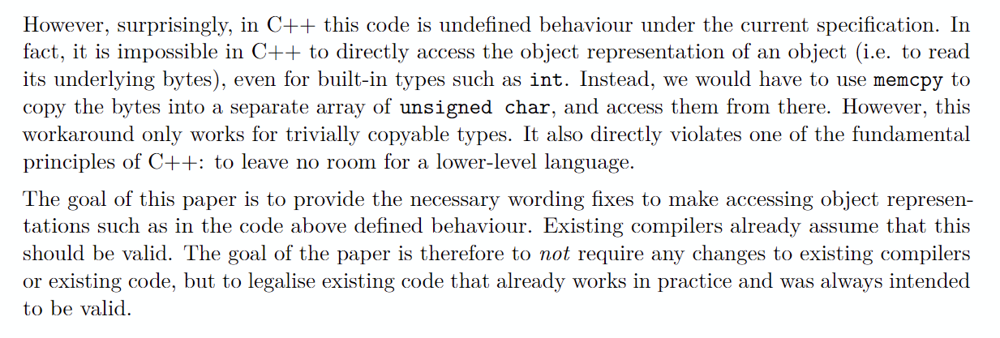
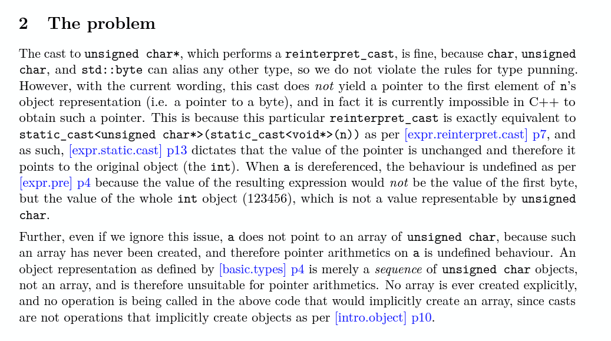

Current issues 

 https://cplusplus.github.io/CWG/issues/1997.html 
At present placement new is not clear on wheather the storages bits been carried over!


https://www.open-std.org/jtc1/sc22/wg21/docs/cwg_active.html#1027


https://cplusplus.github.io/CWG/issues/2551.html

https://cplusplus.github.io/CWG/issues/793.html


 --EXISTING C++ ISUE (CWG 2115) --------->
Basically it is not established wheather destructors for automatic variables at the end of block or memory (trivial types) for them is going to be released first. Because trivally destructible types dont need destructor to be run
--------------
The relative ordering between destruction of automatic variables on exit from a block and the release of the variables storage is not specified by the Standard: are all the destructors executed first and then the storage released, or are they interleaved?

Notes from the February, 2016 meeting:

CWG agreed that the storage should persist until all destructions are complete, although the “as-if” rule would allow for unobservable optimizations of this ordering.
<-----------------


This means it is entirely possible for the code to work, for n to outlive a. But it is unspecified whether it does work.


# problems

## creation 
not clear when objects are created. clearlying name, type and storage duration are properties of ojects at creation, but is storage itself a requirenment for object to be created? does object creation comes before the re-use in placement new?

the following from https://eel.is/c++draft/expr.new#nt:noptr-new-declarator suggest that "obtaining storage" does create the obect as well!
[Note 11: When the allocation function returns a value other than null, it must be a pointer to a block of storage in which space for the object has been reserved. The block of storage is assumed to be appropriately aligned ([basic.align]) and of the requested size. The address of the created object will not necessarily be the same as that of the block if the object is an array. — end note]

The invocation of the allocation function is sequenced before the evaluations of expressions in the new-initializer. Initialization of the allocated object is sequenced before the value computation of the new-expression.


I think a lot of it comes
down to when exactly the new object is *created*, which is the precise operation
that [basic.life]/8 cares about. One possible interpretation can be derived from
the wording of [intro.object]/10, where implicitly creating objects "creates and
starts the lifetime" of those objects. If "starting the lifetime" of an object
includes obtaining its storage per [basic.life]/(1.1), then this implies that
creating an object occurs *before* obtaining its storage. Thus, under this
reading, there is no contradiction in [basic.life]/8, since the storage hasn't
yet been reused at the point when the new object is created.

However, this is not as clear-cut for other methods of creating an object. For
instance, it is very clear that new-expressions obtain storage ([basic.life]/1)
and initialize the object ([expr.new]/21) only after the allocation function
returns. But at what point does it create the object? The standard appears to be
completely silent on this question. It would definitely be nice of the timing of
object creation could be clarified in general.

## destroyed
how is that defined?


# type

Objects, references, functions including function template specializations, and expressions have a property called type, which both restricts the operations that are permitted for those entities and provides semantic meaning to the otherwise generic sequences of bits.


# object access


If a program attempts to access the stored value of an object through a glvalue whose type is not similar to one of the following types the behavior is undefined:48

(11.1) the dynamic type of the object,

(11.2) a type that is the signed or unsigned type corresponding to the dynamic type of the object, or

(11.3) a char, unsigned char, or std​::​byte type.

If a program invokes a defaulted copy/move constructor or copy/move assignment operator for a union of type U with a glvalue argument that does not denote an object of type cv U within its lifetime, the behavior is undefined.

[Note 10: Unlike in C, C++ has no accesses of class type. — end note]   ####################### basically works only on scalars!!!!!!!!!!!!!!


[defns.access]: [..] [Note 1: Only objects of scalar type can be accessed. Reads of scalar objects are described in [conv.lval] and modifications of scalar objects are describred in [expr.ass], [expr.post.incr], and [expr.pre.incr]. Attempts to read or modify an object of class type typically invoke a constructor or assignment operator; such invocations do not themselves constitute accesses, although they may involve accesses of scalar subobjects. — end note]


## right now undefined behaviour in the standard to read 






# typeid

typeid ( type )	(1)	
typeid ( expression )	(2)	

Return value: const std::type_info&

```
const std::type_info& ti1 = typeid(A);
const std::type_info& ti2 = typeid(A); 
assert(&ti1 == &ti2); // not guaranteed
assert(ti1 == ti2); // guaranteed


assert(ti1.hash_code() == ti2.hash_code()); // guaranteed
assert(std::type_index(ti1) == std::type_index(ti2)); // guaranteed

```


- If type is a reference type, the result refers to a std::type_info object representing the cv-unqualified version of the referenced type.
- When applied to an expression of polymorphic type, evaluation of a typeid expression may involve runtime overhead (a virtual table lookup), otherwise typeid expression is resolved at compile tim

program needs to use -rdynamic flag in order for this to work cross libraries (but looks like it won't work with libc++).

# Memory model

The fundamental storage unit in the C++ memory model is the byte
The least significant bit is called the low-order bit; the most significant bit is called the high-order bit. The memory available to a C++ program consists of one or more sequences of contiguous bytes. Every byte has a unique address


There are few terms describing memory model:
- address 
- pointer value 
- integer represetning pointer value - typically type uintptr_t
- memory location


A memory location is either an object of scalar type that is not a bit-field or a maximal sequence of adjacent bit-fields all having nonzero width. It is NOT address as it is more logical concept! Just been a locatoin that complier will allow concurrent access to!

An object of trivially copyable or standard-layout type ([basic.types]) shall occupy contiguous bytes of storage

## pointer

---->some pointer values to represent the address, but not much is said about the details of that -------
A value of a pointer type that is a pointer to or past the end of an object represents the address of the first byte in memory ([intro.memory]) occupied by the object34 or the first byte in memory after the end of the storage occupied by the object, respectively.
[Note 2: A pointer past the end of an object ([expr.add]) is not considered to point to an unrelated object of the object's type, even if the unrelated object is located at that address. A pointer value becomes invalid when the storage it denotes reaches the end of its storage duration; see [basic.stc]. — end note]


      [(1)A value of a pointer type that is a pointer *to*] or [(2)past the end of an object represents] 
      [(1) the address of the first byte in memory ([intro.memory]) occupied by the object35 ] or [(2) the first byte in memory (for arrays) after the end of the storage occupied by the object, respectively].  The value representations of pointers to objects and invalid pointers may overlap

      Every *logical value* of pointer type is one of the following:

      - a pointer to an object or function (in which case the pointer is said to point to the object or function), or(for all objects: many *logical values*, many *value representations* as well)
      - a pointer past the end of an object, or
      - the null pointer value for that type, (for all objects : one *logical value* , not sure about one representation as technically you cannot reintepret_cast between diffrent types of null pointer values)
      - an invalid pointer value. (for all objects: one *logical value*, many value representations)

      IMPORTANT ->>>> pointers point to OBJECTS not to ADDRESSES, but they do represent addresses which matters for COMPARISONS!

      ------------>pointer comparison<----
  If at least one of the operands is a pointer, pointer conversions, function pointer conversions, ***and qualification conversions are performed on both operands to bring them to their composite pointer type***. Comparing pointers is defined as follows:
  (3.1)If one pointer represents the address of a complete object, and another pointer represents the address one past the last element of a different complete object,70 the result of the comparison is unspecified.
  (3.2)Otherwise, if the pointers are both null, both point to the same function, or both represent the same address, they compare equal.
  (3.3)Otherwise, the pointers compare unequal.

      ```
      struct B{int i;}; struct B1{int b;} struct D : B, B1 {}
      D* d = D;
      B1* b = d;
      if (b == d) //will always be true even though addresses are diffrent becasue d gets converted into B1 before comparing equal!

    void *other = b;
    D *dptr2 = static_cast<D *>(other);
    if (dptr2 == b) //will always be false as pointer comparison is based on addresses

      ```


    The type of a pointer to cv void or a pointer to an object type is called an object pointer type.

    [Note 1: A pointer to void does not have a pointer-to-object type, however, because void is not an object type. — end note]
    The type of a pointer that can designate a function is called a function pointer type. A pointer to an object of type T is referred to as a *pointer to T*.
    [Example 1: A pointer to an object of type int is referred to as *pointer to int* and a pointer to an object of class X is called a *pointer to X*. — end example]


      In general, pointer is a type of a variable that stores a link to another object. In C and C++, the link is the address of that object in the program memory. Pointers allow to refer to the same object from multiple locations of the source code without copying the object. Also, the same pointer variable may refer to different objects during its lifetime.


      The inability to compare two addresses of two discrete objects is down to only one thing: The anachronistic and now utterly irrelevant segmented memory architecture of the 8086. std::less shall offer total order though, while < operator will not.


      A prvalue of type “pointer to cv T”, where T is an object type, can be converted to a prvalue of type “pointer to cv void”. The pointer value ([basic.compound]) is unchanged by this conversio


      - the same pointer may have multiple integer representations
      - an array is not pointer-interconvertible with the first element


      C++, a pointer doesnt point to a memory location, it points to a designated object: pointers are high level types, not low level addresses as in assembly. Pointing to an object is not the same to pointing to a different object at the exact same address


      A pointer to void may be converted to or from a pointer to any object type. A pointer to any object type may be converted to a pointer to void and back again; the result shall compare equal to the original pointe
      
      A null pointer constant is an integer literal ([lex.icon]) with value zero or a prvalue of type std​::​nullptr_t. A null pointer constant can be converted to a pointer type; the result is the null pointer value of that type ([basic.compound]) and is distinguishable from every other value of object pointer or function pointer type. Such a conversion is called a null pointer conversion. Two null pointer values of the same type shall compare equal. The conversion of a null pointer constant to a pointer to cv-qualified type is a single conversion, and not the sequence of a pointer conversion followed by a qualification conversion ([conv.qual]). A null pointer constant of integral type can be converted to a prvalue of type std​::​nullptr_t.
      [Note 1: The resulting prvalue is not a null pointer value. — end note]


      The address of the whole array, and the address of the first element, are defined to be the same, since arrays in C++ (and C) have no intrinsic padding besides that of the constituent objects


      As far as C++ is concerned, pointers are not integers; theyre just pointers. You can use casts to convert between pointer values and integer values, and the result should be meaningful in terms of the underlying machines memory model, but not much is guaranteed about the results. You can perform arithmetic on pointers, but on the language level thats not at all the same thing as integer arithmetic (though its probably implemented as scaled integer arithmetic on the machine level).

      -------------------------

      std::has_unique_object_representations
      checks if the two object with the same values also got the same object representation. Note that they must not have padding bits basically or in case of flaot/double to give diffrent object representation for the same value!

      --------------------------------------------

      Usually, value representation determines the value of an object. Meaning, that if you change the value, it’s value representation changes as well. Pointers are an exception to that rule! You can change the value without changing its value representation. For example:
      X* p = new X;
      Y* y = reintrepret_cast<Y*>(p); // here value changed and p is now points to an object of Y, however it's value representation is totally unchanged - bits that make up pointer value; y is invalid pointer;


      Most (but not all) usual
      operations require that the dynamic type of the pointee actually
      matches the type of the pointer.

      (*E1).E2

      If E2 is a non-static member and the result of E1 is an object whose type is not similar ([conv.qual]) to the type of E1, the behavior is undefined.
      [Example 1:
      struct A { int i; };
      struct B { int j; };
      struct D : A, B {};
      void f() {
        D d;
        static_cast<B&>(d).j;             // OK, object expression designates the B subobject of d
        reinterpret_cast<B&>(d).j;        // undefined behavior
      }
      — end example]

      ------------------------------

     

      Note that two pointers that represent the same address may nonetheless have different values.

      ```
      struct C
      {
          int x, y;
      } c;
      
      int* px = &c.x;   // value of px is "pointer to c.x"
      int* pxe= px + 1; // value of pxe is "pointer past the end of c.x"
      int* py = &c.y;   // value of py is "pointer to c.y"
      
      assert(pxe == py); // == tests if two pointers represent the same address
                        // may or may not fire

      ```

      Another example is array. The first member of array may have diffrent pointer value compared to the pointer to array. Generally pointer-interconvertible define if pointer values are the same.

      ```
      int a[4] = {1, 2, 3, 4};
      void* p1 = &a;
      void* p2 = &a[0];

      assert((int*)p1 == (int*)p2 ) // MAY FAIL!

          int i[100]{0};
          int (*i2) [100] = &i;   /ok 
          int * p2 = std::launder(reinterpret_cast<int*>(i2)); /ok . the whole point of laudner is to convert pointers between objects which are not pointer-interconvertible
      ```


      An lvalue or rvalue of type “array of N T” or “array of unknown bound of T” can be converted to a prvalue of type “pointer to T”. The temporary materialization conversion ([conv.rval]) is applied. The result is a pointer to the first element of the array

      An object of array type contains a contiguously allocated non-empty set of N subobjects of type T

      Pointers of every type have a special value known as null pointer value of that type. A pointer whose value is null does not point to an object or a function (the behavior of dereferencing a null pointer is undefined), and compares equal to all pointers of the same type whose value is also null

      Pointer to object of any type can be implicitly converted to pointer to void (optionally cv-qualified); the pointer value is unchanged. The reverse conversion, which requires static_cast or explicit cast, yields the original pointer value

      there are no pointers to references and there are no pointers to bit-fields
      standard does not require that pointers are directly related to memory addresses

      You access it as float and after that as double for example. But that is not allowed. That is a strict aliasing violation. You may only access the objects through a typed pointer if an object of that type is currently alive at this address. And to make sure that things are alive, you need to construct them (even if the constructor is no-op)


      A null pointer constant is an integer literal ([lex.icon]) with value zero or a prvalue of type std​::​nullptr_t. A null pointer constant can be converted to a pointer type; the result is the null pointer value of that type ([basic.compound]) and is distinguishable from every other value of object pointer or function pointer type. Such a conversion is called a null pointer conversion. Two null pointer values of the same type shall compare equal. The conversion of a null pointer constant to a pointer to cv-qualified type is a single conversion, and not the sequence of a pointer conversion followed by a qualification conversion ([conv.qual]). A null pointer constant of integral type can be converted to a prvalue of type std​::​nullptr_t.
      [Note 1: The resulting prvalue is not a null pointer value. — end note]
      2
      #
      <----- IMPORTANT, this how static_cast works from T* to void* which basiscally does not change the pointer value ---->>>>>
      A prvalue of type “pointer to cv T”, where T is an object type, can be converted to a prvalue of type “pointer to cv void”. The pointer value ([basic.compound]) is unchanged by this conversion.
      3
      #
      A prvalue of type “pointer to cv D”, where D is a complete class type, can be converted to a prvalue of type “pointer to cv B”, where B is a base class ([class.derived]) of D. If B is an inaccessible ([class.access]) or ambiguous ([class.member.lookup]) base class of D, a program that necessitates this conversion is ill-formed. The result of the conversion is a pointer to the base class subobject of the derived class object. The null pointer value is converted to the null pointer value of the destination type.
at, i may no longer use the int pointer to access the int (because there is no int ali


--------------------- 

Aliasing is all about lifetimes. If i place an int into the storage, i may access it through an int pointer. If i place a float afterwards, i may access the storage trough a float pointer. As soon as i place the flove)

(new in c++11)
{
  A memory location is either an object of scalar type that is not a bit-field or a maximal sequence of adjacent bit-fields all having nonzero width.
  [Note 2: Various features of the language, such as references and virtual functions, might involve additional memory locations that are not accessible to programs but are managed by the implementation. — end note]


  Two or more threads of execution can access separate memory locations without interfering with each other.
  4
  
  [Note 3: Thus a bit-field and an adjacent non-bit-field are in separate memory locations, and therefore can be concurrently updated by two threads of execution without interference. The same applies to two bit-fields, if one is declared inside a nested struct declaration and the other is not, or if the two are separated by a zero-length bit-field declaration, or if they are separated by a non-bit-field declaration. It is not safe to concurrently update two bit-fields in the same struct if all fields between them are also bit-fields of nonzero width. — end note]
}

this is now invalid in C++20 as calling destructors on non-class types ends their lifetimes!
```
constexpr int f() {
  int a = 123;
  using T = int;
  a.~T();
  return a;  // undefined behavior; previously returned 123
}
static_assert(f() == 123);  // ill-formed; previously valid


union U {
  int n;
  float f;
};
float pun(int n) {
  U u = {.n = n};
  U u2 = u;    // #1
  return u2.f; // #2 ill formred as active member is n
}


float do_bad_things(int n) {
  alignof(int) alignof(float)
  unsigned  char buffer[max(sizeof(int), sizeof(float))];
  *(int*)buffer = n;      // #1
  new (buffer) std::byte[sizeof(buffer)];
  return (*float*)buffer; // #2 //undefined behaviour because the lifetime of int ended and float contains intermediate value! otherwise it is valid since std::byte buffer would create an implicit object and using C-style cast would have been fine
}
```
## address

 The trick is that you can't take the address of something without a name (an rvalue). But by binding that temporary to a reference, you've given it a name (recall that a reference is just another name for an object) and so you're allowed to take its **address**

## [[no_unique_addresss]]

Two objects with overlapping lifetimes that are not bit-fields may have the same address if one is nested within the other, or if at least one is a subobject of zero size and they are of different types; otherwise, they have distinct addresses and occupy disjoint bytes of storage

## fancy pointer

Fancy pointers
When the member type pointer is not a raw pointer type, it is commonly referred to as a "fancy pointer". Such pointers were introduced to support segmented memory architectures and are used today to access objects allocated in address spaces that differ from the homogeneous virtual address space that is accessed by raw pointers. An example of a fancy pointer is the mapping address-independent pointer boost::interprocess::offset_ptr, which makes it possible to allocate node-based data structures such as std::set in shared memory and memory mapped files mapped in different addresses in every process. Fancy pointers can be used independently of the allocator that provided them, through the class template std::pointer_traits (since C++11). The function std::to_address can be used to obtain a raw pointer from a fancy pointer. (since C++20)

https://www.open-std.org/jtc1/sc22/wg21/docs/papers/2017/p0653r2.html


It is often necessary to obtain a raw pointer from an object of any pointer-like type. One common use is writing allocator-aware code where an allocator's pointer member type is not a raw pointer type.

Typically the expression addressof(*p) is used but this is not well-defined when p does not reference storage that has an object constructed in it. This means that using this expression to obtain a raw pointer for the purpose of constructing an object (e.g. via a placement new-expression or via an allocator) is incorrect.

A common example of such code:

auto p = a.allocate(1);
std::allocator_traits<A>::construct(a, std::addressof(*p), v);
The correct code now looks like:

auto p = a.allocate(1);
std::allocator_traits<A>::construct(a, std::to_address(p), v);
To customize the behavior of this function for a pointer-like type, users can specialize pointer_traits for that type and define member function to_address accordingly.

Existing practice
Typically implementors work around this problem by defining a utility like the following:

template <class Ptr>
auto to_address(const Ptr& p) noexcept
{
  return to_address(p.operator->());
}

template <class T>
T* to_address(T* p) noexcept
{
  return p;
}
This proposal provides a standard library solution, with an optional customization point.


## launder

      When reusing storage denoted by some pointer value p, launder(reinterpret_cast<T*>(new (p) byte[n * sizeof(T)])) can be used to implicitly create a suitable array object and obtain a pointer to it. It is not fully clear if the pointer to array or its first element is returned as the standard clearly does not specify this to choose it based on what would make the program behaviour defined.

      The reinterpret_cast gets you a pointer that has the "wrong" value (but represents the "right" address); the launder can be used to attempt to recover the "right" value.  but not all "right" values are recoverable because we dont want to outlaw optimizers.

      When storage for an object with automatic or dynamic storage duration is obtained, the object has an indeterminate value, and if no initialization is performed for the object, that object retains an indeterminate value until that value is replaced ([expr.ass]).
      [Note 1: Objects with static or thread storage duration are zero-initialized, see [basic.start.static]. — end note]


      std::launder has no effect on its argument. Its return value must be used to access the object. Thus, its always an error to discard the return value.
      Typical uses of std::launder include:
      - Obtaining a pointer to an object created in the storage of an existing object of the same type, where pointers to the old object cannot be reused (for instance, because either object is a base class subobject);
      - Obtaining a pointer to an object created by placement new from a pointer to an object providing storage for that object.

    A byte of storage b is reachable through a pointer value that points to an object x if there is an object y, pointer-interconvertible with x, such that b is within the storage occupied by y, or the immediately-enclosing array object if y is an array element


      the point is that  you have to pass to std::launder a pointer that represent the address of a real object that is within its lifetime!

      launder(reinterpret_­cast<T*>(new (p) byte[n * sizeof(T)])) 
      Which basically implies that the idea is to make the syntax (T*)malloc(...) and (T*)(::operator new(... ) ) (and similar cases) valid for subsequent pointer arithmeti
      Although correct format should be -> launder(reinterpret_­cast<T(*)[n]>(new (p) byte[n * sizeof(T)])) - coorect way to get array out of allocation! 
      becuase launder requires the object to start its lifetime

      The only case that left, where we still need to use std::launder tool is when we know there is a pointer of one type, and you know that under its address there, in fact, lives object of a different type


      reinterpret_cast cannot change "pointer value" apart from pointer-interconvertible types, but combined with std::launder, that is possible in some circumstances.

        For example, while array pointer and its first element are not pointer-interconvertible, std::launder can make the same effect as long as the result of std::launder cannot reach "bytes" not accessible to the source pointer.

        this example is OK to me, and you can use a_array_ptr and a_ptr to access A as data
            int a[5];
            int(*a_array_ptr)[5] = std::launder(reinterpret_cast<int(*)[5]>(&a[0]));
            int* a_ptr = std::launder(reinterpret_cast<int*>(&a));
        
        Formally, std::launder does impose some reachability requirements. And Id keep storages reachable through result and source as two separate entities and dont try merging them with reachability requirements as that would make it look like std::launder only works with pointer-interconvertible pointers.
        All bytes of storage that would be reachable through ([basic.compound]) the result are reachable through p.

        Now reachability requirements are these:
        A byte of storage b is reachable through a pointer value that points to an object x if there is an object y, pointer-interconvertible with x, such that b is within the storage occupied by y, or the immediately-enclosing array object if y is an array element.
        
        

        For example, lets try to substitute that reachability requirements for our example int(*a_array_ptr)[5] = std::launder(reinterpret_cast<int(*)[5]>(&a[0]));
        
        -------------------  
        For source pointer:
        ------------------

        A byte of storage "int c" is reachable through a  "pointer to first element of array a" that points to an object a[0] if there is an object a[0], pointer-interconvertible with a[0], such that storage "int a[5]" is within  the immediately-enclosing array object ******a[5]******* if a[0] is an array element.

        -------------------  
        For result pointer:
        -------------------
        A byte of storage "int a[5]" is reachable through a pointer "a_array_ptr" that points to an object "a" if there is an object "a", pointer-interconvertible with "a", such that storage "int a[5]" is within the storage occupied by "a" (storage "int a[5]" itself)
        
        
        Note in both I use storage "int a[5]" as a proof that the result pointer does not access more "bytes" in a defined way than the source pointer.
        
        
        Even more, I reckon that with the similar reasoning the following code is valid as well
        
        Precondition: T1 and T2 got the same size of alignment  
        T1 storage;
        T2 *ptr_ = ::new (&storage_) T2;
        T2* ptr2 = std::launder(reinterpret_cast<T2 *>(&storage_))
        ptr2->.....


          // Case 2: access to a new object whose storage is provided
          // by a byte array through a pointer to the array.
          struct Y { int z; };
          alignas(Y) std::byte s[sizeof(Y)];
          Y* q = new(&s) Y{2};
          const int f = reinterpret_cast<Y*>(&s)->z; // Class member access is undefined
                                                    // behavior: reinterpret_cast<Y*>(&s)
                                                    // has value "pointer to s" and does
                                                    // not point to a Y object (needs launder)

      int x[10];
      auto p = std::launder(reinterpret_cast<int(*)[10]>(&x[0])); // OK
      
      int x2[2][10];
      auto p2 = std::launder(reinterpret_cast<int(*)[10]>(&x2[0][0]));
      // Undefined behavior: x2[1] would be reachable through the resulting pointer to x2[0]
      // but is not reachable from the source


      struct A { int x; int y};
      int* p = &(arr[1]);
      new (&arr) A;
      *p = 0; //UB now in C++20 because while y and p are not transparently replacable, that is not the case for arr and A as both p and y are technically subobjects and in that case complete objects must be transparently replaceble as well!

# Helpfull utilities

##  addressof

```
template< class T >
T* addressof( T& arg ) noexcept;
```

Obtains the actual address of the object or function arg, even in presence of overloaded operator&
The expression std::addressof(e) is a constant subexpression, if e is an lvalue constant subexpression

## std::pointer_traits

The pointer_traits class template provides the standardized way to access certain properties of pointer-like types (fancy pointers, such as boost::interprocess::offset_ptr). The standard template std::allocator_traits relies on pointer_traits to determine the defaults for various typedefs required by Allocator.

https://www.open-std.org/jtc1/sc22/wg21/docs/papers/2017/p0653r2.html

## construct_at

template< class T, class... Args >
constexpr T* construct_at( T* p, Args&&... args );

Creates a T object initialized with arguments args... at given address p. Specialization of this function template participates in overload resolution only if ::new(std::declval<void*>()) T(std::declval<Args>()...) is well-formed in an unevaluated context.

Equivalent to, but also can be used in constexpr

```
::new (const_cast<void*>(static_cast<const volatile void*>(p)))
    T(std::forward<Args>(args)...);
```

The reason to "const volatile" added it to be able to work for any pointer includin this one!

```
const foo * ptr = get_mem();
ptr = std::construct_at(ptr); 
```

## mempcy

```
void* memcpy( void* dest, const void* src, std::size_t count );
```


     WARNING !!!! *If the objects are potentially-overlapping or not TriviallyCopyable, the behavior of memcpy is not specified and may be undefined.*

IMPORTANT **note that it may not copy padding bits! as that is is unspecified!**
IMPORTANT **source and destination may not OVERLAP**


int32_t x_representation;
std::memcpy(&x_representation, &x, sizeof(x));
 
Implementations now generally outlaw using reinterpret_cast to violate strict aliasing, but allow representation casting to be done via unions.  But even that is an extension, and according to a strict reading of the standard it is UB.  I think that this is exactly the kind of thing that should have "implementation-defined" behavior rather than be UB.  The difference is that usually implementation-defined behavior has bounds to how wild implementations can go, for example: "the resulting value is implementation-defined" vs. "is UB".  It puts boundaries on how non-portable this code is.

Permitting aliasing via unions would wreck performance, as you would never know when two objects of completely different types might alias. The C union visibilrwise be modified by the user, so the compiler can, with this constraint on memcpy, make assumptions about them (e.g. that thity rule is highly controversial even within the C community; see e.g. https://gcc.gnu.org/bugzilla/show_bug.cgi?id=65892


static_cast<Base&>(d) obtains a potentially overlapping subobject, because every base subobject is a potentially overlapping subobject. It's then not permitted to use raw memory access to the underlying representation, as memcpy. The concept of "potentially overlapping subobject" is not with reference to another object. It's an absolute concept

Before the standard did allow copying of POD bases through memcpy , and to not break ABI right now compliers still don't re-use padding bits for PODs.


The padding bytes aren't part of the value representation of the independent target object, so its value can't be affected. However, the padding bytes in the independent target object can not otheey are always zero if the object doesn't have an indeterminate value). If you drop this constraint then such assumptions won't hold anymore

For any object (other than a potentially-overlapping subobject) of trivially copyable type T, whether or not the object holds a valid value of type T, the underlying bytes ([intro.memory]) making up the object can be copied into an array of char, unsigned char, or std​::​byte ([cstddef.syn]).36 If the content of that array is copied back into the object, the object shall subsequently hold its original value.

the standard is very strict about as basically it renders the following code invalid even though you only copy potentialy overlapping suboject to NON overlalping subobject, but the complier probably wants to make sure Base& does not poin to the derived class....

```
   class Base { int i; };
    class Derived : public Base { int d; };
    
   void copy_base(const Base &src, Base &dest) {
      memcpy((void *)&dest, (const void *)&src, sizeof(Base));//UNDEFINED BEHAVIOUR, THE STANDARD FORBITS COPYING POTENTIALLY OVERLAPPONG SUBOBJECT
   }
    
    int main() {
       Derived d;
       Base copy;
       copy_base(static_cast<Base&>(d), copy);
       return 0;
    }
  ```


  he padding bytes aren't part of the value representation of the independent target object, so its value can't be affected. However, the padding bytes in the independent target object can not otherwise be modified by the user, so the compiler can, with this constraint on memcpy, make assumptions about them (e.g. that they are always zero if the object doesn't have an indeterminate value). If you drop this constraint then such assumptions won't hold anymore
  

# implicit objects creation

# construction

An object whose initialization has completed is deemed to be constructed, even if the object is of non-class type or no constructor of the object's class is invoked for the initialization. [Note 9: Such an object might have been value-initialized or initialized by aggregate initialization ([dcl.init.aggr]) or by an inherited constructor ([class.inhctor.init]). — end note]

# non trival types

The std::memcpy itself is perfectly well-defined (all it does is copy the
source to the destination as an unsigned char array); it simply fails to
implicitly create an std::string at the fields address, or an s that can
be laundered

struct s{
 int a;
 std::string str;
 };
>
// is an aggregate according to [dcl.init.aggr] and thus eligible for
// implicit lifetime

 const s v = s{1, "a very long string to avoid SSO"};
 unsigned char buffer[sizeof(s)];
 std::memcpy(buffer, &v, sizeof(s)); //OK
 s* v2 = std::launder(reinterpret_cast<s*>(buffer)); //UB, s cannot be laundered 
 v2->str[0] = 'a'; //UB, v2 is invalid pointer!

## from array of byte or unsigned char

      std::memcpy does do something special, in that it implicitly creates objects
      in its destination region ([cstring.syn] p3). Since 'buffer' is a char array
      instead of an unsigned char array, it cannot provide storage for any created
      objects, and starting the lifetime of an int object would end the lifetime
      of the char array object. However, this does not prevent laundering its
      pointer as an int pointer (as below), since a declared object with automatic
      storage duration only has to live to the end of its block if its type has a
      non-trivial destructor ([basic.life] p9).

      As language.lawyer points out, the snippet as written results in UB,
      regardless of whether 'buffer' is a char or unsigned char array. The
      lifetime of an int object can be started at the first address, but 'buffer'
      (after an array-to-pointer conversion) still points to the first char
      object in the array, rather than the int object. Since char is not similar
      to int, 'j' still points to the first char object after the reinterpret_cast
      ([expr.static.cast] p14), and reading an int from it is UB
      ([basic.lval] p11).

      To access the created int object, we would have to use std::launder:

```
      int i = 42;
      alignas(int) unsigned char buffer[sizeof(int)];
      void* newJ = std::memcpy(buffer, &i, sizeof(int)); //remeber that mempcy would create an implicty object so that newJ would point to it!
      int* j = std::launder(reinterpret_cast<int*>(buffer)); #1 ok
      int * j  = reintepret_cast<int*>(newJ); //#2 ok
      reintepret_cast<int*>(buffer) = 30; //#3 UB as buffer points to char[];

      alignas(int) char/float buffer2[sizeof(int)];  //--->>>not providing storage so creating anything there would end buffer2's lifetime<---- ONLY unsigned char / std::byte provide storage!
      void* newJ = std::memcpy(buffer2, &i, sizeof(int)); 
      *newJ; //valid!
      reintepret_cast<int*>(buffer2) = 30; //#3 UB as buffer2 lifetime is over!
      int* j = std::launder(reinterpret_cast<int*>(buffe2r)); #1 ok
```

 ## multiple objects possible!

  #include <cstdlib>
struct X { int a, b; };
X *make_x() {
  // The call to std::malloc implicitly creates an object of type X
  // and its subobjects a and b, and returns a pointer to that X object
  // (or an object that is pointer-interconvertible ([basic.compound]) with it),
  // in order to give the subsequent class member access operations
  // defined behavior.
  X *p = (X*)std::malloc(sizeof(struct X) * 2); // me: added the *2
  p->a = 1;
  p->b = 2;
  return p;
}
Previously, there was only one set of valid objects that could be created implicitly in that storage - it had to be exactly one X. But now, we have storage for two Xs, but only write to one of them, and nothing in this program ever touches the rest of the bytes. So there are many different sets of objects that could be implicitly created - maybe two Xs, maybe an X and two ints, maybe an X and eight chars, ...

Its not observable which set is created, because if there were any actual observations, that would reduce the possibilities to only those sets which were valid. If we did something like p[1]->a = 3 then the universe of possibilities collapses down to just the one with two Xs.

In other words, multiple sets of implicitly-created-objects are possibly only when there arent enough observations in the program to distinguish their validity. If there were a way to distinguish, then by definition, they wouldnt all be valid

## pointers to the implicitly created objects

Further, after implicitly creating objects within a specified region of storage, some operations are described as producing a pointer to a suitable created object. These operations select one of the implicitly-created objects whose address is the address of the start of the region of storage, and produce a pointer value that points to that object, if that value would result in the program having defined behavior. If no such pointer value would give the program defined behavior, the behavior of the program is undefined. If multiple such pointer values would give the program defined behavior, it is unspecified which such pointer value is produced.
12

[Example 3: 
#include <cstdlib>
struct X { int a, b; };
X *make_x() {
  // The call to std​::​malloc implicitly creates an object of type X
  // and its subobjects a and b, and returns a pointer to that X object
  // (or an object that is pointer-interconvertible ([basic.compound]) with it),
  // in order to give the subsequent class member access operations
  // defined behavior.
  X *p = (X*)std::malloc(sizeof(struct X));
  p->a = 1;
  p->b = 2;
  return p;

# std::initializer_list

internally it storts const T objects and when it is passed to a function the variables are first copied to the stack before been copied to the called function!

# objects partial re-use

partial reuse of the object kills the host object, but not all of its subojects! only those re-used!
struct A { int y; int x; };
void f() {
  A a;
  int &r = a.y;
  static_assert(sizeof(int) == sizeof(float));
  new (&a.x) float; // by [basic.life], this ends the lifetime of a.x and the lifetime of a, but not the lifetime of a.y, because it reuses the storage of a and of a.x to create an object that is nested within neither of them
  r = 1; // There are open defects in relation to this topic. For example, when the lifetime of o ends the lifetime of o.a should also end, but nothing seems to specify this currently. Presumably a subobject shouldn't stop being a subobject, although I wouldn't be surprised if there are uses of "subobject" in the standard that should refer to alive subobjects. I don't know if there's a clause in the standard that says a subobject's lifetime is bounded by the lifetime of the complete object which contains it. Such a thing ought to be part of the definition of "subobject". Because the Standard doesn't define what happens to a subobject when a different part of the storage of its complete object is reused, it falls into "Undefined Behavior by omission"

  a.y = 4; //UB, because gvalue is used  for object which lifetime ended, but storage was not yet re-used!
}

    ----------------------------------------------------
  int main()
  {
      alignas(std::complex<float>) unsigned char network_data[sizeof(std::complex<float>)]{
          0xcd, 0xcc, 0xcc, 0x3d, 0xcd, 0xcc, 0x4c, 0x3e
      };
  
  //  auto d = *reinterpret_cast<std::complex<float>*>(network_data);
  //  std::cout << d << '\n'; // UB: network_data does not point to a complex<float>
  
  //  auto d = std::launder(reinterpret_cast<std::complex<float>*>(network_data));
  //  std::cout << d << '\n'; // Possible UB, related to CWG1997:
  //      the implicitly created complex<float> may hold indeterminate value
  
      auto d = *std::start_lifetime_as<std::complex<float>>(network_data);
      std::cout << d << '\n'; // OK
  }


std::launder` does not work if there isn't a `T` there. So I don't
know what you mean by "a pointer to storage" (though C++20's implicit
object creation can make `launder` work for that case, but it would do
so for a `reinterpret_cast` too).


# Object model

The constructs in a C++ program create, destroy, refer to, access, and manipulate objects. An object is created by a definition, by a new-expression ([expr.new]), by an operation that implicitly creates objects (see below), when implicitly changing the active member of a union, or when a temporary object is created ([conv.rval], [class.temporary]). An object occupies a region of storage in its period of construction ([class.cdtor]), throughout its lifetime, and in its period of destruction ([class.cdtor]).
[Note 1: A function is not an object, regardless of whether or not it occupies storage in the way that objects do. — end note]
The properties of an object are determined when the object is created. 
- An object can have a name ([basic.pre]).
- An object has a storage duration ([basic.stc]) which influences its lifetime ([basic.life]). 
- An object has a type ([basic.types]).
[Note 2: Some objects are polymorphic ([class.virtual]); the implementation generates information associated with each such object that makes it possible to determine that objects type during program execution. — end note]


new (this) C(other); - > new object C is created, than new object reuses storage for the old object---> not clear when lifetins of the old object ends

Objects can contain other objects, called subobjects. A subobject can be a member subobject ([class.mem]), a base class subobject ([class.derived]), or an array element. An object that is not a subobject of any other object is called a complete object. If an object is created in storage associated with a member subobject or array element e (which may or may not be within its lifetime), the created object is a subobject of e containing object if:
(2.1) the lifetime of e containing object has begun and not ended, and
(2.2) the storage for the new object exactly overlays the storage location associated with e, and
(2.3) the new object is of the same type as e (ignoring cv-qualification).
------->IMPORTANT<---- NOTE THAT IT DOES NOT LIST BASE CLASS SUBOBJECT ABOVE, REPLACING WHICH WOULD END THE LIFETIME OF THE CONTAINING OBJECT <-----> 

<----->IMPORTANT <----->
 I interpret it to say that the subobject property is determined at creation by the listed rules, not that at any given point in time the subobject property is determined according to the listed rules

! Generaly speaking the properties of the object are determined when it is created!


for an object of a scalar type, its lifetime only ends when the storage is reused or released 

```
struct A {
    T t /*initializer*/;
    U* u;

    A() {
        t.~T(); 
        u = ::new(static_cast<void*>(&t)) U /*initializer*/; 
      //u does not point to suboject because lifetime of A has not started yet!
    }
```


If a complete object is created ([expr.new]) in storage associated with another object e of type “array of N unsigned char” or of type “array of N std​::​byte” ([cstddef.syn]), that array provides storage for the created object if:
(3.1) the lifetime of e has begun and not ended, and
(3.2) the storage for the new object fits entirely within e, and
(3.3) there is no array object that satisfies these constraints nested within e.
[Note 3: If that portion of the array previously provided storage for another object, the lifetime of that object ends because its storage was reused ([basic.life]). — end note]


An object of trivially copyable or standard-layout type ([basic.types.general]) shall occupy contiguous bytes of storage

Unless an object is a bit-field or a subobject of zero size, the address of that object is the address of the first byte it occupies. Two objects with overlapping lifetimes that are not bit-fields may have the same address if one is nested within the other, or if at least one is a subobject of zero size and they are of different types; otherwise, they have distinct addresses and occupy disjoint bytes of storage.22
[Example 2:
static const char test1 = 'x';
static const char test2 = 'x';
const bool b = &test1 != &test2; 

!IMPORTANT: BUT NOTE THAT -------->


Two types cv1 T1 and cv2 T2 are *layout-compatible* types if T1 and T2 are the same type, layout-compatible enumerations, or layout-compatible standard-layout class types.


The common initial sequence of two standard-layout struct ([class.prop]) types is the longest sequence of non-static data members and bit-fields in declaration order, starting with the first such entity in each of the structs, such that
(23.1) corresponding entities have layout-compatible types ([basic.types]),
(23.2) corresponding entities have the same alignment requirements ([basic.align]),
(23.3) if a has-attribute-expression ([cpp.cond]) is not 0 for the no_unique_address attribute, then neither entity is declared with the no_unique_address attribute ([dcl.attr.nouniqueaddr]), and
(23.4) either both entities are bit-fields with the same width or neither is a bit-field.
[Example 4: 
```
struct A { int a; char b; };
struct B { const int b1; volatile char b2; };
struct C { int c; unsigned : 0; char b; };
struct D { int d; char b : 4; };
struct E { unsigned int e; char b; };
```
The common initial sequence of A and B comprises all members of either class. The common initial sequence of A and C and of A and D comprises the first member in each case. The common initial sequence of A and E is empty. — end example]
- Two standard-layout struct ([class.prop]) types are layout-compatible classes if their common initial sequence comprises all members and bit-fields of both classes ([basic.types]).
- Two standard-layout unions are layout-compatible if they have the same number of non-static data members and corresponding non-static data members (in any order) have layout-compatible types ([basic.types.general]).
- In a standard-layout union with an active member of struct type T1, it is permitted to read a non-static data member m of another union member of struct type T2 provided m is part of the common initial sequence of T1 and T2; the behavior is as if the corresponding member of T1 were nominated.
[Example 5: 
```
struct T1 { int a, b; };
struct T2 { int c; double d; };
union U { T1 t1; T2 t2; };
int f() {
  U u = { { 1, 2 } };   // active member is t1
  return u.t2.c;        // OK, as if u.t1.a were nominated
}
```
— end example]
[Note 10: Reading a volatile object through a glvalue of non-volatile type has undefined behavior ([dcl.type.cv]). — end note]
- If a standard-layout class object has any non-static data members, its address is the same as the address of its first non-static data member if that member is not a bit-field. Its address is also the same as the address of each of its base class subobjects.
[Note 11: There can therefore be unnamed padding within a standard-layout struct object inserted by an implementation, but not at its beginning, as necessary to achieve appropriate alignment. — end note]
[Note 12: The object and its first subobject are pointer-interconvertible ([basic.compound], [expr.static.cast]). — end note]


# Lifetime

## start of lifetime 

The properties ascribed to objects and references throughout this document apply for a given object or reference only during its lifetime.
[Note 2: In particular, before the lifetime of an object starts and after its lifetime ends there are significant restrictions on the use of the object, as described below, in [class.base.init], and in [class.cdtor]. Also, the behavior of an object under construction and destruction can differ from the behavior of an object whose lifetime has started and not ended. [class.base.init] and [class.cdtor] describe the behavior of an object during its periods of construction and destruction. — end note]


A program may end the lifetime of an object of class type without invoking the destructor, by reusing or releasing the storage as described above.
[Note 3: A delete-expression ([expr.delete]) invokes the destructor prior to releasing the storage. — end note]
In this case, the destructor is not implicitly invoked.
[Note 4: The correct behavior of a program often depends on the destructor being invoked for each object of class type. — end note]


The lifetime of an object or reference is a runtime property of the object or reference. A variable is said to have vacuous initialization if it is default-initialized and, if it is of class type or a (possibly multidimensional) array thereof, that class type has a trivial default constructor. The lifetime of an object of type T begins when:
(1.1) storage with the proper alignment and size for type T is obtained, and
(1.2) its initialization (if any) is complete (including vacuous initialization) ([dcl.init]),
except that if the object is a union member or subobject thereof, its lifetime only begins if that union member is the initialized member in the union ([dcl.init.aggr], [class.base.init]), or as described in [class.union], [class.copy.ctor], and [class.copy.assign], and except as described in [allocator.members]. 


(2) The lifetime of a reference begins when its initialization is complete. The lifetime of a reference ends as if it were a scalar object requiring storage.
[Note 1: [class.base.init] describes the lifetime of base and member subobjects. 

## end of lifetime

(3) The lifetime of an object o of type T ends when:
The lifetime of an object o of type T ends when:
(1.3) if T is a non-class type, the object is destroyed, or
(1.4) if T is a class type, the destructor call starts, or
(1.5) the storage which the object occupies is released, or is reused by an object that is not nested within o ([intro.object]).
Right now, even if you called n.~int();, that would not actually end ns lifetime


(5) This removed in C++20 -----> If the subobject contains a reference member or a const subobject, the name of the original subobject cannot be used to access the new object ([basic.life]). ?�?end note?] [?Example:

struct X { const int n; };
union U { X x; float f; };
void tong() {
  U u = {{ 1 }};
  u.f = 5.f;                          // OK, creates new subobject of u ([class.union])
  X *p = new (&u.x) X {2};            // OK, creates new subobject of u
  assert(p->n == 2);                  // OK
  assert(*std::launder(&u.x.n) == 2); // OK
  assert(u.x.n == 2);                 // undefined behavior, u.x does not name new subobject
}


(6) It is not strictly defined in the C++ standard, what is a lifetime. Intuitively we refer to it as a time when object lives. The reason for introducing the concept (not confuse with concepts feature) of a lifetime in the language is to know when we can use objects without some limitations.

The actual life of an object has multiple stages:

storage allocated, constructor not yet started
object under construction (constructor is running)
lifetime


 
object under destruction (destructor is running)
destructor finished, storage not yet released


(7) When an object is being constructed and destructed, we can do a little bit more with the object. Namely, we can get to the members of object under construction, that already were initialized. An important thing to note is, that we can do that only via this pointer. Let’s look at what it means by looking at the example from the draft:

struct C;
void no_opt(C*);
struct C {
  int c;
  C() : c(0) { no_opt(this); }
};
const C cobj;
void no_opt(C* cptr) {
  int i = cobj.c * 100;         // value of cobj.c is unspecified
  cptr->c = 1;
  cout << cobj.c * 100          // value of cobj.c is unspecified
       << '\n';
}
in this example inside no_opt using object cobj by its name and not by its pointer reads unspecified values.

- Arithmetic types ([basic.fundamental]), enumeration types, pointer types, pointer-to-member types ([basic.compound]), std​::​nullptr_t, and cv-qualified versions of these types are collectively called scalar types. 
- Scalar types, trivially copyable class types ([class.prop]), arrays of such types, and cv-qualified versions of these types are collectively called trivially copyable types. 
- Scalar types, trivial class types ([class.prop]), arrays of such types and cv-qualified versions of these types are collectively called trivial types.
- Scalar types, standard-layout class types ([class.prop]), arrays of such types and cv-qualified versions of these types are collectively called standard-layout types. S
- Scalar types, implicit-lifetime class types ([class.prop]), array types, and cv-qualified versions of these types are collectively called implicit-lifetime types.

A class S is an implicit-lifetime class if
(9.1) it is an aggregate whose destructor is not user-provided or
(9.2) it has at least one trivial eligible constructor and a trivial, non-deleted destructor.


(8) Before the lifetime of an object has started but after the storage which the object will occupy has been allocated23 or, after the lifetime of an object has ended and before the storage which the object occupied is reused or released !!!! Otherwise |||||||||| , any pointer that represents the address of the storage location where the object will be or was located may be used but only in limited ways. ------------------------> SUPER IMPORTANT(this means that during construciton and destruction the lifetime by standart has not started yet and not finished correspondinly ) For an object under construction or destruction, see [class.cdtor] <-----------------. ||||||||||||||| Otherwise, such a pointer refers to allocated storage ([basic.stc.dynamic.allocation]), and using the pointer as if the pointer were of type void* is well-defined. Indirection through such a pointer is permitted but the resulting lvalue may only be used in limited ways, as described below. The program has undefined behavior if:
(6.1) the pointer is used as the operand of a delete-expression,
(6.2) the pointer is used to access a non-static data member or call a non-static member function of the object, or
(6.3) the pointer is implicitly converted ([conv.ptr]) to a pointer to a virtual base class, or
(6.4) the pointer is used as the operand of a static_cast ([expr.static.cast]), except when the conversion is to pointer to cv void, or to pointer to cv void and subsequently to pointer to cv char, cv unsigned char, or cv std​::​byte ([cstddef.syn]), or
(6.5) the pointer is used as the operand of a dynamic_cast ([expr.dynamic.cast]).

nothing says that the lifetime itself is one of the properties
determined on creation. CREATION OF OBJECT IS NOT CLEAR WHEN IT HAPPENS! ALTHOGH IT SEEMS TO HAPPEN BEFORE OBJECT'S CONSTRUCTION!
It doesn't really make sense to infer that the listed operations in [intro.object]/1 only create
objects at the point of completion. Before it completes, a new-expression can
call a user-defined constructor in order to initialize the new object. For the
constructor to receive a 'this' pointer referring to the new object under
construction, the new-expression must have already created that object and
obtained its storage at some earlier point in time. Thus, at best, we can infer
from [intro.object]/1 that the listed operations create objects at some
unspecified point between their start and completion

(9) If a program ends the lifetime of an object of type T with static ([basic.stc.static]), thread ([basic.stc.thread]), or automatic ([basic.stc.auto]) storage duration and if T has a non-trivial destructor,24 and another object of the original type does not occupy that same storage location when the implicit destructor call takes place, the behavior of the program is undefined. This is true even if the block is exited with an exception.
[Example 3:
class T { };
struct B {
   ~B();
};

void h() {
   B b;
   new (&b) T;
} 

(10) Unless an object is a bit-field or a base class subobject of zero size, the address of that object is the address of the first byte it occupies. Two objects a and b with overlapping lifetimes that are not bit-fields may have the same address if one is nested within the other, or if at least one is a base class subobject of zero size and they are of different types; otherwise, they have distinct addresses.5

[?Example:

static const char test1 = 'x';
static const char test2 = 'x';
const bool b = &test1 != &test2;      // always true


Before the lifetime of an object has started but after the storage which the object will occupy has been allocated23 or, after the lifetime of an object has ended and before the storage which the object occupied is reused or released, any pointer that represents the address of the storage location where the object will be or was located may be used but only in limited ways. For an object under construction or destruction, see [class.cdtor]. Otherwise, such a pointer refers to allocated storage ([basic.stc.dynamic.allocation]), and using the pointer as if the pointer were of type void* is well-defined. Indirection through such a pointer is permitted but the resulting lvalue may only be used in limited ways, as described below

struct B { vritual f();}; //non trivial defualt constructor because of virtual table pointer
struct D1 : B { void f(); };
struct D2 : B { void f(); };
void B::mutate() {
  new (this) D2;    // reuses storage � ends the lifetime of *this
  f();  //not ok, object stroage was reused by another *type*(D2)!
    However this is well defined! (new (this) D2)->f() 
}
B* b = new D1;

If, after the lifetime of an object has ended and before the storage which the object occupied is reused or released, a new object is created at the storage location which the original object occupied, a pointer that pointed to the original object, a reference that referred to the original object, or the name of the original object will automatically refer to the new object and, once the lifetime of the new object has started, can be used to manipulate the new object, if the original object is transparently replaceable (see below) by the new object. An object is transparently replaceable by an object 

(8.1) the storage that occupies exactly overlays the storage that 
 occupied, and
(8.2) are of the same type (ignoring the top-level cv-qualifiers), and
(8.3) is not a const, complete object, and
(8.4) neither is a potentially-overlapping subobject ([intro.object]), and
(8.5) either  both complete objects, or  are direct subobjects of objects p1
 and p2 , respectively, and p1 is transparently replaceable by p2 .

[Example 2:
struct C {
  int i;
  void f();
  const C& operator=( const C& );
};

const C& C::operator=( const C& other) {
  if ( this != &other ) {
    this->~C();                 // lifetime of *this ends
    new (this) C(other);        // new object of type C created
    f();                        // well-defined
  }
  return *this;
}


(11) For an object with a non-trivial constructor, referring to any non-static member or base class of the object before the constructor begins execution results in undefined behavior. For an object with a non-trivial destructor, referring to any non-static member or base class of the object after the destructor finishes execution results in undefined behavio
struct W { int j; };
struct X : public virtual W { };
struct Y {
  int* p;
  X x;
  Y() /*******constructor execution begins*****/: p(&x.j) {   // undefined, x is not yet constructed
    
(12) Objects can contain other objects, called subobjects. A subobject can be a member subobject ([class.mem]), a base class subobject ([class.derived]), or an array element. An object that is not a subobject of any other object is called a complete object. If an object is created in storage associated with a member subobject or array element e (which may or may not be within its lifetime), the created object is a subobject of e's containing object if:
(2.1) the lifetime of e's containing object has begun and not ended, and
(2.2) the storage for the new object exactly overlays the storage location associated with e, and
(2.3) the new object is of the same type as e (ignoring cv-qualification).


--- IMPORTANT > STANDART PRETTY CLEARLY defines what subobject is really, it is either member subobject in a class , base base or an array element. Everything else we dont consider subobjects. Note that complete object is an object which is not suboject!


 If a complete object is created ([expr.new]) in storage associated with another object e of type “array of N unsigned char” or of type “array of N std​::​byte” ([cstddef.syn]), that array **********PROVIDES STORAGE******** for the created object if:
(3.1) the lifetime of e has begun and not ended, and
(3.2) the storage for the new object fits entirely within e, and
(3.3) there is no array object that satisfies these constraints nested within e. ---->  struct A { unsigned char a[32]; }; ...
----> .... struct B { unsigned char b[16]; };

[Note 3: If that portion of the array previously provided storage for another object, the lifetime of that object ends because its storage was reused ([basic.life]). — end note]
[Example 1:
template<typename ...T>
struct AlignedUnion {
  alignas(T...) unsigned char data[max(sizeof(T)...)];
};
int f() {
  AlignedUnion<int, char> au;
  int *p = new (au.data) int;           // OK, au.data provides storage
  char *c = new (au.data) char();       // OK, ends lifetime of *p because of "
  [Note 3: If that portion of the array previously provided storage for another object, the lifetime of that object ends because its storage was reused ([basic.life]). — end note]
  char *d = new (au.data + 1) char();
  return *c + *d;                       // OK
}

struct A { unsigned char a[32]; };
struct B { unsigned char b[16]; };
A a;
B *b = new (a.a + 8) B;                 // a.a provides storage for *b
int *p = new (b->b + 4) int;            // b->b provides storage for *p
                                        // a.a does not provide storage for *p (directly),
                                        // but *p is nested within a (see below)
— end example]

 An object a is nested within another object b if:
(4.1) a is a subobject of b, or
(4.2) b provides storage for a(IMPORTANT ---> note that only arrays of unsigned char / std::byte CANNNNNN provide storage), or
(4.3) there exists an object c where a is nested within c, and c is nested within b.


(13)
Block-scope variables not explicitly declared static, thread_­local, or extern have automatic storage duration. The storage for these entities lasts until the block in which they are created exits.
 [ Note: These variables are initialized and destroyed as described in [stmt.dcl].  — end note ]


If a variable with automatic storage duration has initialization or a destructor with side effects, an implementation shall not destroy it before the end of its block nor eliminate it as an optimization, even if it appears to be unused, except that a class object or its copy/move may be eliminated as specified in [class.copy].


Variables with automatic storage duration are initialized each time their declaration-statement is executed. Variables with automatic storage duration declared in the block are destroyed on exit from the block.  On exit from a scope (however accomplished), objects with automatic storage duration that have been constructed in that scope are destroyed in the reverse order of their construction

Notice that the order of destruction is specified, but the order of automatic storage release is not specified. This means that the implementation could release the storage right after each variable is destroyed, or release it all at once later, or in some arbitrary other order.

Now, the fact that it uses the singular for storage ("the storage for ... lasts") rather than talking about each variable individually may suggest that the intent is for the storage as a whole to be released at once for that scope. But there is no explicit statement of this in the standard. So as long as a variable is destroyed before its storage is released, any ordering of destruction vs. release appears to be legal, BUT STANDART DID AGREE in 2015 that RELEASE MUST HAPPEN AFTER DESTRUCTION! CWG Issue 2115

(14)

In [basic.indet]/1, we have:

When storage for an object with automatic or dynamic storage duration is obtained, the object has an indeterminate value, and if no initialization is performed for the object, that object retains an indeterminate value until that value is replaced ([expr.ass]).

One important detail here (which I missed at first) is that <obtaining storage> is different from <allocating storage> or the storage duration of a storage region. The <obtain storage> words are also used to define the beginning of an objects lifetime in [basic.life]/1 and in the context of a new-expression in [expr.new]/10:

A new-expression may obtain storage for the object by calling an allocation function ([basic.stc.dynamic.allocation]). ... [ Note: ... The set of allocation and deallocation functions that may be called by a new-expression may include functions that do not perform allocation or deallocation; for example, see [new.delete.placement]. — end note ]


(15)
dynamic storage duration means that you have to take care for the object lifecycle and delete when necessary
dynamic storage means that there are no constraints to the storage duration.


(16)
[no_unique_address]
Indicates that this data member need not have an address distinct from all other non-static data members of its class. This means that if the member has an empty type (e.g. stateless Allocator), the compiler may optimise it to occupy no space, just like if it were an empty base. If the member is not empty, any tail padding in it may be also reused to store other data members.


(17)
at least one of the following must be true for any two objects:

They must have different types.
They must have different addresses in memory.
They must actually be the same object.


(18)
If a program invokes a defaulted copy/move constructor or copy/move assignment operator for a union of type U with a glvalue argument that does not denote an object of type cv U within its lifetime, the behavior is undefined.


# implicitly created objects

-----> it is either aggregate or got trival eglibible constructor  and a trivial non-deleted destructor. Note that in aggregatre if subojbect is not itself implicitly created object than it wont be created. <---------------


Certain operations may implicitly create and start the lifetime of objects of implicit-lifetime types, if doing so would prevent undefined behavior. However, such operations do not start the lifetimes of subobjects of such objects that are not themselves of implicit-lifetime types.

The following operations may implicitly create objects:

An operation that begins the lifetime of an array of unsigned char or std::byte (since C++17).
An invocation of std::aligned_alloc, (since C++17)std::calloc, std::malloc, or std::realloc.
Any implicit or explicit invocation of a function named operator new or operator new[] (including non-allocating and user-defined placement allocation functions). Including
std::allocator::allocate
std::allocator::allocate_at_least (since C++23)
(since C++17) An invocation of std::memory_resource::allocate, regardless of how storage is obtained. Including
std::pmr::polymorphic_allocator::allocate (since C++17)
std::pmr::polymorphic_allocator::allocate_bytes (since C++20)
std::pmr::polymorphic_allocator::allocate_object (since C++20)
An invocation of std::memcpy or std::memmove.
(since C++20) An invocation of std::bit_cast.
(since C++23) An invocation of std::start_lifetime_as or std::start_lifetime_as_array.
An assignment expression that involves union members if the unions assignment operator is built-in or trivial.


# Compound types


Compound types can be constructed in the following ways:

(1.1) arrays of objects of a given type, [dcl.array];
(1.2) functions, which have parameters of given types and return void or references or objects of a given type, [dcl.fct];
(1.3) pointers to cv void or objects or functions (including static members of classes) of a given type, [dcl.ptr];
(1.4) references to objects or functions of a given type, [dcl.ref]. There are two types of references:
(1.4.1) lvalue reference
(1.4.2) rvalue reference

(1.5) classes containing a sequence of objects of various types (Clause [class]), a set of types, enumerations and functions for manipulating these objects ([class.mfct]), and a set of restrictions on the access to these entities (Clause [class.access]);

(1.6) unions, which are classes capable of containing objects of different types at different times, [class.union];

(1.7) enumerations, which comprise a set of named constant values. Each distinct enumeration constitutes a different enumerated type, [dcl.enum];


# aggregate

An aggregate is one of the following types:

array type
class type (typically, struct or union), that has
no private or protected direct (since C++17
no user-provided, inherited, or explicit constructors (explicitly defaulted or deleted constructors are allowed)
no virtual, private, or protected (since C++17) base classes
no virtual member functions


# memset

memset  will most likely set padding bits to 0, however that is unsepcified!


# const 

A const object is an object of type const T or a non-mutable *subobject* of a const object.
Except for array types, a compound type ([basic.compound]) is not cv-qualified by the cv-qualifiers (if any) of the types from which it is compounded.

static _Tp* _S_access(const _Storage& __storage)
{ 
   // The contained object is in __storage._M_buffer
  const void* __addr = &__storage._M_buffer; //address is taken from _storage and that is const hence _addr is const too!
  return static_cast<_Tp*>(const_cast<void*>(__addr));

}


