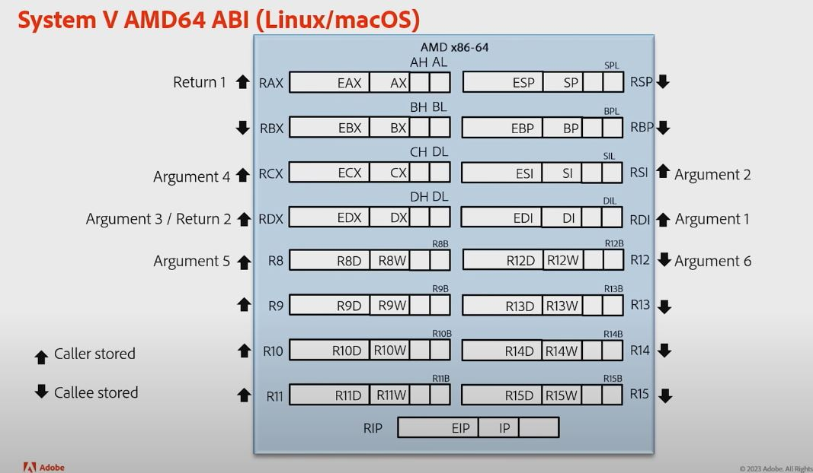

# Tricks

- xor rax, rax - quick way to zero something!

# Endian 

Big endian multibyte numbers are stored inp memory starting with the most significant bytes.

Little endian multibyte numbers are stored in memory starting with the least significant bytes.

The advantage of little endian is that we can discard the most significant bytes effectively converting the number from a wider format to a narrower one, like 8 bytes.

# syscall 

2. A system-call is done via the syscall instruction. The kernel destroys
registers %rcx and %r11. syscall leaves rcx and r11 changed
3. The number of the syscall has to be passed in register %rax.
4. System-calls are limited to six arguments, no argument is passed directly on
the stack.
5. Returning from the syscall, register %rax contains the result of the
system-call. A value in the range between -4095 and -1 indicates an error,
it is -errno.
6. Only values of class INTEGER or class MEMORY are passed to the kernel

CC dictates how the stack is used. Contract between caller and callee on x86:

    * after call instruction:
          o %eip points at first instruction of function
          o %esp+4 points at first argument
          o %esp points at return address 
    * after ret instruction:
          o %eip contains return address
          o %esp points at arguments pushed by caller
          o called function may have trashed arguments
          o %eax contains return value (or trash if function is void)
          o %ecx, %edx may be trashed
          o %ebp, %ebx, %esi, %edi must contain contents from time of call 
    * Terminology:
          o %eax, %ecx, %edx are "caller save" registers
          o %ebp, %ebx, %esi, %edi are "callee save" registers

syscall leaves rcx and r11 changed

# JUMPS

cmd  - just computes arithmetic diffrence and set ZF if it evaluates to 0
jxxxx set of instructions - do comparions (neeed to use diffrent ones per signed/unsigned) as well as makes a jump by label. NOT function!
Each Jxxxx function has logical NOT alternative
for example ja and jna(!ja)
test - performs bitwise comparison

# STACK

        push    rbp
        mov     rbp, rsp
        mov     DWORD PTR [rbp-4], edi (-4) is required because the stack is growing downwards!
        
        Example: 
                     RSP --->128 (Prev RBP(starts at 128!))
                             124 <----EDI has to be written here! that is why -4 comes into play like that!
                             120 

16-byte stack alignment is mandatory!

# MATH

Do not confuse the "carry" flag with the "overflow" flag in integer
arithmetic.  Each flag can occur on its own, or both together.  The CPU's
ALU doesn't care or know whether you are doing signed or unsigned
mathematics; the ALU always sets both flags appropriately when doing any
integer math.  The ALU doesn't know about signed/unsigned; the ALU just
does the binary math and sets the flags appropriately.  It's up to you,
the programmer, to know which flag to check after the math is done

## Carry Flag

The rules for turning on the carry flag in binary/integer math are two:

1. The carry flag is set if the addition of two numbers causes a carry
   out of the most significant (leftmost) bits added.

   1111 + 0001 = 0000 (carry flag is turned on)

2. The carry (borrow) flag is also set if the subtraction of two numbers
   requires a borrow into the most significant (leftmost) bits subtracted.

   0000 - 0001 = 1111 (carry flag is turned on)

Otherwise, the carry flag is turned off (zero).
 * 0111 + 0001 = 1000 (carry flag is turned off [zero])
 * 1000 - 0001 = 0111 (carry flag is turned off [zero])

In unsigned arithmetic, watch the carry flag to detect errors.
In signed arithmetic, the carry flag tells you nothing interesting.

## Overflow Flag

The rules for turning on the overflow flag in binary/integer math are two:

1. If the sum of two numbers with the sign bits off yields a result number
   with the sign bit on, the "overflow" flag is turned on.

   0100 + 0100 = 1000 (overflow flag is turned on)

2. If the sum of two numbers with the sign bits on yields a result number
   with the sign bit off, the "overflow" flag is turned on.

   1000 + 1000 = 0000 (overflow flag is turned on)

# MEMORY

It is, however, important to mention that despite the fact that it is a 64-bit architecture, the MMU only uses the first 48 bits of the virtual address (also called the linear addresss

Address bits	Meaning
0 - 11	Offset into a 4 KB page
12 - 20	Index of a page entry in the table of 512 pages
21 - 29	Index of a page table entry in the page directory
30 - 38	Index of a page directory entry in the page directory pointer table
39 - 47	Index of a page directory pointer table in the page-map level 4 table

# SEGMENTS and GDT

You can’t change cs directly

Each of segment registers cs, ds, ss, es, gs, and fs stores so-called segment selector , containing an index in a special segment descriptor table and a little additional information

This way we could create numerous segments with various permissions and use RPL values in segment selectors to define which of them are accessible to us right now (given our privilege level)

Privilege levels are the same thing as protection rings!

For example, we are currently in ring0 and ds= 0x02. Even though the lowest two bits of cs and ss are 0 (as we are inside ring0), we can’t access data in a segment with privilege level higher than 2 (like 1 or 0)

If you try, for instance, to load a new value into a segment register, the CPU needs to perform safety and access control checks to see whether you're actually entitled to access that specific memory area

You might think that every memory transaction needs another one now to read GDT contents. This is not true: for each segment register there is a so-called shadow register, which cannot be directly referenced. It serves as a cache for GDT contents. It means that once a segment selector is changed, the corresponding shadow register is loaded with the corresponding descriptor from GDT. Now this register will serve as a source of all information needed about this segment.

(PROTECTED MODE) Linear address = segment base (taken from system table) + offset
(REAL MODE) physical address = segment base * 16 + offset
(REAL MODE) All memory addressing through main segment registers (cs, ds, es, and ss) do not consider the GDT values of base and offset anymore. The segment base is always fixed at 0x0 no matter the descriptor contents; the segment sizes are not limited at all. The other descriptor fields, however, are not ignored

# REGISTERS

GDTR is a register to store GDT address and size.

GS is commonly used as a pointer to a thread local storage (TLS) 

 RIP register
  . It is a 64-bit register, which always stores an address of the **next** instruction to be executed. Branching instructions (e.g., jmp) are in fact modifying it. So, every time any instruction is being executed, rip stores the address of the next instruction to be execute

rax..rdx - general purpose! (Accumulator, Base, Counter, Data)

  RAX - normally holds return value in function calls

GS register stores the base address for per-cpu are
ECX(RCX) - counter register - used mostly within loops
EAX/EDX - accumulators (have special meaning for multiplication and division)
ESI and EDI registers serve as source and destination index registers in string operations, where ESI contains the source address and EDI, obviously, the destination address

CR3: This register is used when virtual addressing is enabled (paging) and contains the physical address of the page directory, page directory pointer table, or page map level 4 table, depending on the current mode of operation.

RFlags  register
Bit #0 - carry flag
The carry flag (CF) is mostly used for the detection of carry/borrow in arithmetic operations and is set if the bit width result of the last such operation (such as addition and subtraction) exceeds the width of the ALU. For example, the addition of two 8-bit values, 255 and 1, would result in 256, which requires at least nine bits to be stored. In such a case, bit eight (the ninth bit) is placed into the CF, thus, letting us and the processor know that the last operation ended with carry.

Bit #6 - zero flag
The zero flag (ZF) is set when the result of an arithmetic or bitwise operation is 0. This includes operations that do not store the result (for example, comparison and bit test). like if the expression evaluates to 0,  the flag itself would be set to 1

Bit #9 - interrupt enable flag
The interrup enable flag (IF) defines whether processor will or will not react to incoming interrupts. This flag is only accessible in real mode or at the Ring 0 protection level in other mode

Bit #7 - sign flag
sets (SF) is operation result is negative

Bit #11 - overflow flag
The overflow flag (OF) is sometimes perceived as two's complement form of the carry flag, which is not really the case. OF is set when the result of the operation is either too small or too big a number to fit into the destination operand.

----
params
---------          <--- frame pointer!
return adddress
-------
locals
----               < -- stack pointer!

r12 - temporary register free to use in just current subroutine! gets cleared before 
subrouting calls

rbp is the frame pointer on x86_64. In your generated code,
 it gets a snapshot of the stack pointer (rsp) so that when adjustments are made 
to rsp (i.e. reserving space for local variables or pushing values on to the stack), 
local variables and function parameters are still accessible from a constant offset from rbp.
A lot of compilers offer frame pointer omission as an optimization option; this will make the
 generated assembly code access variables relative to rsp instead and free up rbp as another
 general purpose register for use in function

 The first six arguments are passed in rdi, rsi, rdx, rcx, r8, and r9, respectively. The rest is passed on to the stack in reverse order

G
-----
In common usage, the word size refers to the size of a processor register.
 On a 32 bit processor, this will be 32 bits. On a 64 bit processor, this will be 64 bits
----------------

# FUNCTION CALL on x64

User-level applications use as integer registers for passing the sequence
%rdi, %rsi, %rdx, %rcx, %r8 and %r9. The kernel interface uses %rdi,
%rsi, %rdx, %r10, %r8 and %r9.

If you change rbx, rbp, rsp, or r12-r15, change them back!
If you need any other register to survive function call, save it yourself before calling!

So, the pattern of calling a function is as follows:
1. Save all caller-saved registers you want to survive function call (you can use push for that). Caller saved registers are all NOT these ones 
rbx, rbp, rsp, r12-r15

2. saves RIP on the stack as well and sets to the function address to be called
rbx, rbp, rip, rsp, r12-r15

2. Store arguments in the relevant registers (rdi, rsi, etc.).
3. Invoke function using call.
4. After function returns, rax will hold the return value.
5. Restore caller-saved registers stored before the function cal

# INSTRUCTIONS

## PUSH

This instructs the processor to store the value of the operand onto a stack and decrements stack pointer (ESP register on 32-bit systems and RSP register on 64-bit ones).

## MOV

This is the most commonly used instruction for transferring data:
It moves data between registers of the same size
It loads a register with either an immediate value or a value read from memory
It stores the content of a register to memory
It stores the immediate value to memory

mov rsi, [rax]—copies memory contents (8 sequential bytes) starting at address, stored in rax, into rsi

## MOVZX

This is less powerful than MOV by means of addressing modes, as it may only transfer data from register to register or from memory to register, but it has its special feature--the value being transferred is converted to a wider (one that uses more bits) one and is zero extended. As to the addressing modes supported by this instruction, it may only do the following:
It moves the byte value from register or memory to a word-sized register and extends the resulting value with zeroes (one byte would be added)
It moves byte value from register or memory to a double word-sized register, in which case three bytes would be added to the original value and the value itself would be extended with zeroes
It moves word-sized value from register or memory to a double word-sized register, adding two bytes and filling them with the extension value of 0

## MOVSX

is similar to MOVZX; however, the extended bits are filled with the sign bit of the source operand.

## BSWAP/MOVBE

 The BSWAP instruction is the easiest way to switch the endianness of a value; however, it is not really a transfer instruction as it only rearranges data within a register. The BSWAP instruction only works on 32/64-bit operands. MOVBE is a more convenient instruction for swapping byte order as it also moves data between the operands. This instruction works on 16, 32, and 64-bit operands. It cannot move data from register to register.

## POP

 This retrieves values previously stored on stack. The only operand of this instruction is the destination where the value should be stored, and it may be a register or a location in memory. This instruction increments the stack pointer register as well.

## LEA

; rsi <- address of label 'codes', a number
mov rsi, codes

; rsi <- memory contents starting at 'codes' address
; 8 consecutive bytes are taken because rsi is 8 bytes long
mov rsi, [codes]

; rsi <- address of 'codes'
; in this case it is equivalent of mov rsi, codes
; in general the address can contain several components
lea rsi, [codes]

; rsi <- memory contents starting at (codes+rax)
mov rsi, [codes + rax]

; rsi <- codes + rax
; equivalent of combination:
; -- mov rsi, codes
; -- add rsi, rax
; Can't do it with a single mov!
lea rsi, [codes + rax]

**THIS IS REALLY TRICKY COMMAND**

MOV with brackets will get what's at the address written in the brackets (which can be arithmetic or not). Without the brackets (no arithmetic possible), it will write the address to the register. LEA only works with the brackets (so arithmetic possible) and will basically do what MOV does when the brackets are not provided. So both are useful. Aside from going on the given address, MOV can also do what LEA does, except it can only do it without the brackets - but without them, no arithmetic is possible. So LEA "corrects" that

LEA EAX, [ EAX + 1 ] and INC EAX is that the latter changes EFLAGS but the former does not; this preserves CMP state

**WARNING** There's a big difference between 2 operand LEA which is fast and 3 operand LEA which is slow. The Intel Optimization manual says fast path LEA is single cycle and slow path LEA takes three cycles. Moreover, on Skylake there are two fast path functional units (ports 1 and 5) and there's only one slow path functional unit (port 1)

out-of-order CPUs typically run LEA on ALUs

LEA doesn't always calculate; it calculates if the effective address expressed in the source operand calculates. LEA EAX, GLOBALVAR doesn't calculate; it just moves the address of GLOBALVAR into EAX. LEA is not a specific arithmetic instruction; it is a way of intercepting the effective address arising from any one of the processor's memory addressing modes.

This is the reason why people who think that the brackets in LEA are superfluous are severely mistaken; the brackets are not LEA syntax but are part of the addressing mode

LEA is real at the hardware level. The generated instruction encodes the actual addressing mode and the processor carries it out to the point of calculating the address. Then it moves that address to the destination instead of generating a memory reference. (Since the address calculation of an addressing mode in any other instruction has no effect on CPU flags, LEA has no effect on CPU flags.)

## CMP

    cmp byte [rdi+rax], 0 ; Check if the current symbol is null-terminator.
                          ; We absolutely need that 'byte' modifier since
                          ; the left and the right part of cmp should be
                          ; of the same size. Right operand is immediate
                          ; and holds no information about its size,
                          ; hence we don't know how many bytes should be
                          ; taken from memory and compared to zero
