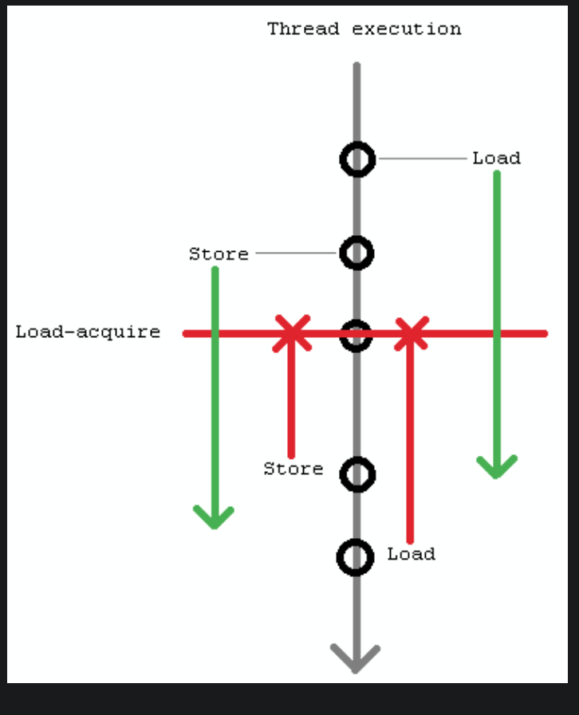

# Introduction

Ok, so what is the most important thing regarding synchronization algorithm's performance and scalability? I frequently hear the answer that it's a number of atomic RMW (read-modify-write) instructions (like Compare-And-Swap or Fetch-And-Add) per operation. It's dead wrong. The most important thing is amount of write sharing per operation. Numerical measure of write sharing is number cache-line transfers per operation, and the ideal value is 0. If there is 0 cache-line transfers per operations amortized (we are perfectly Ok with amortization here), then the algorithm is perfectly scalable. Anything other than 0, even 1, is a serious problem for scalability

# Memory model

What I am going to discuss here is memory models in the context of multi-threading/concurrency. There are 3 fundamental properties: Atomicity, Ordering and Visibility; and 2 levels: Compiler and Hardware. In order to implement and reason about any synchronization algorithm you need clear understanding of them

## Atomicity

I hope you understand what it means in general - indivisibility of an operation, that is, an operation is either does not happen at all or fully completed. No intermediate states and no partial effects can be observed by other threads.

## Visibility

Visibility determines when other threads will see changes made by the current thread, and whether they will see them at all. A lot of people endeavour to do something special in order to ensure visibility (like placing memory fences). However, in practice it's the most boring property, because on cache-coherent architectures (read - on all modern commodity architectures - IA-32, Intel 64, IA-64, SPARC, POWER) visibility is ensured automatically. Namely,  each write is automatically propagated to all other processors/cores in a best-effort manner. There are no ways to prevent nor to speed it up. Period

However, there is an interesting deviation - on x86 architecture non-temporal stores (made with instructions like MOVNTDQ) and stores made to WC (Write-Combining) region of memory are effectively non cache-coherent. That is, they will be propagated to other processors/cores only before execution of SFENCE instruction, MFENCE instruction, LOCKed instruction or other serializing action

# std::atomic & std::atomic_ref

std::atomic_ref is used to refrence another non-atomic variable and make operatoins on it atomic!
note that atomic  operations only work on value representation since C++20! so padding bits are all ignored now!
atomic on floating types is not atomic inc/dec, but store and load are!

In addition, there are relaxed atomic operations, which are not synchronization operations, and atomic read-modify-write operations, which have special characteristics

# Ordering 

if you mix aqc-release oprations with seq_const operations then seq_const operations behave like ack-release operations!

A synchronization operation on one or more memory locations is either a consume operation, an acquire operation, a release operation, or both an acquire and release operation


##  "is sequenced before"

"is sequenced before" is strictly intra-thread(within single thread)

Sequenced before is an asymmetric, transitive, pair-wise relation between evaluations executed by a single thread ([intro.multithread]), which induces a partial order among those evaluations. Given any two evaluations A and B, if A is sequenced before B (or, equivalently, B is sequenced after A), then the execution of A shall precede the execution of B. If A is not sequenced before B and B is not sequenced before A, then A and B are unsequenced.
[Note 3: The execution of unsequenced evaluations can overlap. — end note]
Evaluations A and B are indeterminately sequenced when either A is sequenced before B or B is sequenced before A, but it is unspecified which.
[Note 4: Indeterminately sequenced evaluations cannot overlap, but either can be executed first. — end note]

## Side effects

Reading an object designated by a volatile glvalue ([basic.lval]), modifying an object, calling a library I/O function, or calling a function that does any of those operations are all side effects, which are changes in the state of the execution environment. Evaluation of an expression (or a subexpression) in general includes both value computations (including determining the identity of an object for glvalue evaluation and fetching a value previously assigned to an object for prvalue evaluation) and initiation of side effects. When a call to a library I/O function returns or an access through a volatile glvalue is evaluated the side effect is considered complete, even though some external actions implied by the call (such as the I/O itself) or by the volatile access may not have completed yet.
8

## "synchronize with"

An atomic operation A that performs a release operation on an atomic object M synchronizes with an atomic operation B that performs an acquire operation on M and takes its value from any side effect in the release sequence headed by A.

## "inter-thread happens before" 

An evaluation A "inter-thread happens before" an evaluation B 
if A synchronizes with B, or 
for some evaluation X, 
  - A synchronizes with X and X is sequenced before B, or
  - A is sequenced before X and X inter-thread happens before B, or
  - A inter-thread happens before X and X inter-thread happens before B

The “inter-thread happens before” relation describes arbitrary concatenations of “sequenced before”, “synchronizes with apart from been only concatentaions by "sequenced before"!

The second exception is that a concatenation is not permitted to consist entirely of “sequenced before”. The reasons for this limitation are (1) to permit “inter-thread happens before” to be transitively closed and (2) the “happens before” relation, defined below, provides for relationships consisting entirely of “sequenced before”

The "transitively closed" remark simply means that the relation is transitive: if A inter-thread happens before B and B inter-thread happens before C, then A inter-thread happens before C


## "hapens before"

An evaluation A happens before an evaluation B (or, equivalently, B happens after A) if:
- A is sequenced before B, or
- A inter-thread happens before B.

## "visible side effect"

A visible side effect A on a scalar object or bit-field M with respect to a value computation B of M satisfies the conditions:
- A happens before B and
- there is no other side effect X to M such that A happens before X and X happens before B.

The value of a non-atomic scalar object or bit-field M, as determined by evaluation B, shall be the value stored by the visible side effect A.
[Note 12: If there is ambiguity about which side effect to a non-atomic object or bit-field is visible, then the behavior is either unspecified or undefined. — end note]


## "strongly happens before"

An evaluation A strongly happens before an evaluation D if, either
- A is sequenced before D, or
- A synchronizes with D, and both A and D are sequentially consistent atomic operations ([atomics.order]), or
- there are evaluations B and C such that A is sequenced before B, B simply happens before C, and C is sequenced before D, or
- there is an evaluation B such that A strongly happens before B, and B strongly happens before D.
[Note 11: Informally, if A strongly happens before B, then A appears to be evaluated before B in all contexts. Strongly happens before excludes consume operations. — end note]

## Coherence

**non-atomic**
The value of a non-atomic scalar object or bit-field M, as determined by evaluation B (**read**), shall be the value stored by the *visible side effect* (**write**) A.
[Note 12: If there is ambiguity about which side effect to a non-atomic object or bit-field is visible, then the behavior is either unspecified or undefined. — end note]
[Note 13: This states that operations on ordinary objects are not visibly reordered. This is not actually detectable without data races, but it is necessary to ensure that data races, as defined below, and with suitable restrictions on the use of atomics, correspond to data races in a simple interleaved (sequentially consistent) execution. — end note]


**atomic**
The value of an atomic object M, as determined by evaluation B(**read**), shall be the value stored by some side effect(**write**) A that modifies M, where B does not happen before A.
[Note 14: The set of such side effects is also restricted by the rest of the rules described here, and in particular, by the coherence requirements below. — end note]

### write-write

If an operation A that modifies an atomic object M happens before an operation B that modifies M, then A shall be earlier than B in the modification order of M.
[Note 15: This requirement is known as write-write coherence. — end note]

### read-read

If a value computation(**read**) A of an atomic object M happens before a value computation B(**read**) of M, and A takes its value from a side effect X on M, then the value computed by B shall either be the value stored by X or the value stored by a side effect Y on M, where Y follows X in the modification order of M.
[Note 16: This requirement is known as read-read coherence. — end note]

### read-write

If a value computation A of an atomic object M happens before an operation B that modifies M, then A shall take its value from a side effect X on M, where X precedes B in the modification order of M.
[Note 17: This requirement is known as read-write coherence. — end note]
18

### write-read

If a side effect X on an atomic object M happens before a value computation B of M, then the evaluation B shall take its value from X or from a side effect Y that follows X in the modification order of M.
[Note 18: This requirement is known as write-read coherence. — end note]


[Note 19: The four preceding coherence requirements effectively disallow compiler reordering of atomic operations to a single object, even if both operations are relaxed loads. This effectively makes the cache coherence guarantee provided by most hardware available to C++ atomic operations. — end note]
0

[Note 20: The value observed by a load of an atomic depends on the “happens before” relation, which depends on the values observed by loads of atomics. The intended reading is that there must exist an association of atomic loads with modifications they observe that, together with suitably chosen modification orders and the “happens before” relation derived as described above, satisfy the resulting constraints as imposed here. — end note]

## std::atomic<T> variables

### memory_order_acuqire

**memory_order_acquire** - no reads or writes in the current thread can be reordered before this load. 
A part
x.load(acquire)
B part
B part cannot cross BEFORE x load, however A part can be moved past X. Note  A operations can apear in B!




### memory_order_release 

**memory_order_release** - no reads or writes in the current thread can be reordered after this store. 
A part
x.store(release)
B part

A part cannot be re-ordered AFTER store x, but B part operations can appear before x!

### memory_order_relaxed

relaxed is a bit more than just a plain normal read/write; it guarantees that read/writes are not "torn" which allows you to implement tear-free shared variables without any imposition from memory barriers


## Fences

A synchronization operation without an associated memory location is a fence and can be either an acquire fence, a release fence, or both an acquire and release fence

**IMPORTANT ----> note that they are opposite to atomic variable fences!**

Establishes memory synchronization ordering of non-atomic and relaxed atomic accesses, as instructed by order, without an associated atomic operation. Note however, that at least one atomic operation is required to set up the synchronization, as described below.

Fence-atomic synchronization
A release fence F in thread A synchronizes-with atomic acquire operation Y in thread B, if

there exists an atomic store X (with any memory order),
Y reads the value written by X (or the value would be written by release sequence headed by X if X were a release operation),
F is sequenced-before X in thread A.
In this case, all non-atomic and relaxed atomic stores that are sequenced-before F in thread A will happen-before all non-atomic and relaxed atomic loads from the same locations made in thread B after Y.

Atomic-fence synchronization
An atomic release operation X in thread A synchronizes-with an acquire fence F in thread B, if

there exists an atomic read Y (with any memory order),
Y reads the value written by X (or by the release sequence headed by X),
Y is sequenced-before F in thread B.
In this case, all non-atomic and relaxed atomic stores that are sequenced-before X in thread A will happen-before all non-atomic and relaxed atomic loads from the same locations made in thread B after F.

Fence-fence synchronization
A release fence FA in thread A synchronizes-with an acquire fence FB in thread B, if

there exists an atomic object M,
there exists an atomic write X (with any memory order) that modifies M in thread A,
FA is sequenced-before X in thread A,
there exists an atomic read Y (with any memory order) in thread B,
Y reads the value written by X (or the value would be written by release sequence headed by X if X were a release operation),
Y is sequenced-before FB in thread B.
In this case, all non-atomic and relaxed atomic stores that are sequenced-before FA in thread A will happen-before all non-atomic and relaxed atomic loads from the same locations made in thread B after FB.

### release fence

A part
atomic_thread_fence(memory_order_release)
B part

prevents all preceding reads and writes from moving past all subsequent stores.
A release fence prevents the memory reordering of any read or write which precedes it in program order with any write which follows it in program order

### acuire fence

An acquire fence prevents the memory reordering of any read which precedes it in program order with any read or write which follows it in program order

A part
atomic_thread_fence(memory_order_aqcuire)
B part

B part cannot re-order with loads from A part (can with STOREs!),however A part stores can apear in B part
 in this range no read / writes *below* below the fance  can re-order with *any* read above the fence in program order
Say
(Ln) //nothing below fence can re-order with it
(S) //this can slide up or down 
(L1) //nothing below fence can re-order with it
(S1) //this can slide up or down		      
atomic_thread_fence(memory_order_aqcuire)
(S2)		      | 	
(`L1)
(S) 
(`Ln)

UNKNOWN: can Ln reorder with L1 above the  fence? Most likely it is possible!

### Example

```
// Global
std::string computation(int);
void print(std::string);
 
std::atomic<int> arr[3] = {-1, -1, -1};
std::string data[1000]; //non-atomic data
 
// Thread A, compute 3 values.
void ThreadA(int v0, int v1, int v2)
{
//  assert(0 <= v0, v1, v2 < 1000);
    data[v0] = computation(v0);
    data[v1] = computation(v1);
    data[v2] = computation(v2);
    std::atomic_thread_fence(std::memory_order_release);
    std::atomic_store_explicit(&arr[0], v0, std::memory_order_relaxed);
    std::atomic_store_explicit(&arr[1], v1, std::memory_order_relaxed);
    std::atomic_store_explicit(&arr[2], v2, std::memory_order_relaxed);
}
 
// Thread B, prints between 0 and 3 values already computed.
void ThreadB()
{
    int v0 = std::atomic_load_explicit(&arr[0], std::memory_order_relaxed);
    int v1 = std::atomic_load_explicit(&arr[1], std::memory_order_relaxed);
    int v2 = std::atomic_load_explicit(&arr[2], std::memory_order_relaxed);
    std::atomic_thread_fence(std::memory_order_acquire);
//  v0, v1, v2 might turn out to be -1, some or all of them.
//  Otherwise it is safe to read the non-atomic data because of the fences:
    if (v0 != -1)
        print(data[v0]);
    if (v1 != -1)
        print(data[v1]);
    if (v2 != -1)
        print(data[v2]);
}
```

# volatile

While almost all programmers know that a volatile does not have the properties of an atomic variable, many code are still written with the idea that an atomic has the propertie of a volatile: "an atomic access is an observable behaviour". According to the standard it is no

compilers optimize code as if atomics were also volatiless

importantly, volatile does not guarantee that memory operations won’t tear, meaning that a volatile load may observe partial writes and volatile stores may be observed in parts. Realistically, compilers will only tear when the hardware doesn’t have an instruction which can perform the entire memory operation atomically. That being said, the Standard technically allows an implementation which touched each target byte exactly once, one after the other, in an unspecified order that could change on each execution.

The order of volatile operations cannot change relative to other volatile operations, but may change relative to non-volatile operations.

That being said, volatile doesn’t imply any observable ordering in terms of the C++ memory model

http://www.open-std.org/jtc1/sc22/wg21/docs/papers/2018/p1152r0.html

# CAS

Since C++20, this has an extra compute in compare_exchange operations now to clear out the padding bits when doing it!
weak cas compare is the same as strong cas compare on x86! because on x86 strong/weak cas does the same lock to get exclusive access to the cache line in case it needs to write into it! note that it always read it first before getting exclusive accessin order to quickly see if values match!

gcc / clang on x86-64 Linux do use lock cmpxchg16b if available, but gcc7 and later still return false for is_lock_free even though technically it is; but pure-loads and pure-stores are slow and pure loads contend with each other

However - a lot of professional implementations of lockfree algorithms (such as Boost.Lockfree) don't actually use double-word CAS - instead they rely on single-word CAS and opt to use non-portable pointer-stuffing shenanigans. Since x86_64 architectures only use the first 48 bits of a pointer, you can use the hi 16-bits to stuff in a counte

# x86
As I mentioned, the x86 lock prefix is a full memory barrier, so using num.fetch_add(1, std::memory_order_relaxed); generates the same code on x86 as num++ (the default is sequential consistency), but it can be much more efficient on other architectures (like ARM). Even on x86, relaxed allows more compile-time reordering.


- all cores see writes in the same order
- if one core (1) reads X than writes Y=a, than another core (2) which sees Y=a cannot see older  value of X compared to core (1)
- reads can re-order with writes to diffrent locations

# Spink Lock

SUPER IMPORTANT
https://stackoverflow.com/questions/21536846/is-memory-order-acquire-really-sufficient-for-locking-a-spinlock

Atomic read-modify-write operations shall always read the last value (in the modification order)
 written before the write associated with the read-modify-write operation

Read-Modify-Write operations are special.
 Per 29.3/12 "Atomic read-modify-write operations shall always read the last value (in the modification order)
 written before the write associated with the read-modify-write operation." 
The memory ordering you select for such an R-M-W op only affects how it is ordered with reads/writes to other
 memory locations and non R-M-W ops to the same atomic. As far as the atomic_flag itself is concerned,
 the test_and_set and clear could both be relaxed and provide mutual exclusion - 
but it wouldn't order accesses to other memory locations

Let's say that they don't affect how the read/writes to this variable happen. The synchronizes-with means that if a different thread sees the updated value then (in this case with release/acquire) it will also see any writes before the update to the lock. But it does not affect how and when the value of this particular variable is visible in the other threa

Example:

```
class UnfairSpinlock {
  std::atomic<unsigned> lock_{0};

public:
  using scoped_lock = std::lock_guard<UnfairSpinlock>;

  void lock() noexcept {
    for (;;) {
      if (!lock_.load(std::memory_order_relaxed) &&
          !lock_.exchange(1, std::memory_order_acquire))
        return;
      _relax_;
    }
  }

  void unlock() noexcept { lock_.store(0, std::memory_order_release); }
};
```


--------------------------------------------
memory_order_seq_cst fences ensure a total order only for the fences themselves. Fences cannot, in general,
be used to restore sequential consistency for atomic operations with weaker ordering specifications

------------------------
-------------------------

-------------------------

A release fence prevents the memory reordering of any read or write which precedes it in program order with any write which follows it in program order

A part
atomic_thread_fence(memory_order_aqcuire_release)
B part

B part cannot re-order with A part UNLESS STORE from A apart can re-order with a load from B part!!!!
A release fence constrains stuff from moving below subsequent writes
------------------------------------------
A part
atomic_thread_fence(memory_order_aqcuire_release)
B part
The same as release fence, but also prohibits load between load reordering, but sitll enables load between store reordering!

(possible)
a.store(relaxed);					 b.load(relaxed);a.store(relaxed);
atomic_thread_fence(memory_order_aqcuire_release)    ->   atomic_thread_fencememory_order_aqcuire_release)
b.load(relaxed);				        	

A release fence A synchronizes with an acquire fence B if there exist atomic operations X and Y, both operating on some atomic object M, such that A is sequenced before X, X modifies M, Y is sequenced before B, and Y reads the value written by X or a value written by any side effect in the hypothetical release sequence X would head if it were a release operation


-----------------
NOW ATOMIC MEMORY OPERATION ARE DIFFRENT FROM FENCE IN THE SENSE THAT THEY WON'T ALLOW LATER LOADS TO RE-ORDER WITH EARLIER LOADS IN CASE OF *****READ_WRITE_MODIFY OPERATIONS****!!!!
-----------------------------
-------------------------------
------------------
memory_order_acq_rel - No memory reads or writes in the current thread can be reordered before or after this store

membarrier - issue memory barriers on a set of threads

memory_order_relaxed - does not change atomicit of the variable, but impacts compiler/cpu ordering.  It essentially guarantees that if you take all the operations affecting a specific address, a consistent ordering exists.In addition, it is legal to reorder non-atomic and Unordered loads around Monotonic loads.

In boost's implementation of shared_ptr, it uses relaxed memory ordering to increment its reference count. This appears safe as decrements use acquire/release to make sure that any previous decrements are visible to the thread before releasing memory

----------------------
https://gcc.gnu.org/wiki/Atomic/GCCMM/AtomicSync

Release/acquire mode only requires the two threads involved to be synchronized. This means that synchronized values are not commutative to other threads. The assert in thread 2 must still be true since thread 1 and 2 synchronize with x.load(). Thread 3 is not involved in this synchronization, so when thread 2 and 3 synchronize with y.load(), thread 3's assert can fail. There has been no synchronization between threads 1 and 3, so no value can be assumed for 'x' there

This code is not safe and both lines can be printed!

T1: x = 1;
T2: y = 1;
T3: if( x == 1 && y == 0 ) puts("x first");
T4: if( y == 1 && x == 0 ) puts("y first");

****You absolutely need sequential consistency to guarantee that at most one line is printed****

-----------------------

C++11 defines a happens-before relation on memory accesses in a program execution.
 It represents enforced ordering on those accesses. Access a happens before b if either a
occurs before b in the same thread (a �is sequenced before�
b), or if a and b are synchronization operations such that a
synchronizes with b

---------
r2 = x.load(std::memory_order_relaxed); // C 
y.store(42, std::memory_order_relaxed); // D

(D) CAN BE RE_ORDERED WITH (C) BY THE COMPILER!!! BECAUSE std::memory_order_relaxed ALLOWS IT!

The only ordering imposed is that once a value for a variable from thread 1 is observed in thread 2, thread 2 can not see an �earlier� value for that variable from thread 1. ie, assuming 'x' is initially 0:
Once the store of 2 is seen by thread 2, it can no longer see the value 1

-Thread 1-
x.store (1, memory_order_relaxed)
x.store (2, memory_order_relaxed)

-Thread 2-
y = x.load (memory_order_relaxed)
z = x.load (memory_order_relaxed)
assert (y <= z)
The assert cannot fail


----------
ack release are transitive but not commulative between many threads!

GOOD! assert not fired
thread 1
=========
a.store(1,relaxed)
b.store(1,release)

thread 2
=========
if (b.load(aqcuire))
 c.store(1,release)

thread 3
if (c.load(aquire))
  assert(1==a.load(relaxed));

-----------

Release sequence
After a release operation A is performed on an atomic object M, 
the longest continuous subsequence of the modification order of M that consists of

1) Writes performed by the same thread that performed A
(until C++20)
2) Atomic read-modify-write operations made to M by any thread
is known as release sequence headed by 

---------

Pause prevents speculative execution, eliminating the branch misprediction penalty
-------------


