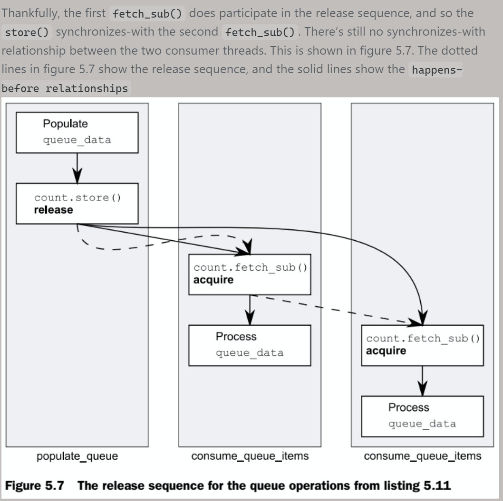
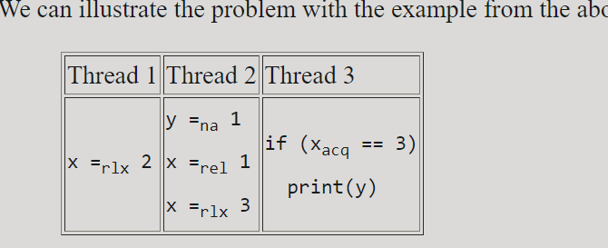
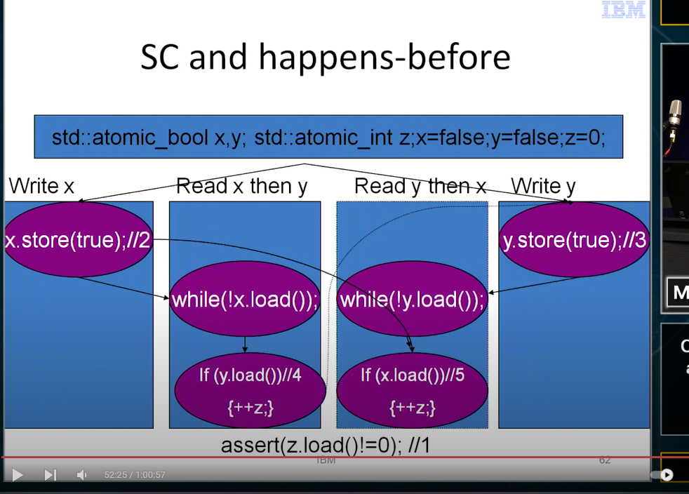
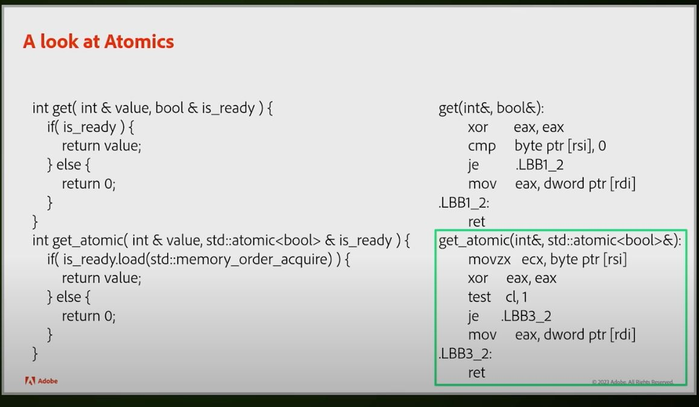
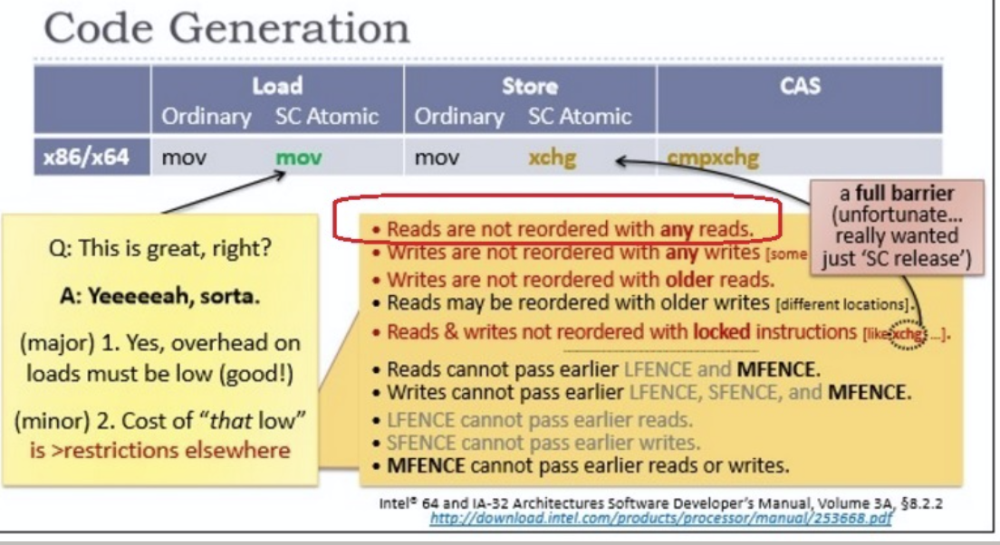
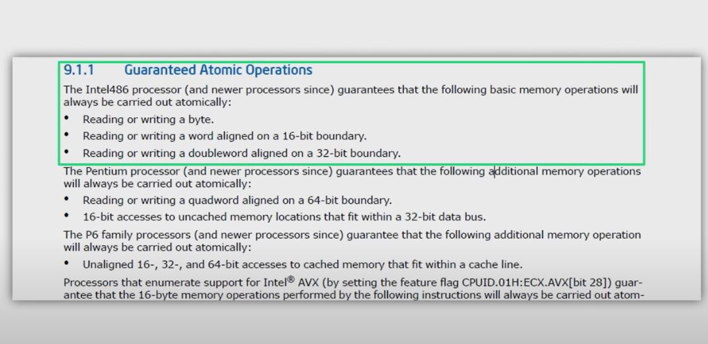

# Introduction

Ok, so what is the most important thing regarding synchronization algorithm's performance and scalability? I frequently hear the answer that it's a number of atomic RMW (read-modify-write) instructions (like Compare-And-Swap or Fetch-And-Add) per operation. It's dead wrong. The most important thing is amount of write sharing per operation. Numerical measure of write sharing is number cache-line transfers per operation, and the ideal value is 0. If there is 0 cache-line transfers per operations amortized (we are perfectly Ok with amortization here), then the algorithm is perfectly scalable. Anything other than 0, even 1, is a serious problem for scalability

# Memory model

What I am going to discuss here is memory models in the context of multi-threading/concurrency. There are 3 fundamental properties: Atomicity, Ordering and Visibility; and 2 levels: Compiler and Hardware. In order to implement and reason about any synchronization algorithm you need clear understanding of them

## Atomicity

I hope you understand what it means in general - indivisibility of an operation, that is, an operation is either does not happen at all or fully completed. No intermediate states and no partial effects can be observed by other threads.

## Visibility

Visibility determines when other threads will see changes made by the current thread, and whether they will see them at all. A lot of people endeavour to do something special in order to ensure visibility (like placing memory fences). However, in practice it's the most boring property, because on cache-coherent architectures (read - on all modern commodity architectures - IA-32, Intel 64, IA-64, SPARC, POWER) visibility is ensured automatically. Namely,  each write is automatically propagated to all other processors/cores in a best-effort manner. There are no ways to prevent nor to speed it up. Period

However, there is an interesting deviation - on x86 architecture non-temporal stores (made with instructions like MOVNTDQ) and stores made to WC (Write-Combining) region of memory are effectively non cache-coherent. That is, they will be propagated to other processors/cores only before execution of SFENCE instruction, MFENCE instruction, LOCKed instruction or other serializing action

# std::atomic & std::atomic_ref

std::atomic_ref is used to refrence another non-atomic variable and make operatoins on it atomic!
note that atomic  operations only work on value representation since C++20! so padding bits are all ignored now!
atomic on floating types is not atomic inc/dec, but store and load are!

In addition, there are relaxed atomic operations, which are not synchronization operations, and atomic read-modify-write operations, which have special characteristics

# Ordering 

if you mix aqc-release oprations with seq_const operations then seq_const operations behave like ack-release operations!

A synchronization operation on one or more memory locations is either a consume operation, an acquire operation, a release operation, or both an acquire and release operation

## full expression 

A full-expression is an expression that is not a subexpression of another expression. If a language construct is defined to produce an implicit call of a function, a use of the language construct is considered to be an expression for the purposes of this definition. A call to a destructor generated at the end of the lifetime of an object other than a temporary object is an implicit full-expression

## value computations

 value computations (including determining the identity of an object for glvalue evaluation and fetching a value previously assigned to an object for prvalue evaluation)

## "evaluation"

Evaluation of an expression (or a subexpression) in general includes both value computations (including determining the identity of an object for glvalue evaluation and fetching a value previously assigned to an object for prvalue evaluation) and initiation of side effects. 

##  "is sequenced before"

"is sequenced before" is strictly intra-thread(within single thread)

Sequenced before is an asymmetric, transitive, pair-wise relation between evaluations executed by a single thread ([intro.multithread]), which induces a partial order among those evaluations. Given any two evaluations A and B, if A is sequenced before B (or, equivalently, B is sequenced after A), then the execution of A shall precede the execution of B. If A is not sequenced before B and B is not sequenced before A, then A and B are unsequenced.
[Note 3: The execution of unsequenced evaluations can overlap. — end note]
Evaluations A and B are indeterminately sequenced when either A is sequenced before B or B is sequenced before A, but it is unspecified which.
[Note 4: Indeterminately sequenced evaluations cannot overlap, but either can be executed first. — end note]


An expression X is said to be sequenced before an expression Y if every value computation and every side effect associated with the expression X is sequenced before every value computation and every side effect associated with the expression Y.


Every value computation and side effect associated with a full-expression is sequenced before every value computation and side effect associated with the next full-expression to be evaluated. 
[ Basicaly it says that "A is sequenced before B"
A = 1;
B = 3;]


**IMPORTANT----->But note "as-if" rule!**
The compiler does not have to do anything at all in the order the programmer wrote, as long as the observable effects occur in the same order that they would have when obeying the sequencing rules. Reordering statements that have no dependency on each other is a very common violation of "sequenced before", and it is the "as-if" rule that permits it


------------>>>>> **Except where noted, evaluations of operands of individual operators and of subexpressions of individual expressions are unsequenced.** <<----------------this is important as basically the standard dictates on the sequence before relationship for SUB-EXPRESIONS and OPERANDS!!!!!!!!!!!!!!!!!!!!!!!!!!!!!!!!!!!!!

If a side effect on a scalar object is unsequenced relative to either another side effect on the same scalar object or a value computation using the value of the same scalar object, the behavior is undefined


The value computations of the operands of an operator are sequenced before the value computation of the result of the operator.
That means in x + y the value computation of x and y are sequenced before the value computation of (x + y)

### Example
The sequenced-before relationship, and the rules concerning it are a "tidying up" of the prior rules on sequence points, defined in a consistent way with the other memory model relationships such as happens-before and synchronizes-with so that it can be precisely specified which operations and effects are visible under which circumstances.

The consequences of the rules are unchanged for simple single-threaded code.

Let's start with your examples:

1. i = ++i;
If i is a built-in type such as int then there are no function calls involved, everything is a built-in operator. There are thus 4 things that happen:

(a) The value computation of ++i, which is original-value-of-i +1

(b) The side effect of ++i, which stores original-value-of-i +1 back into i

(c) The value computation of the assignment, which is just the value stored, in this case the result of the value computation of ++i

(d) The side effect of the assignment, which stores the new value into i

All of these things are sequenced-before the following full expression. (i.e. they are all complete by the final semicolon of the statement)

Since ++i is equivalent to i+=1, the side effect of storing the value is sequenced-before the value computation of ++i, so (b) is sequenced-before (a).

The value computation of both operands of an assignment is sequenced-before the value computation of the assignment itself, and that is in turn sequenced-before the side effect of storing the value. Therefore (a) is sequenced before (c), and (c) is sequenced-before (d).

We therefore have (b) -> (a) -> (c) -> (d), and this is thus OK under the new rules, whereas it was not OK under C++98.


### Rules

1) Each value computation and side effect of a full expression, that is
- unevaluated operand
constant expression
- an entire initializer, including any comma-separated constituent expressions
- the destructor call generated at the end of the lifetime of a non-temporary object
- an expression that is not part of another full-expression (such as the entire expression statement, controlling expression of a for/while loop, conditional expression of if/switch, the expression in a return statement, etc),
-  including implicit conversions applied to the result of the expression, destructor calls to the temporaries, default member initializers (when initializing aggregates), and every other language construct that involves a function call, is sequenced before each value computation and side effect of the next full expression.
2) The value computations (but not the side-effects) of the operands to any operator are sequenced before the value computation of the result of the operator (but not its side-effects).
3) When calling a function (whether or not the function is inline, and whether or not explicit function call syntax is used), every value computation and side effect associated with any argument expression, or with the postfix expression designating the called function, is sequenced before execution of every expression or statement in the body of the called function.
4) The value computation of the built-in post-increment and post-decrement operators is sequenced before its side-effect.
5) The side effect of the built-in pre-increment and pre-decrement operators is sequenced before its value computation (implicit rule due to definition as compound assignment)
6) Every value computation and side effect of the first (left) argument of the built-in logical AND operator && and the built-in logical OR operator || is sequenced before every value computation and side effect of the second (right) argument.
7) Every value computation and side effect associated with the first expression in the conditional operator ?: is sequenced before every value computation and side effect associated with the second or third expression.
8) The side effect (modification of the left argument) of the built-in assignment operator and of all built-in compound assignment operators is sequenced after the value computation (but not the side effects) of both left and right arguments, and is sequenced before the value computation of the assignment expression (that is, before returning the reference to the modified object)
9) Every value computation and side effect of the first (left) argument of the built-in comma operator , is sequenced before every value computation and side effect of the second (right) argument.
10) In list-initialization, every value computation and side effect of a given initializer clause is sequenced before every value computation and side effect associated with any initializer clause that follows it in the brace-enclosed comma-separated list of initalizers.
11) A function call that is not sequenced before or sequenced after another function call is indeterminately sequenced (the program must behave as if the CPU instructions that constitute different function calls were not interleaved, even if the functions were inlined).
The rule 11 has one exception: a function calls made by a standard library algorithm executing under std::par_unseq execution policy are unsequenced and may be arbitrarily interleaved.	(since C++17)
12) The call to the allocation function (operator new) is indeterminately sequenced with respect to (until C++17)sequenced before (since C++17) the evaluation of the constructor arguments in a new-expression
13) When returning from a function, copy-initialization of the temporary that is the result of evaluating the function call is sequenced-before the destruction of all temporaries at the end of the operand of the return statement, which, in turn, is sequenced-before the destruction of local variables of the block enclosing the return statement.
(since C++14)
14) In a function-call expression, the expression that names the function is sequenced before every argument expression and every default argument.
15) In a function call, value computations and side effects of the initialization of every parameter are indeterminately sequenced with respect to value computations and side effects of any other parameter.
16) Every overloaded operator obeys the sequencing rules of the built-in operator it overloads when called using operator notation.
17) In a subscript expression E1[E2], every value computation and side-effect of E1 is sequenced before every value computation and side effect of E2
18) In a pointer-to-member expression E1.*E2 or E1->*E2, every value computation and side-effect of E1 is sequenced before every value computation and side effect of E2 (unless the dynamic type of E1 does not contain the member to which E2 refers)
19) In a shift operator expression E1<<E2 and E1>>E2, every value computation and side-effect of E1 is sequenced before every value computation and side effect of E2
20) In every simple assignment expression E1=E2 and every compound assignment expression E1@=E2, every value computation and side-effect of E2 is sequenced before every value computation and side effect of E1
21) Every expression in a comma-separated list of expressions in a parenthesized initializer is evaluated as if for a function call (indeterminately-sequenced)
22) For any two function calls in the full expression, either the value computation of the result of one is sequenced-before the call to the other, or vice-versa. If no other rule specifies the ordering, the compiler may choose.

Thus in a()+b(), either a() is sequenced-before b(), or b() is sequenced-before a(), but there is no rule to specify which.
If there are two side effects that modify the same variable, and neither is sequenced-before the other, the code has undefined behaviour.

If there is a side effect that modifies a variable, and a value computation that reads that variable, and neither is sequenced-before the other, the code has undefined behaviour.

## release operation

 Informally, performing a release operation on A forces prior side effects on *other*(exactly not specified on which ones) memory locations to become visible to other threads that later perform a consume or an acquire operation on A. “Relaxed” atomic operations are not synchronization operations even though, like synchronization operations, they cannot contribute to data races.

An atomic operation A that performs a release operation on an atomic object M synchronizes with an atomic operation B that performs an acquire operation on M and ***IMPORTANT------->takes its value from any side effect in the release sequence headed by A.***

Note that above does not limit to just one acquire operation!

that the querent might be thinking that a release store only has enough synchronization "mojo" to sync with one reader, and that reader would use up its ability to sync with anything else. If so, it might help to understand that's not how it works. In real implementations, a release operation in a writer orders access to coherent shared cache/memory wrt. earlier loads/stores in that thread. Acquire is similar for the read side, just ordering this CPU core's access to coherent shared state

In ISO C++ there is not much of a guarantee of a coherent shared state existing, other than the coherency guarantees on single objects. ISO C++ only defines things in terms of syncs-with guaranteeing visibility, so if nobody's looking then a release store can in theory be optimized away or relaxed by the as-if rule. But in practice compilers don't try to prove that an atomic object has no acquire-or-stronger reader


## Side effects

Reading an object designated by a volatile glvalue ([basic.lval]), modifying an object, calling a library I/O function, or calling a function that does any of those operations are all side effects, which are changes in the state of the execution environment. Evaluation of an expression (or a subexpression) in general includes both value computations (including determining the identity of an object for glvalue evaluation and fetching a value previously assigned to an object for prvalue evaluation) and initiation of side effects. When a call to a library I/O function returns or an access through a volatile glvalue is evaluated the side effect is considered complete, even though some external actions implied by the call (such as the I/O itself) or by the volatile access may not have completed yet.
8

## "synchronize with"

An atomic operation A that performs a release operation on an atomic object M synchronizes with an atomic operation B that performs an acquire operation on M and takes its value from any side effect in the release sequence headed by A. (**note that is runtime propperty not something to do with statements, in other words statement to release and acquire don't guarantee it would happen all the time**)
(**very important about releases sequence, not that while the side effect above can be taken from a releae sequence fundamentally acquire is still synchronizing with the very first release in the release sequence**)

All memory writes (including non-atomic and relaxed atomic) that happened-before the atomic store from the point of view of thread A, become visible side-effects in thread B. That is, once the atomic load is completed, thread B is guaranteed to see everything thread A wrote to memory. This promise only holds if B actually returns the value that A stored, or a value from later in the release sequence.

**But don’t fall into the trap of thinking that synchronizes-with is a relationship between statements in your source code. It isn’t! It’s a relationship between operations which occur at runtime, based on those statements**

The happens-before relationship is about what is guaranteed wrt
to *other* memory locations.

Thread 1: store to X, RMW on Y.
Thread 2: RMW on Y, load from X.

If thread 1's RMW on Y does not have (at least) "release" ordering
and/or the thread 2's RMW on Y does not have (at least) "acquire"
ordering then even if thread 2's RMW is later in modification order than
thread 1's, then the compiler/processor/cache is not required to ensure
visibility of the store to X from thread 1 to the load in thread 2.

However, relaxed RMW ops can form part of a "release sequence" --- a
store release followed by a series of RMW ops from random threads,
followed by a load acquire of the last value written is still a
release-acquire pairing.


## "inter-thread happens before" 

An evaluation A "inter-thread happens before" an evaluation B 

- if A synchronizes with B, or 
- for some evaluation X, 
  - A synchronizes with X and X is sequenced before B, or
  - A is sequenced before X and X inter-thread happens before B, or
  - A inter-thread happens before X and X inter-thread happens before B

The “inter-thread happens before” relation describes arbitrary concatenations of “sequenced before”, “synchronizes with apart from been only concatentaions by "sequenced before"!

The second exception is that a concatenation i entirely of “sequenced before”|/+* ``


       `

The "transitively closed" remark simply means that the relation is transitive: if A inter-thread happens before B and B inter-thread happens before C, then A inter-thread happens before C


## "hapens before"

An evaluation A happens before an evaluation B (or, equivalently, B happens after A) if:
- A is sequenced before B, or
- A inter-thread happens before B.

**(note that hapens before is defined as an implication -> (if), which means there are other events to be seen as "happens before")**


At least in C++11, strictly speaking, happens-before is not transitive. According to the standard, §1.10:12 (I am referring to the N3337 draft), an evaluation A happens before an evaluation B if A is sequenced before B, or A inter-thread happens before B.

For example, assume that operation A is dependency-ordered before B (see §1.10:11 for a definition; this is where consume operations come into play). In particular this means that A inter-thread happens before B. Further assume that B is sequenced before C.

Then A happens before B, B happens before C, but A is not required to happen before C by the standard.

This shows that happens-before is not transitive in C++11. **IMPORTANT--------------->** But if you ignore "consume" opratoins that it is transitive.


The implementation shall ensure that no program execution demonstrates a cycle in the “happens before” relation


## "Modification order"

All modifications to a particular atomic object M occur in some particular total order, called the modification order of M.
[Note 3: There is a separate order for each atomic object. There is no requirement that these can be combined into a single total order for all objects. In general this will be impossible since different threads can observe modifications to different objects in inconsistent orders. — end note]


modification order does not imply 'happens before', rather the oppositing 'happens before' impliy modification order


The modification order for an object is the order a thread would see if it was spinning in a tight loop running while(1) { y.load(relaxed); }, and happened to see every every change. (Not that that's a useful way to actually observe it, but every object has its own modification order that all threads can always agree on, like on real CPUs thanks to MESI exclusive ownership being required to commit a store to L1d cache. Or see it early via private store-forwarding between SMT threads on POWER CPUs.)


**different threads may observe modifications to different atomic objects in different orders**
So if atomic object 1 has the totally ordered sequence of modifications A B C, and atomic object 2 has the totally ordered sequence D E F, then all threads will see A before C and D before F, but threads may disagree whether A comes before D. Therefore, the set of all modifications {A B D C E F} has no total order.

But all threads that agree that B comes before E will also agree that A comes before F. Partial orders still give some guarantee

## "release sequence"

A release sequence headed by a release operation A on an atomic object M is a maximal contiguous sub-sequence of side effects in the modification order of M, where the first operation is A, and every subsequent operation is an atomic read-modify-write operation. 


If the "initialized" bit is set by a memory_order_release operation, additional bits in the same location are added using any atomic read-modify-write operations, and then the "initialized" bit is read via a memory_order_acquire load, we guarantee that the initial release operation still synchronizes with the final acquire load, even if the intervening read-modify-write operations are relaxed operations. In order for a release store to synchronize with an acquire load on the same location, the acquire load must observe either the value stored by the original release operation, or another store operation in the "release sequence" headed by the release store. Read-modify-write operations are included in the release sequence, and hence the appropriate synchronizes-with relationship is established, and a thread observing the "initialized" bit set is guaranteed to see the intialization of the associated objec



**IMPORTANT--> changes in C++20**
Except for the initial release operation, a release sequence consists solely of atomic read-modify-write operationsffect on original feature: If a memory_order_release atomic store is followed by a memory_order_relaxed store to the same variable by the same thread, then reading the latter value with a memory_order_acquire load no longer provides any "happens before" guarantees, even in the absence of intervening stores by another thread.



pre C++20 standard allowed x = rlx 3 to participiate in the release sequence of x in Thread 2. But now if store from Thread 1 interleaved between Xrel1 and Xrlx3 than that would break the release sequence from Xrel1 to Xrlx3 and hence Xacq is not longer synchronize with Xrlx2 or Xrlx3

## "visible side effect"

A visible side effect A on a scalar object or bit-field M with respect to a value computation B of M satisfies the conditions:
- A happens before B and
- there is no other side effect X to M such that A happens before X and X happens before B.

The value of a non-atomic scalar object or bit-field M, as determined by evaluation B, shall be the value stored by the visible side effect A.
[Note 12: If there is ambiguity about which side effect to a non-atomic object or bit-field is visible, then the behavior is either unspecified or undefined. — end note]o


The value of an atomic object M, as determined by evaluation B, shall be the value stored by some side effect A that modifies M, where B does not happen before A.
[Note 14: The set of such side effects is also restricted by the rest of the rules described here, and in particular, by the coherence requirements below. — end note]


## "strongly happens before"

An evaluation A strongly happens before an evaluation D if, either
- A is sequenced before D, or
- A synchronizes with D, and both A and D are sequentially consistent atomic operations ([atomics.order]), or
- there are evaluations B and C such that A is sequenced before B, B simply happens before C, and C is sequenced before D, or
- there is an evaluation B such that A strongly happens before B, and B strongly happens before D.
[Note 11: Informally, if A strongly happens before B, then A appears to be evaluated before B in all contexts. Strongly happens before excludes consume operations. — end note]

in pre c++20 happens before also implied global total order S of evaluations, but now "strong happens before" governs it

## sequential consistency

mental model for this is like any store using SC would be seen by any other thread at the very same time. More relaxed aqcuire + release model allows diffrent "orders" to be made visible by diffrent threads, which is a crucial diffrence. It is kind of like not only store have a defined modification order but **loads too**! It is basically like an update to atomic variable M is synchronized with mutex - but only to one variable!


Strongest and most expensive are sequentially consistent (SC) accesses, whose primary purpose is to restore the simple interleaving semantics of sequential consistency [20] if a program (when executed under SC semantics) only has races on SC accesses
------------------------------

seq_cst additionally can't be reordered relative to each other

------------------------------

in pre c++20 happens before also implied global total order S of evaluations, but now "strong happens before" governs it

------------------------------

Remember that C++11 only guarantees a single total order for SC operations, so the exchange and the load both need to be SC for C++11 to guarantee i


pre c++20 very formal definition
Now, to give semantics to SC atomics, C11 stipulates that
in consistent executions, there should be a strict total order,
S, over all SC events, intuitively corresponding to the order
in which these events are executed. This order is required
to satisfy a number of conditions (but see Remark 1 below),
where Esc denotes the set of all SC events in E:
(S1) S must include hb restricted to SC events
(formally: [Esc]; hb; [Esc]  S);
(S2) S must include mo restricted to SC events
(formally: [Esc]; mo; [Esc]  S);
(S3) S must include rb restricted to SC events
(formally: [Esc]; rb; [Esc]  S);
(S4-7) S must obey a few more conditions having to do with
SC fences.

## release-acquire

Weaker than SC atomics are release-acquire accesses,
which can be used to perform “message passing” between
threads without incurring the implementation cost of a full
SC access

## out of thin air updates

Implementations should ensure that no “out-of-thin-air” values are computed that circularly depend on their own computation.
[Note 6: For example, with x and y initially zero,
```
// Thread 1:
r1 = y.load(memory_order::relaxed);
x.store(r1, memory_order::relaxed);
// Thread 2:
r2 = x.load(memory_order::relaxed);
y.store(r2, memory_order::relaxed);
```

this recommendation discourages producing r1 == r2 == 42, since the store of 42 to y is only possible if the store to x stores 42, which circularly depends on the store to y storing 42. Note that without this restriction, such an execution is possible. — end note]

## Coherence

**non-atomic**
The value of a non-atomic scalar object or bit-field M, as determined by evaluation B (**read**/**calc**), shall be the value stored by the *visible side effect* (**write**) A.
[Note 12: If there is ambiguity about which side effect to a non-atomic object or bit-field is visible, then the behavior is either unspecified or undefined. — end note]
[Note 13: This states that operations on ordinary objects are not visibly reordered. This is not actually detectable without data races, but it is necessary to ensure that data races, as defined below, and with suitable restrictions on the use of atomics, correspond to data races in a simple interleaved (sequentially consistent) execution. — end note]


**atomic**
The value of an atomic object M, as determined by evaluation B(**read**/**calc**), shall be the value stored by some side effect(**write**) A that modifies M, where B does not happen before A.
[Note 14: The set of such side effects is also restricted by the rest of the rules described here, and in particular, by the coherence requirements below. — end note]


all modifications to any particular atomic variable occur in a total order that is specific to this one atomic variable


**NOTE THAT TOTAL ORDER DOES NOT FORM HAPPENS BEFORE RELATIONSHIPS! as the fact that the value was modified does not mean that it was read!**

### write-write

If an operation A that modifies an atomic object M happens before an operation B that modifies M, then A shall be earlier than B in the modification order of M.
[Note 15: This requirement is known as write-write coherence. — end note]

### read-read

If a value computation(**read**/**calc**) A of an atomic object M happens before a value computation B(**read**/**calc**) of M, and A takes its value from a side effect X on M, then the value computed by B shall either be the value stored by X or the value stored by a side effect Y on M, where Y follows X in the modification order of M.
[Note 16: This requirement is known as read-read coherence. — end note]

### read-write

If a value computation A of an atomic object M happens before an operation B that modifies M, then A shall take its value from a side effect X on M, where X precedes B in the modification order of M.
[Note 17: This requirement is known as read-write coherence. — end note]
18

### write-read

If a side effect X on an atomic object M happens before a value computation B of M, then the evaluation B shall take its value from X or from a side effect Y that follows X in the modification order of M.
[Note 18: This requirement is known as write-read coherence. — end note]


[Note 19: The four preceding coherence requirements effectively disallow compiler reordering of atomic operations to a single object, even if both operations are relaxed loads. This effectively makes the cache coherence guarantee provided by most hardware available to C++ atomic operations. — end note]
0

[Note 20: The value observed by a load of an atomic depends on the “happens before” relation, which depends on the values observed by loads of atomics. The intended reading is that there must exist an association of atomic loads with modifications they observe that, together with suitably chosen modification orders and the “happens before” relation derived as described above, satisfy the resulting constraints as imposed here. — end note]

## std::atomic_flag
std::atomic_flag is an atomic boolean type. Unlike all specializations of std::atomic, it is guaranteed to be lock-free. Unlike std::atomic<bool>, std::atomic_flag does not provide load or store operations.

## std::atomic<T> variables

atomic operations are no substitute for barriers where they are needed. When an object isn't used by multiple threads (like a refcount only used in the current thread) the compiler can remove the atomic part and generate fast unthreaded code

### the same code with / without atomics is not the same!



### memory_order_acuqire

**memory_order_acquire** - no reads or writes in the current thread can be reordered before this load. 
A part
x.load(acquire)
B part
B part cannot cross BEFORE x load, however A part can be moved past X. Note  A operations can apear in B!


### memory_order_release 

**memory_order_release** - no reads or writes in the current thread can be reordered after this store. 
A part
x.store(release)
B part

A part cannot be re-ordered AFTER store x, but B part operations can appear before x!


### memory_order_relaxed

relaxed is a bit more than just a plain normal read/write; it guarantees that read/writes are not "torn" which allows you to implement tear-free shared variables without any imposition from memory barriers. **Also relexed operations relative to the same atomic object cannot be re-ordered!**

### memory_order_acq_release

x.exchange(1, acq_release)
If exchange is implemented with a single transaction like on x86, so the load and store are adjacent in the global order of memory operations, then certainly no later operations can be reordered with an acq_rel exchange and it's basically equivalent to seq_cst. But on other CPUs like PowerPC, separate fences may be issues , one for load and another one for store

load x
load fence 
store 1 to x <--- "load y may be ordered past store 1 to x"
store fence
load y

#this means that load y may be issues after "load fence"!

Also technically that instruction could just turn 'x.exchange(1. acq_release)' into x.store(1) as value x is not read at all

----

also important to realize is that complier would still try to respect the ordering provided in memory order paramater even if it could not apply to a given operation.
For example this code below 
```
v.store(1, std::memory_order_acq_rel);
```
may get converted into even though technically that is not required since v.store does not do any read operations!
xchg    eax, DWORD PTR [rsp-4]


### memory_order_seq_cst

seq_cst evaluations additionally can't be reordered relative to each other

So, where difference between acq_rel and seq_cst makes sense? Consider
following example:

atomic<int> x; // = 0
atomic<int> y; // = 0

// thread 1
x.store(1, memory_order_acq_rel);
R1 = y.load(memory_order_acq_rel);

// thread 2
y.store(1, memory_order_acq_rel);
R2 = x.load(memory_order_acq_rel);

In the above example the output R1 == R2 == 0 is possible. However, if
you will replace acq_rel with seq_cst the result will be impossible,
because there is no such interleaving of threads under which both
threads will miss update of another


seq_cst operations participate in total global order of all
seq_cst operations, while acq_rel operations do not.
Consider following example:

Initially X==Y==0

// thread 1
X.exchange(1, memory_order_acq_rel);

// thread 2
X.exchange(1, memory_order_acq_rel);

// thread 3
R1 = X.load(memory_order_acquire);
R2 = Y.load(memory_order_acquire);

// thread 4
R3 = Y.load(memory_order_acquire);
R4 = X.load(memory_order_acquire);

Here, output R1==1, R2==0, R3==1, R4==0 is possible (which basically
means that thread 3 and 4 see stores in different order(**although NOT true on x86**)).
However, if you will replace acq_rel and acquire with seq_cst the
output will be impossible, because seq_cst operations form total
global order, so other threads can't see stores in different order


----------------
The proposal in Lahav et al is mathematically elegant. Currently the standard requires that the sequential consistency total order S is consistent with the happens before relation. Essentially, if any two sc operations are ordered by happens before, then they must be ordered the same way by S. In our example, this requires x =sc 1 to be ordered before b = fetch_add(y)sc //1 in spite of the fact that the hardware mapping does not sufficiently enforce it. The core fix (S1fix in the paper) is to relax the restriction that a happens before ordering implies ordering in S to only the sequenced before case, or the case in which the happens before ordering between a and b is produced by a chain

a is sequenced before x happens before y is sequenced before b

The downside of this is that "happens before" now has a rather strange meaning, since sequentially consistent operations can appear to execute in an order that's not consistent with it.
------------------

## Fences

A synchronization operation without an associated memory location is a fence and can be either an acquire fence, a release fence, or both an acquire and release fence

**IMPORTANT ----> note that they are opposite to atomic variable fences!**

Establishes memory synchronization ordering of non-atomic and relaxed atomic accesses, as instructed by order, without an associated atomic operation. Note however, that at least one atomic operation is required to set up the synchronization, as described below.

Fence-atomic synchronization
A release fence F in thread A synchronizes-with atomic acquire operation Y in thread B, if

there exists an atomic store X (with any memory order),
Y reads the value written by X (or the value would be written by release sequence headed by X if X were a release operation),
F is sequenced-before X in thread A.
In this case, all non-atomic and relaxed atomic stores that are sequenced-before F in thread A will happen-before all non-atomic and relaxed atomic loads from the same locations made in thread B after Y.

Atomic-fence synchronization
An atomic release operation X in thread A synchronizes-with an acquire fence F in thread B, if

there exists an atomic read Y (with any memory order),
Y reads the value written by X (or by the release sequence headed by X),
Y is sequenced-before F in thread B.
In this case, all non-atomic and relaxed atomic stores that are sequenced-before X in thread A will happen-before all non-atomic and relaxed atomic loads from the same locations made in thread B after F.

Fence-fence synchronization
A release fence FA in thread A synchronizes-with an acquire fence FB in thread B, if

there exists an atomic object M,
there exists an atomic write X (with any memory order) that modifies M in thread A,
FA is sequenced-before X in thread A,
there exists an atomic read Y (with any memory order) in thread B,
Y reads the value written by X (or the value would be written by release sequence headed by X if X were a release operation),
Y is sequenced-before FB in thread B.
In this case, all non-atomic and relaxed atomic stores that are sequenced-before FA in thread A will happen-before all non-atomic and relaxed atomic loads from the same locations made in thread B after FB.

### release fence

A part
atomic_thread_fence(memory_order_release)
B part

prevents all preceding reads and writes from moving past all subsequent stores.
A release fence prevents the memory reordering of any read or write which precedes it in program order with any write which follows it in program order

### acuire fence

An acquire fence prevents the memory reordering of any read which precedes it in program order with any read or write which follows it in program order

A part
atomic_thread_fence(memory_order_aqcuire)
B part

B part cannot re-order with loads from A part (can with STOREs!),however A part stores can apear in B part
 in this range no read / writes *below* below the fance  can re-order with *any* read above the fence in program order
Say
(Ln) //nothing below fence can re-order with it
(S) //this can slide up or down 
(L1) //nothing below fence can re-order with it
(S1) //this can slide up or down		      
atomic_thread_fence(memory_order_aqcuire)
(S2)		      | 	
(`L1)
(S) 
(`Ln)

UNKNOWN: can Ln reorder with L1 above the  fence? Most likely it is possible!

### Example

```
// Global
std::string computation(int);
void print(std::string);
 
std::atomic<int> arr[3] = {-1, -1, -1};
std::string data[1000]; //non-atomic data
 
// Thread A, compute 3 values.
void ThreadA(int v0, int v1, int v2)
{
//  assert(0 <= v0, v1, v2 < 1000);
    data[v0] = computation(v0);
    data[v1] = computation(v1);
    data[v2] = computation(v2);
    std::atomic_thread_fence(std::memory_order_release);
    std::atomic_store_explicit(&arr[0], v0, std::memory_order_relaxed);
    std::atomic_store_explicit(&arr[1], v1, std::memory_order_relaxed);
    std::atomic_store_explicit(&arr[2], v2, std::memory_order_relaxed);
}
 
// Thread B, prints between 0 and 3 values already computed.
void ThreadB()
{
    int v0 = std::atomic_load_explicit(&arr[0], std::memory_order_relaxed);
    int v1 = std::atomic_load_explicit(&arr[1], std::memory_order_relaxed);
    int v2 = std::atomic_load_explicit(&arr[2], std::memory_order_relaxed);
    std::atomic_thread_fence(std::memory_order_acquire);
//  v0, v1, v2 might turn out to be -1, some or all of them.
//  Otherwise it is safe to read the non-atomic data because of the fences:
    if (v0 != -1)
        print(data[v0]);
    if (v1 != -1)
        print(data[v1]);
    if (v2 != -1)
        print(data[v2]);
}
```

# volatile

While almost all programmers know that a volatile does not have the properties of an atomic variable, many code are still written with the idea that an atomic has the propertie of a volatile: "an atomic access is an observable behaviour". According to the standard it is no

compilers optimize code as if atomics were also volatiless

importantly, volatile does not guarantee that memory operations won’t tear, meaning that a volatile load may observe partial writes and volatile stores may be observed in parts. Realistically, compilers will only tear when the hardware doesn’t have an instruction which can perform the entire memory operation atomically. That being said, the Standard technically allows an implementation which touched each target byte exactly once, one after the other, in an unspecified order that could change on each execution.

The order of volatile operations cannot change relative to other volatile operations, but may change relative to non-volatile operations.

That being said, volatile doesn’t imply any observable ordering in terms of the C++ memory model

http://www.open-std.org/jtc1/sc22/wg21/docs/papers/2018/p1152r0.html

Accesses (reads and writes) to volatile objects occur strictly according to the semantics of the expressions in which they occur. In particular, they are not reordered with respect to other volatile accesses on the same thread

# Store buffer re-ordering

CPUs are allowed to see *their own stores* out of order with respect to the stores from other CPUs, and you can't explain this by simple store-load reordering.

This is explained in the Intel manual with statements like "Any two CPUs *other than those performing the stores* see stores in a consistent order". The underlying hardware reason is store-forwarding: a CPU may consume its own stores from the store buffer, long before those stores have become globally visible, resulting in those stores appearing "earlier" to that CPU than to all the other CPUs.

seq_cst would still ensure global ordering even for local changes

# RWM

Since nearly all of the C++ memory model is defined in terms of loads and stores, I believe (others may disagree) that we must treat an atomic read-modify-write as a pair consisting of one load and one store. Its "atomic" nature comes from [atomics.order p10] (in C++20), that the load must see the value that immediately precedes, in the modification order, the value written by the store

----------------

Atomic read-modify-write operations shall always read the last value (in the modification order) written before the write associated with the read-modify-write operation

Decrement (inside, say, smart_ptr dtoc)
  if (control_block_ptr->refs.fetch_sub(1, memory_order_acq_rel) == 0) {
    delete control_block_ptr;

The release semantics ensure that other (non-atomic) memory accesses
preceeding the decrement are not reordered after the decrement. For
instance, if you made some changes to the object, you want these changes
become visible to other threads before you release the reference to the
object so that if another thread releases his last reference and calls
the destructor he has the actual view of the object.

note you could do better as you only need synchrinize-with for deletes, so that fences can work better

  if (x->refcount_.fetch_sub(1, boost::memory_order_release) == 1) {
      boost::atomic_thread_fence(boost::memory_order_acquire);
      delete x;
    }

-----
An atomic RMW doesn't have to keep its load/store glued together in the total order of all operations (if one even exists), it just has to make sure no other operations (including loads) on that object intervene

# xchg

lock is implicit in xchg reg, [mem], so don't use xchg with mem to save code-size or instruction count unless performance is irrelevant

# CAS

Since C++20, this has an extra compute in compare_exchange operations now to clear out the padding bits when doing it!
weak cas compare is the same as strong cas compare on x86! because on x86 strong/weak cas does the same lock to get exclusive access to the cache line in case it needs to write into it! note that it always read it first before getting exclusive accessin order to quickly see if values match!

gcc / clang on x86-64 Linux do use lock cmpxchg16b if available, but gcc7 and later still return false for is_lock_free even though technically it is; but pure-loads and pure-stores are slow and pure loads contend with each other

However - a lot of professional implementations of lockfree algorithms (such as Boost.Lockfree) don't actually use double-word CAS - instead they rely on single-word CAS and opt to use non-portable pointer-stuffing shenanigans. Since x86_64 architectures only use the first 48 bits of a pointer, you can use the hi 16-bits to stuff in a counter. Note that new Intel processors now want 57 bits for addressing! also you can use some lower bits depending how pointer is alianged! If it is alinged by 2 bytes, LSB bit is all yours. YOU MUST BE AWARE THAT YOU MUST KEEP CANONICAL FORM of these pointers if you want to derefrence them as this what CPU requires! Also note that most OSs allocate first half of memory to user-space and the upperhalf to Kernel so taht 48th / 57th bit is yours as well.

https://stackoverflow.com/questions/16198700/using-the-extra-16-bits-in-64-bit-pointers

# ARM

https://www.cl.cam.ac.uk/~pes20/cpp/cpp0xmappings.html - that link shows some possible implementation of atomics on target architechture


# PowerPC

https://www.cl.cam.ac.uk/~pes20/cpp/cpp0xmappings.html - that link shows some possible implementation of atomics on target architechture

lwsync (short for “lightweight sync”) instruction acts as all three #LoadLoad, #LoadStore and #StoreStore barriers at the same time, yet is less expensive than the sync instruction, which includes a #StoreLoad barrier

# x86

https://www.cl.cam.ac.uk/~pes20/cpp/cpp0xmappings.html - that link shows some possible implementation of atomics on target architechture

As I mentioned, the x86 lock prefix is a full memory barrier, so using num.fetch_add(1, std::memory_order_relaxed); generates the same code on x86 as num++ (the default is sequential consistency), **although compiler may reorder statemens!** but it can be much more efficient on other architectures (like ARM). Even on x86, relaxed allows more compile-time reordering.

x86 RMW with LOCK prefix is more powerful than acq_rel, it's actually seq_cst RMW


- all cores see writes in the same order
- if one core (1) reads X than writes Y=a, than another core (2) which sees Y=a cannot see older  value of X compared to core (1)
- reads can re-order with writes to diffrent locations





Intel Guaranteed atomic operations




# Spink Lock

SUPER IMPORTANT
https://stackoverflow.com/questions/21536846/is-memory-order-acquire-really-sufficient-for-locking-a-spinlock

Atomic read-modify-write operations shall always read the last value (in the modification order)
 written before the write associated with the read-modify-write operation

Read-Modify-Write operations are special.
 Per 29.3/12 "Atomic read-modify-write operations shall always read the last value (in the modification order)
 written before the write associated with the read-modify-write operation." 
The memory ordering you select for such an R-M-W op only affects how it is ordered with reads/writes to other
 memory locations and non R-M-W ops to the same atomic. As far as the atomic_flag itself is concerned,
 the test_and_set and clear could both be relaxed and provide mutual exclusion - 
but it wouldn't order accesses to other memory locations

Let's say that they don't affect how the read/writes to this variable happen. The synchronizes-with means that if a different thread sees the updated value then (in this case with release/acquire) it will also see any writes before the update to the lock. But it does not affect how and when the value of this particular variable is visible in the other threa

Example:

```
class UnfairSpinlock {
  std::atomic<unsigned> lock_{0};

public:
  using scoped_lock = std::lock_guard<UnfairSpinlock>;

  void lock() noexcept {
    for (;;) {
      if (!lock_.load(std::memory_order_relaxed) &&
          !lock_.exchange(1, std::memory_order_acquire))
        return;
      _relax_;
    }
  }

  void unlock() noexcept { lock_.store(0, std::memory_order_release); }
};
```


--------------------------------------------
memory_order_seq_cst fences ensure a total order only for the fences themselves. Fences cannot, in general,
be used to restore sequential consistency for atomic operations with weaker ordering specifications

------------------------
-------------------------

-------------------------

A release fence prevents the memory reordering of any read or write which precedes it in program order with any write which follows it in program order

A part
atomic_thread_fence(memory_order_aqcuire_release)
B part

B part cannot re-order with A part UNLESS STORE from A apart can re-order with a load from B part!!!!
A release fence constrains stuff from moving below subsequent writes
------------------------------------------
A part
atomic_thread_fence(memory_order_aqcuire_release)
B part
The same as release fence, but also prohibits load between load reordering, but sitll enables load between store reordering!

(possible)
a.store(relaxed);					 b.load(relaxed);a.store(relaxed);
atomic_thread_fence(memory_order_aqcuire_release)    ->   atomic_thread_fencememory_order_aqcuire_release)
b.load(relaxed);				        	

A release fence A synchronizes with an acquire fence B if there exist atomic operations X and Y, both operating on some atomic object M, such that A is sequenced before X, X modifies M, Y is sequenced before B, and Y reads the value written by X or a value written by any side effect in the hypothetical release sequence X would head if it were a release operation


-----------------
NOW ATOMIC MEMORY OPERATION ARE DIFFRENT FROM FENCE IN THE SENSE THAT THEY WON'T ALLOW LATER LOADS TO RE-ORDER WITH EARLIER LOADS IN CASE OF *****READ_WRITE_MODIFY OPERATIONS****!!!!
-----------------------------
-------------------------------
------------------
memory_order_acq_rel - No memory reads or writes in the current thread can be reordered before or after this store

membarrier - issue memory barriers on a set of threads

memory_order_relaxed - does not change atomicit of the variable, but impacts compiler/cpu ordering.  It essentially guarantees that if you take all the operations affecting a specific address, a consistent ordering exists.In addition, it is legal to reorder non-atomic and Unordered loads around Monotonic loads.

In boost's implementation of shared_ptr, it uses relaxed memory ordering to increment its reference count. This appears safe as decrements use acquire/release to make sure that any previous decrements are visible to the thread before releasing memory

----------------------
https://gcc.gnu.org/wiki/Atomic/GCCMM/AtomicSync

Release/acquire mode only requires the two threads involved to be synchronized. This means that synchronized values are not commutative to other threads. The assert in thread 2 must still be true since thread 1 and 2 synchronize with x.load(). Thread 3 is not involved in this synchronization, so when thread 2 and 3 synchronize with y.load(), thread 3's assert can fail. There has been no synchronization between threads 1 and 3, so no value can be assumed for 'x' there

This code is not safe and both lines can be printed!

T1: x = 1;
T2: y = 1;
T3: if( x == 1 && y == 0 ) puts("x first");
T4: if( y == 1 && x == 0 ) puts("y first");

****You absolutely need sequential consistency to guarantee that at most one line is printed****

-----------------------

C++11 defines a happens-before relation on memory accesses in a program execution.
 It represents enforced ordering on those accesses. Access a happens before b if either a
occurs before b in the same thread (a �is sequenced before�
b), or if a and b are synchronization operations such that a
synchronizes with b

---------
r2 = x.load(std::memory_order_relaxed); // C 
y.store(42, std::memory_order_relaxed); // D

(D) CAN BE RE_ORDERED WITH (C) BY THE COMPILER!!! BECAUSE std::memory_order_relaxed ALLOWS IT!

The only ordering imposed is that once a value for a variable from thread 1 is observed in thread 2, thread 2 can not see an �earlier� value for that variable from thread 1. ie, assuming 'x' is initially 0:
Once the store of 2 is seen by thread 2, it can no longer see the value 1

-Thread 1-
x.store (1, memory_order_relaxed)
x.store (2, memory_order_relaxed)

-Thread 2-
y = x.load (memory_order_relaxed)
z = x.load (memory_order_relaxed)
assert (y <= z)
The assert cannot fail


----------
ack release are transitive but not commulative between many threads!

GOOD! assert not fired
thread 1
=========
a.store(1,relaxed)
b.store(1,release)

thread 2
=========
if (b.load(aqcuire))
 c.store(1,release)

thread 3
if (c.load(aquire))
  assert(1==a.load(relaxed));

-----------

Release sequence
After a release operation A is performed on an atomic object M, 
the longest continuous subsequence of the modification order of M that consists of

1) Writes performed by the same thread that performed A
(until C++20)
2) Atomic read-modify-write operations made to M by any thread
is known as release sequence headed by 

---------

Pause prevents speculative execution, eliminating the branch misprediction penalty
-------------


