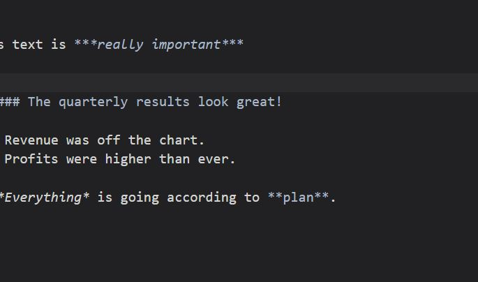

# test1
asdfasdf
asdfasf
as
asdf
asdf
asdf
as
a

asdf
a
fa
sdf
asdf

## test 2

test 3 
------------------

* First item
* Second item
* Third item
* Fourth item

test 11
=============
 > asdfasdf
 > asasdfsdf

afasdfasdf
asdfasdfasfd

My favorite search engine is [Duck Duck Go](https://duckduckgo.com "The best search engine for privacy").

At the command prompt, type 
 > #include <iostream> 
 > int main () 
 > { 
 >    return 0;
 > }.

> Dorothy followed her through many of the beautiful rooms in her castle.
>
>> The Witch bade her clean the pots and kettles and sweep the floor and keep the fire fed with wood

***

asdfasdf 

---

adsfasdf
_________________

asdfasdf 

> Dorothy followed her through many of the beautiful rooms in her castle.
>
> The Witch bade her clean the pots and kettles and sweep the floor and keep the fire fed with wood.

# test2
adsfadsf

I just love **bold text**.

I just love __bold text__.

Italicized text is the *cat's meow*.

asdf_asdfasdf

This text is ***really important***

> #### The quarterly results look great!
>
> - Revenue was off the chart.
> - Profits were higher than ever.
>
>  *Everything* is going according to **plan**.

[head link](#test-2)
[ink](#test-3)