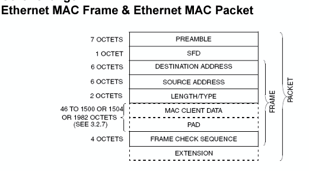
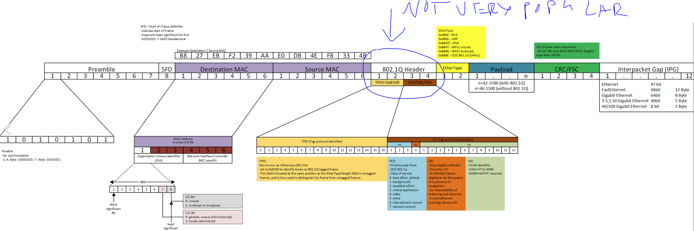
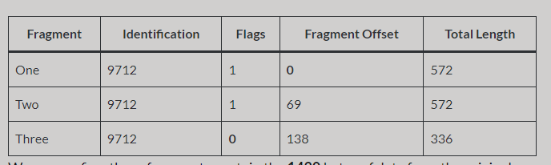
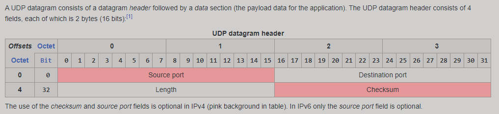
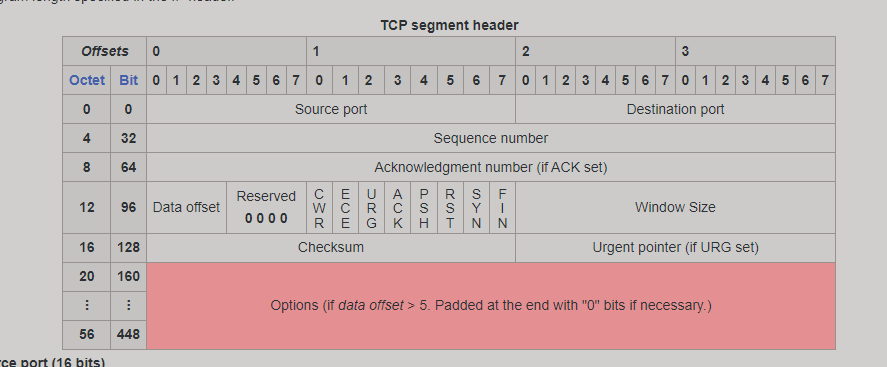
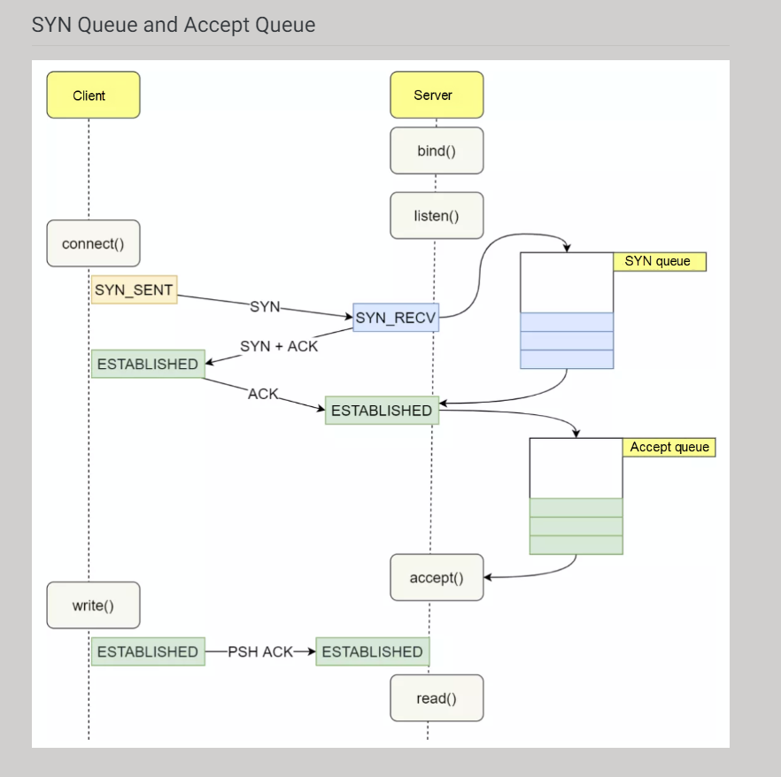

# Sockets low level data structure

## Packet
In networking, a packet is a small segment of a larger message. Data sent over computer networks*, such as the Internet, is divided into packets. These packets are then recombined by the computer or device that receives them. 

## Segment
The original TCP RFC is kind of fuzzy with how it uses the term ***segment***.

In some cases, the term "segment" refers to just the current piece of the application data stream that's being transmitted, which excludes the TCP headers. For example, the TCP "Maximum Segment Size" (MSS) is the maximum size of the application data chunk in this message, not counting the TCP headers.

But in other cases the term "segment" includes the whole TCP message, including the TCP headers. In fact in at least one case the spec mentions TCP segments with no application data (such as plain Acks).

A single whole IP message is a ***datagram***.

The original IP RFC refers to link-layer messages as "packets". IP datagrams can be broken into "fragments" to fit into the packet size limits on small-packet networks.

The IEEE 802.3 / Ethernet link layer refers to a single contiguous physical-layer transmission as a "packet". The MAC data-link portion of the packet is called the "frame". The frame begins with the destination MAC address and ends with the Frame Check Sequence. The part of the frame that may contain an IP datagram (or fragment thereof) is called the "MAC Client Data field".

So, technically, there is no such thing as a "TCP packet" or an "IP packet". Packets are terms from the layers below IP. TCP has "segments", and IP has "datagrams"

##MSS

More specifically, MSS is the largest [TCP (Transport Control Protocol)](https://www.cloudflare.com/learning/ddos/glossary/tcp-ip/) segment size that a network-connected device can receive. MSS defines "segment" as only the length of the payload, not any attached headers. MSS is measured in bytes.

MSS is determined by another metric that has to do with packet size: [MTU](https://www.cloudflare.com/learning/network-layer/what-is-mtu/), or the maximum transmission unit, which does include the TCP and [IP (Internet Protocol)](https://www.cloudflare.com/learning/ddos/glossary/internet-protocol/) headers. To continue the analogy, MTU measures the total weight of the truck and its trailer and cargo, instead of just the trailer and cargo.

Essentially, the MSS is equal to MTU minus the size of a TCP header and an IP header:

*MTU - (TCP header + IP header) = MSS*

One of the key differences between MTU and MSS is that if a packet exceeds a device's MTU, it is broken up into smaller pieces, or "fragmented." In contrast, if a packet exceeds the MSS, it is dropped and not delivered

## Ethernet packet

## IP datagram
Thus, the maximum size of an IP datagram is 65,535 byte. They can be devided by the sender / router if it exceedes MTU size. An IP packet consists of a header section and a data section. An IP packet has no data checksum or any other footer after the data section. Typically the link layer encapsulates IP packets in frames with a CRC footer that detects most errors, many transport-layer protocols carried by IP also have their own error checkin  

### Intresting fields inside IP datagram:

**Identification** 
if three packets are sent from host A to host B and each must be fragmented into four fragments:
* the four fragments of the first packet will share the same Identification field value  
* the four fragments of the second packet will share the same Identification field value, which will be different to the value used with the fragments created from the first packet
* the four fragments of the third packet will share the same Identification field value, which will be different to the value used with the fragments created from the first and second packets

**Time to live (TTL)**
the number of network hops a packet can make before it is discarded
 
**Fragment offset**
This field specifies the offset of a particular fragment relative to the beginning of the original unfragmented IP datagram. The fragmentation offset value for the first fragment is always 0. The field is 13 bits wide, so that the offset can be from 0 to 8191 (from (20  –1) to (213 – 1)). Fragments are specified in units of 8 bytes, which is why fragment length must be a multiple of 8.[37] Therefore, the 13-bit field allows a maximum offset of (213 – 1) × 8 = 65,528 bytes, with the header length included (65,528 + 20 = 65,548 bytes), supporting fragmentation of packets exceeding the maximum IP length of 65,535 byte

[IP fragmentation detailed](https://packetpushers.net/ip-fragmentation-in-detail/)

## UDP 

## TCP 

Transmission Control Protocol accepts data from a data stream, divides it into chunks, and adds a TCP header creating a TCP segment. The TCP segment is then encapsulated into an Internet Protocol (IP) datagram, and exchanged with peers.[7]

The term TCP packet appears in both informal and formal usage, whereas in more precise terminology segment refers to the TCP protocol data unit (PDU), datagram[8]: 5–6  to the IP PDU, and frame to the data link layer PDU:

Processes transmit data by calling on the TCP and passing buffers of data as arguments. The TCP packages the data from these buffers into segments and calls on the internet module [e.g. IP] to transmit each segment to the destination TCP

### TCP session

The only way to identify a TCP connection is by a unique 4-tuple (client-ip, src-port, server-ip, dest-port)

### TCP Segmentation

Large payload not fitting into MSS will be split in many segments 

TCP Segmentation offload - These days many NICs can create headers/checksum for a given user data autmatically given a template from kernel! this can save massive amount of CPU time.

### TCP states

#### SYN 

***a synchronization message typically used to request a connection between a client and a server***

#### ACK
***an acknowledgment message employed to declare the receipt of a particular message***

#### FIN 

***a message that triggers a graceful connection termination between a client and a server***

#### RST

**a message that aborts the connection (forceful termination) between a client and a server**

Linux only tear down a TCP connection if the RST sequence number is the next expected sequence number

A RST isn't ordinarily sent between peers in a normal connection termination. A FIN is. When you kill the client, a FIN is sent on the connection to indicate to the server that the client won't be sending any more data.  But the server is apparently not paying attention to the FIN it receives when the client is killed (i.e. it would need to attempt a recv on the socket and react appropriately to the end-of-file indication it will get -- usually that means close its own socket). Subsequently, the server is attempting to send data to the client but the connection is closed. That is what results in a RST packet being sent.
RST means (roughly) "there is no active connection available to receive the data you're sending; it's pointless to send more." And so the timing of that RST is likely based on when the server next attempts to send to the client, not on any kernel / OS configuration setting. If the server doesn't attempt to send and it doesn't close, the connection should just sit there idle forever, and no RST will be sent

Setting SO_LINGER with a positive timeout does exactly one thing. It enables close() to block for up to that timeout while there is any outbound pending data still in flight. If you don't modify it, the default is for the close() to be asynchronous, which means the application can't tell whether any data still in flight got sent.

When a TCP connection is closed cleanly, the end that initiated the close ("active close") ends up with the connection sitting in TIME_WAIT for 60 seconds. So if your protocol is one where the server initiates the connection close, and involves very large numbers of short-lived connections, then it might be susceptible to this problem. An application level protocol sitting on top of TCP should be designed in such a way that the client always initiates the connection close. That way, the TIME_WAIT will sit at the client doing no harm. Remember as it says in "UNIX Network Programming" third edition (Stevens et al) page 203: "The TIME_WAIT state is your friend and is there to help us. Instead of trying to avoid the state, we should understand it

Note that it is very unlikely that delayed segments will cause problems like this. Firstly the address and port of each end point needs to be the same; which is normally unlikely as the client's port is usually selected for you by the operating system from the ephemeral port range and thus changes between connections. Secondly, the sequence numbers for the delayed segments need to be valid in the new connection which is also unlikely. However, should both of these things occur then TIME_WAIT will prevent the new connection's data from being corrupted.

The server will silently drop the packet since it already has a connection in the ESTABLISHED state, one of the four values from (client-ip, src-port, server-ip, dest-port) must be different for the new SYN to be accepted

### TCP connection establish

The ACK is accompanied by sequence numbers. The RFC is pretty clear on the handshake:

1) A --> B SYN my sequence number is X
2) A <-- B ACK your sequence number is X
3) A <-- B SYN my sequence number is Y (the moment A gets it, it is considered complete)
4) A --> B ACK your sequence number is Y (the moment B gets it it is complete as well)
Steps 2 and 3 are combined in a single packet.

Reasons for sequence numbers is SYN to be randomized:
       - Security: anything too predictable is likely to be used for spoofing purposes
       - Multi-session interference. If all sessions started their sequence numbers at 1, then it would be much easier to end up in situations where you mix up packets from various sessions between two hosts (though there are other measures in place to avoid this, like randomizing the source port).

---> another view:
During the TCP three-way handshake process, the Linux kernel maintains two queues, namely:

SYN Queue
Accept Queue
Normal TCP three-way handshake process:

The Clionnection. The Client side enters the SYN_SENT state.
After the Server side receives the SYN request from the Client side, the Server side enters the SYN_RECV state. At this time, the kernel will store the connection in the SYN queue and reply to the Client side with SYN+ACK.
After the Client side receives the SYN + ACK from the server side, the Client replies and enters the ESTABLISHED state.
After the Server side receives the ACK from the Client side, the kernel removes the connection from the SYN queue and adds it to the accept queue. The Server side enters the ESTABLISHED state.
When the Server side application calls the accept function, the connection is taken out of the accept queue.
Both the SYN queue and the Accept queue have length and size limits. If the limit is exceeded, the kernel discards the connection Drop or returns the RST packet.
s

### TCP connection termination

We have two peers: A and B

A calls close()
A sends FIN to B
A goes into FIN_WAIT_1 state
B receives FIN
B sends ACK to A
B goes into CLOSE_WAIT state
A receives ACK
A goes into FIN_WAIT_2 state
B calls close()
B sends FIN to A
B goes into LAST_ACK state
A receives FIN
A sends ACK to B
A goes into TIME_WAIT state
B receives ACK
B goes to CLOSED state – i.e. is removed from the socket tables

FIN_WAIT timeouts are normally 60 seconds

CLOSE_WAIT - Indicates that the server has received the first FIN signal from the client and the connection is in the process of being closed. This means the socket is waiting for the application to execute close() . A socket can be in CLOSE_WAIT state indefinitely until the application closes

This is where the problem starts. The (127.0.0.1:5000, 127.0.0.1:some-port) socket is still in CLOSE_WAIT state, while (127.0.0.1:some-port, 127.0.0.1:5000) has been cleaned up and is ready to be reused. When this happens the result is a total mess. One part of the socket won't be able to advance from the SYN_SENT state, while the other part is stuck in CLOSE_WAIT. The SYN_SENT socket will eventually give up failing with ETIMEDOUT.
resource: https://blog.cloudflare.com/this-is-strictly-a-violation-of-the-tcp-specification/

### Intresting fields inside TCP segment

**Sequence number (32 bits)**
Has a dual role:
If the SYN flag is set (1), then this is the initial sequence number. The sequence number of the actual first data byte and the acknowledged number in the corresponding ACK are then this sequence number plus 1.
If the SYN flag is unset (0), then this is the accumulated sequence number of the first data byte of this segment for the current session.  Note that this number is in bytes.

If one of your segments is lost, you have to retransmit it but maybe with another segment size (maybe a smaller size if the network is congested)

**Acknowledgment number (32 bits)**
If the ACK flag is set then the value of this field is the next sequence number that the sender of the ACK is expecting. This acknowledges receipt of all prior bytes (if any). The first ACK sent by each end acknowledges the other end's initial sequence number itself, but no data. Note that this number is in bytes.

If one of your segments is lost, you have to retransmit it but maybe with another segment size (maybe a smaller size if the network is congested)

**Window size (16 bits)**
The size of the receive window, which specifies the number of window size units[b] that the sender of this segment is currently willing to receive.[c] (See § Flow control and § Window scaling.) 

# Transfer rules

when you send data that is bigger than ip mtu, it is put into one ip packet, but the ip layer then find the ip packet is too long to transmit，so it will split big packet into several pieces, each of them have the same Identifier but with different offset and data length. the receive side is responsible for collecting all the pieces, after received all the pieces it will reassemble all the pieces into one whole ip packet and push it to upper protocol layer.

but the tcp layer have different behavior. when you send a data that is big enough, the tcp layer won't put the data into one tcp packet then split them into pieces(but ip does), it retrieve a part of the raw data into one tcp packet and then push the tcp packet to ip layer, the length of the tcp packet is determined by mss, later it will retrieve another part of the rest data into another tcp packet, and repeat the process till all the data are transmitted.

if tcp don't use mss，it is horrible. assume you send a data that is bigger than mss, it will be put into only one tcp packet（data is not split into small pieces due to mss not used）, tcp packet is bigger than ip mtu, so the ip will split the tcp packet into pieces. the tcp packet will re-transmit if any one of the pieces is lost, waste time and bandwith

if there is new data to send
  if the window size >= MSS and available data is >= MSS
    send complete MSS segment now
  else
    if there is unconfirmed data still in the pipe
      enqueue data in the buffer until an acknowledge is received
    else
      send data immediately
    end if
  end if
end if

# Transmission Control Protocol

The throughput of a communication is limited by two windows: the congestion window and the receive window. The congestion window tries not to exceed the capacity of the network (congestion control); the receive window tries not to exceed the capacity of the receiver to process data (flow control)

## Ordered data transfer

*the destination host rearranges segments according to a sequence number*

## Retransmission of lost packets

*any cumulative stream not acknowledged is retransmitted*

TCP uses a sequence number to identify each byte of data. The sequence number identifies the order of the bytes sent from each computer so that the data can be reconstructed in order, regardless of any out-of-order delivery that may occur. The sequence number of the first byte is chosen by the transmitter for the first packet, which is flagged SYN. This number can be arbitrary, and should, in fact, be unpredictable to defend against TCP sequence prediction attacks.

Acknowledgements (ACKs) are sent with a sequence number by the receiver of data to tell the sender that data has been received to the specified byte. ACKs do not imply that the data has been delivered to the application, they merely signify that it is now the receiver's responsibility to deliver the data.

Reliability is achieved by the sender detecting lost data and retransmitting it. TCP uses two primary techniques to identify loss. Retransmission timeout (RTO) and duplicate cumulative acknowledgements (DupAcks).

When a TCP segment is retransmitted, it retains the same sequence number as the original delivery attempt. This conflation of delivery and logical data ordering means that, when acknowledgement is received after a retransmission, the sender cannot tell whether the original transmission or the retransmission is being acknowledged, the so-called retransmission ambiguity.[19] TCP incurs complexity due to retransmission ambiguit

## Error-free data transfer

corrupted packets are treated as lost and are retransmitted

## Flow control
 *limits the rate a sender transfers data to guarantee reliable delivery. The receiver continually hints the sender on how much data can be received. When the receiving host's buffer fills, the next acknowledgment suspends the transfer and allows the data in the buffer to be processed*

TCP uses an end-to-end flow control protocol to avoid having the sender send data too fast for the TCP receiver to receive and process it reliably. Having a mechanism for flow control is essential in an environment where machines of diverse network speeds communicate. For example, if a PC sends data to a smartphone that is slowly processing received data, the smartphone must be able to regulate the data flow so as not to be overwhelmed.[6]

TCP uses a sliding window flow control protocol. In each TCP segment, the receiver specifies in the receive window field the amount of additionally received data (in bytes) that it is willing to buffer for the connection. The sending host can send only up to that amount of data before it must wait for an acknowledgement and receive window update from the receiving host.

When a receiver advertises a window size of 0, the sender stops sending data and starts its persist timer. The persist timer is used to protect TCP from a deadlock situation that could arise if a subsequent window size update from the receiver is lost, and the sender cannot send more data until receiving a new window size update from the receiver. When the persist timer expires, the TCP sender attempts recovery by sending a small packet so that the receiver responds by sending another acknowledgement containing the new window size

### Linux socket options

## Congestion control

*lost packets (presumed due to congestion) trigger a reduction in data delivery rate*

In TCP, the congestion window (CWND) is one of the factors that determines the number of bytes that can be sent out at any time. The congestion window is maintained by the sender and is a means of stopping a link between the sender and the receiver from becoming overloaded with too much traffic. This should not be confused with the sliding window maintained by the sender which exists to prevent the receiver from becoming overloaded. The congestion window is calculated by estimating how much congestion there is on the link.

When a connection is set up, the congestion window, a value maintained independently at each host, is set to a small multiple of the maximum segment size (MSS) allowed on that connection. Further variance in the congestion window is dictated by an additive increase/multiplicative decrease (AIMD) approach. This means that if all segments are received and the acknowledgments reach the sender on time, some constant is added to the window size. It will follow different algorithms.

A system administrator may adjust the maximum window size limit, or adjust the constant added during additive increase, as part of TCP tuning.

The flow of data over a TCP connection is also controlled by the use of the receive window advertised by the receiver. A sender can send data less than its own congestion window and the receive window

## Other features

### SACK

SACKs work by appending to a duplicate acknowledgment packet a TCP option containing a range of noncontiguous data received. In other words, it allows the client to say "I only have up to packet #1 in order, but I also have received packets #3 and #4". This allows the server to retransmit only the packet(s) that were not received by the client.

Support for SACK is negotiated at the beginning of a TCP connection; if both hosts support it, it may be used

### Out-of-band data

It is possible to interrupt or abort the queued stream instead of waiting for the stream to finish. This is done by specifying the data as urgent. This marks the transmission as out-of-band data (OOB) and tells the receiving program to process it immediately. When finished, TCP informs the application and resumes the stream queue. An example is when TCP is used for a remote login session where the user can send a keyboard sequence that interrupts or aborts the remotely-running program without waiting for the program to finish its current transfer.[6]

The urgent pointer only alters the processing on the remote host and doesn't expedite any processing on the network itself. The capability is implemented differently or poorly on different systems or may not be supported. Where it is available, it is prudent to assume only single bytes of OOB data will be reliably handled.[43][44] Since the feature is not frequently used, it is not well tested on some platforms and has been associated with vulnerabilities, WinNuke for instance

# Sockets API

## socket()

### Intresting options

**TCP_NODELAY** ON means send the data (partial frames) the moment you get, regardless if you have enough frames for a full network packet.
**TCP_NODELAY** OFF means Nagles Algoritm which means send the data when it is bigger than the MSS or waiting for the receiving acknowledgement before sending data which is smaller.
**TCP_CORK** ON means don't send any data (partial frames) smaller than the MSS until the application says so or until 200ms later.
**TCP_CORK** OFF means send all the data (partial frames) now

**SO_SNDTIMEOUT** 
**SO_REDVTIMEOUT** 
could be used for blocking sockeets to control timeouts on send and recv! if you doing blocking UDP then EGAIN error will indicate timeout!

**SO_REUSEADDR**

Setting SO_REUSEADDR on the client side doesn't help the server side unless it also sets SO_REUSEADDR. This  will NOT fix the issue of CLOSE_WAIT where if the the other side gets FIN and does not call close().

## accept()

       int accept(int sockfd, struct sockaddr *_Nullable restrict addr,
                  socklen_t *_Nullable restrict addrlen);

       #define _GNU_SOURCE             /* See feature_test_macros(7) */
       #include <sys/socket.h>

       int accept4(int sockfd, struct sockaddr *_Nullable restrict addr,
                  socklen_t *_Nullable restrict addrlen, int flags);

The accept() system call is used with connection-based socket
types (SOCK_STREAM, SOCK_SEQPACKET).  It extracts the first
connection request on the queue of pending connections for the
listening socket, sockfd, creates a new connected socket, and
returns a new file descriptor referring to that socket.  The
newly created socket is not in the listening state.  The original
socket sockfd is unaffected by this cal

Usually a Linux process can open up to 1,024 file descriptors. If our application did run out of file descriptors the accept syscall would return the EMFILE error. If the application further mishandled this error case, this could result in losing incoming SYN packets. Failed accept calls will not dequeue a socket from accept queue, causing the accept queue to grow. The accept queue will not be drained and will eventually overflow. An overflowing accept queue could result in dropped SYN packets and failing connection attempts

**WARNING ----->** Linux accept() (and accept4()) passes already-pending network
errors on the new socket as an error code from accept().  This
behavior differs from other BSD socket implementations.  For
reliable operation the application should detect the network
errors defined for the protocol after accept() and treat them
like EAGAIN by retrying.

**WARNING ---->** select(2), poll(2), or epoll(7) return a readability
event because the connection might have been removed by an
asynchronous network error or another thread before accept() is
called.  If this happens, then the call will block waiting for
the next connection to arrive.  To ensure that accept() never
blocks, the passed socket sockfd needs to have the O_NONBLOCK
flag set (see socket(7)).

**WARNING ---- >** Make sure only one thread is calling accept on sockfd at a time

## epoll()

### Level-triggered and edge-triggered
  The epoll event distribution interface is able to behave both as
  edge-triggered (ET) and as level-triggered (LT).  The difference
  between the two mechanisms can be described as follows.  Suppose
  that this scenario happens:

  (1)  The file descriptor that represents the read side of a pipe
      (rfd) is registered on the epoll instance.

  (2)  A pipe writer writes 2 kB of data on the write side of the
      pipe.

  (3)  A call to epoll_wait(2) is done that will return rfd as a
      ready file descriptor.

  (4)  The pipe reader reads 1 kB of data from rfd.

  (5)  A call to epoll_wait(2) is done.

  If the rfd file descriptor has been added to the epoll interface
  using the EPOLLET (edge-triggered) flag, the call to
  epoll_wait(2) done in step 5 will probably hang despite the
  available data still present in the file input buffer; meanwhile
  the remote peer might be expecting a response based on the data
  it already sent.  The reason for this is that edge-triggered mode
  delivers events only when changes occur on the monitored file
  descriptor.  So, in step 5 the caller might end up waiting for
  some data that is already present inside the input buffer.  In
  the above example, an event on rfd will be generated because of
  the write done in 2 and the event is consumed in 3.  Since the
  read operation done in 4 does not consume the whole buffer data,
  the call to epoll_wait(2) done in step 5 might block
  indefinitely.

  An application that employs the EPOLLET flag should use
  nonblocking file descriptors to avoid having a blocking read or
  write starve a task that is handling multiple file descriptors.
  The suggested way to use epoll as an edge-triggered (EPOLLET)
  interface is as follows:

  (1)  with nonblocking file descriptors; and

  (2)  by waiting for an event only after read(2) or write(2)
      return EAGAIN.

  By contrast, when used as a level-triggered interface (the
  default, when EPOLLET is not specified), epoll is simply a faster
  poll(2), and can be used wherever the latter is used since it
  shares the same semantics.

## recv()

ssize_t recv(int s, void *buf, size_t len, int flags);
ssize_t recvfrom(int s, void *buf, size_t len, int flags,
                 struct sockaddr *from, socklen_t *fromlen);

When you call recv(), it will block until there is some data to read. If you want to not block, set the socket to non-blocking or check with select() or poll() to see if there is incoming data before calling recv() or recvfrom()

### Intresting flag
>       MSG_DONTWAIT (since Linux 2.2)
>              Enables nonblocking operation; if the operation would
>              block, the call fails with the error EAGAIN or
>              EWOULDBLOCK.  This provides similar behavior to setting
>               the O_NONBLOCK flag (via the fcntl(2) F_SETFL operation),
>              but differs in that MSG_DONTWAIT is a per-call option,
>              whereas O_NONBLOCK is a setting on the open file
>              description (see open(2)), which will affect all threads
>              in the calling process and as well as other processes that
>              hold file descriptors referring to the same open file
>              description

## send

    ssize_t send(int sockfd, const void buf[.len], size_t len, int flags);
    ssize_t sendto(int sockfd, const void buf[.len], size_t len, int flags,
                  const struct sockaddr *dest_addr, socklen_t addrlen);
    ssize_t sendmsg(int sockfd, const struct msghdr *msg, int flags);

You should just do the send, and only select for writability if the send incurred EAGAIN/EWOULDBLOCK. A socket is almost always ready to write, except when the socket send buffer is full. Your way you're doubling system calls and adding latency

### Intresting flags

       MSG_DONTWAIT (since Linux 2.2)
              Enables nonblocking operation; if the operation would
              block, EAGAIN or EWOULDBLOCK is returned.  This provides
              similar behavior to setting the O_NONBLOCK flag (via the
              fcntl(2) F_SETFL operation), but differs in that
              MSG_DONTWAIT is a per-call option, whereas O_NONBLOCK is a
              setting on the open file description (see open(2)), which
              will affect all threads in the calling process and as well
              as other processes that hold file descriptors referring to
              the same open file description

       MSG_MORE (since Linux 2.4.4)
              The caller has more data to send.  This flag is used with
              TCP sockets to obtain the same effect as the TCP_CORK
              socket option (see tcp(7)), with the difference that this
              flag can be set on a per-call basis.

              Since Linux 2.6, this flag is also supported for UDP
              sockets, and informs the kernel to package all of the data
              sent in calls with this flag set into a single datagram
              which is transmitted only when a call is performed that
              does not specify this flag.  (See also the UDP_CORK socket
              option described in udp(7).)

       MSG_NOSIGNAL (since Linux 2.2)
              Don't generate a SIGPIPE signal if the peer on a stream-
              oriented socket has closed the connection.  The EPIPE
              error is still returned.  This provides similar behavior
              to using sigaction(2) to ignore SIGPIPE, but, whereas
              MSG_NOSIGNAL is a per-call feature, ignoring SIGPIPE sets
              a process attribute that affects all threads in the
              process.

## close()

**WARNINING -->>>>>** A successful close does not guarantee that the data has been
successfully saved to disk, as the kernel uses the buffer cache
to defer writes.  Typically, filesystems do not flush buffers
when a file is closed.  If you need to be sure that the data is
physically stored on the underlying disk, use fsync(2).  (It will
depend on the disk hardware at this point.)

It is probably unwise to close file descriptors while they may be
in use by system calls in other threads in the same process.
Since a file descriptor may be reused, there are some obscure
race conditions that may cause unintended side effects.

On Linux (and possibly some other systems), the behavior is
different.  the blocking I/O system call holds a reference to the
underlying open file description, and this reference keeps the
description open until the I/O system call completes.  (See
open(2) for a discussion of open file descriptions.)  Thus, the
blocking system call in the first thread may successfully
complete after the close() in the second thread

Retrying the close() after a failure return is the wrong thing to
do, since this may cause a reused file descriptor from another
thread to be closed

A careful programmer will check the return value of close(),
since it is quite possible that errors on a previous write(2)
operation are reported only on the final close() that releases
the open file description. 

A careful programmer who wants to know about I/O errors may
precede close() with a call to fsync(2).

So the POSIX-suggested handling of an EINTR, which is to retry the close(), could actually be quite dangerous on Linux. For that reason, Mark Mentovai suggested a change to the glibc manual to avoid recommending retrying close() on Linux.

## Important notes

### RENTR

The code which calls write (or other blocking operations) has to be aware of EINTR. If a signal occurs during a blocking operation, then the operation will either (a) return partial completion, or (b) return failure, do nothing, and set errno to EINTR.

  > int total = 0;
  > while(size > 0) {
  >    int written = write(filedes, buf, size);
  >    if (written == -1) {
  >        if (errno == EINTR) continue;
  >        return (total == 0) ? -1 : total;
  >    }
  >    buf += written;
  >    total += written;
  >    size -= written;
  > }
  > return total; // bytes written

# Sockets config

## netdev_max_backlog 

2000 default per CPU queue to sore data from NIC and push it to sockets

## tcp_mem [low,pressure,limit] 

in PAGES!
 low - no regulation for memory allocation!
 pressure - starts to regulate buffer memory allocation!
 limit - no more allocation!This value overrides any other limits imposed by the kernel

## tcp_retries1 (integer; default: 3; since Linux 2.2)
      The number of times TCP will attempt to retransmit a packet on an established connection normally, without the extra effort of getting the network layers involved.  Once  we  exceed  this
      number of retransmits, we first have the network layer update the route if possible before each new retransmit.  The default is the RFC specified minimum of 3.

## tcp_retries2 (integer; default: 15; since Linux 2.2)
      The  maximum  number of times a TCP packet is retransmitted in established state before giving up.  The default value is 15, which corresponds to a duration of approximately between 13 to
      30 minutes, depending on the retransmission timeout.  The RFC 1122 specified minimum limit of 100 seconds is typically deemed too short.

## /proc/sys/net/ipv4/tcp_window_scaling
 window scale - MAX value establishes during SYN packet(connection)! reciever can advertises futher recive window size in ACKs. The maximum size is 65K, but it can be scaled up to 1GB! The settings is controled by =0/1 in Linux to enable or disable it

## tcp_window_scaling (Boolean; default: enabled; since Linux 2.2)

Enable  RFC 1323  TCP  window  scaling.   This feature allows the use of a large window (> 64 kB) on a TCP connection, should the other end support it

## tcp_fin_timeout (integer; default: 60; since Linux 2.2)

This specifies how many seconds to wait for a final FIN packet before the socket is forcibly closed.  This is strictly a violation of  the  TCP  specification,  but  required  to  prevent
denial-of-service attacks.  In Linux 2.2, the default value was 180

## /proc/sys/net/core/somaxconn

 kernel parameter in Linux that determines the maximum number of connections that can be queued in the TCP/IP stack backlog per socket

# Linux commands

## Packet errors

overruns - not enogh space in ring buffers
dropped - not enough space in buffers TCP/UDP.
errors - ill-formed packets

## Troubleshooting socket queues for listen and established sockets

You can view the information of a fully connected queue by ss.

 -n Does not resolve the service name
 -t only show tcp sockets
 -l Displays LISTEN-state sockets

$ ss -lnt
State      Recv-Q Send-Q    Local Address:Port         Peer Address:Port
LISTEN     0      128       [::]:2380                  [::]:*
LISTEN     0      128       [::]:80                    [::]:*
LISTEN     0      128       [::]:8080                  [::]:*
LISTEN     0      128       [::]:8090                  [::]:*

$ ss -nt
State      Recv-Q Send-Q    Local Address:Port         Peer Address:Port
ESTAB      0      0         [::ffff:33.9.95.134]:80                   [::ffff:33.51.103.59]:47452
ESTAB      0      536       [::ffff:33.9.95.134]:80                  [::ffff:33.43.108.144]:37656
ESTAB      0      0         [::ffff:33.9.95.134]:80                   [::ffff:33.51.103.59]:38130
ESTAB      0      536       [::ffff:33.9.95.134]:80                   [::ffff:33.51.103.59]:38280
ESTAB      0      0         [::ffff:33.9.95.134]:80                   [::ffff:33.51.103.59]:38204
For sockets in LISTEN states

Recv-Q: The size of the current accept queue, which means the three connections have been completed and are waiting for the application accept() TCP connections.
Send-Q: the maximum length of the accept queue, which is the size of the accept queue.
For sockets in non-LISTEN state

Recv-Q: the number of bytes received but not read by the application.
Send-Q: the number of bytes sent but not acknowledged.

# Best practices

## Closing session 1

  When a stream socket peer has performed an orderly shutdown, the
   return value will be 0 (the traditional "end-of-file" return).
What the manpage means here is, orderly shutdown is done by one end (A) choosing to call shutdown(SHUT_WR), which causes a FIN packet to be sent to the peer (B), and this packet takes the form of a 0 return code from recv inside B. (Note: the FIN packet, being an implementation aspect, is not mentioned by the manpage). The "EOF" as the manpage calls it, means there will be no more transmission from A to B, but application B can, and should continue to send what it was in the process of sending, and even send some more, potentially (A is still receiving). When that sending is done (shortly), B should itself call shutdown(SHUT_WR) to close the other half of the duplex. Now app A receives EOF and all transmission has ceased. The two apps are OK to call shutdown(SHUT_RD) to close their sockets for reading and then close() to free system resources associated with the socket (TODO I haven't found clear documentation taht says the 2 calls to shutdown(SHUT_RD) are sending the ACKs in the termination sequence FIN --> ACK, FIN --> ACK, but this seems logical

## Closing session 2

Some operating systems, such as Linux and HP-UX,[citation needed] implement a half-duplex close sequence. If the host actively closes a connection, while still having unread incoming data available, the host sends the signal RST (losing any received data) instead of FIN. This assures that a TCP application is aware there was a data loss

The OS does not discard data you have written when you call shutdown(SHUT_WR). If the other end already shut down its end (you can tell because you received 0 bytes) then you should be able to close the socket, and the OS will keep it open until it has finished sending everything.

The FIN is treated like part of the data. It has to be retransmitted if the other end doesn't receive it, and it doesn't get processed until everything before it has been received. This is called "graceful shutdown" or "graceful close". This is unlike RST, which signals that the connection should be aborted immediately

Linger off means that close() doesn't block. Linger on with a positive timeout means that close() blocks for up to the timeout. Linger on with a zero timeout causes RST, and this is what the question is about
When you close a socket with the SO_LINGER time set to zero:
TCP discards any data in the send buffer
TCP sends a RST packet to the peer
The socket resource are deallocated.
The socket does not enter TIME-WAIT

# Misc

## RoCE 

stands for RDMA over Converged Ethernet. It is a standard that enables
 passing RDMA traffic over an Ethernet network.

## FCoE

Fibre Channel over Ethernet (FCoE) is a computer network technology that encapsulates Fibre Channel frames 
over Ethernet network

